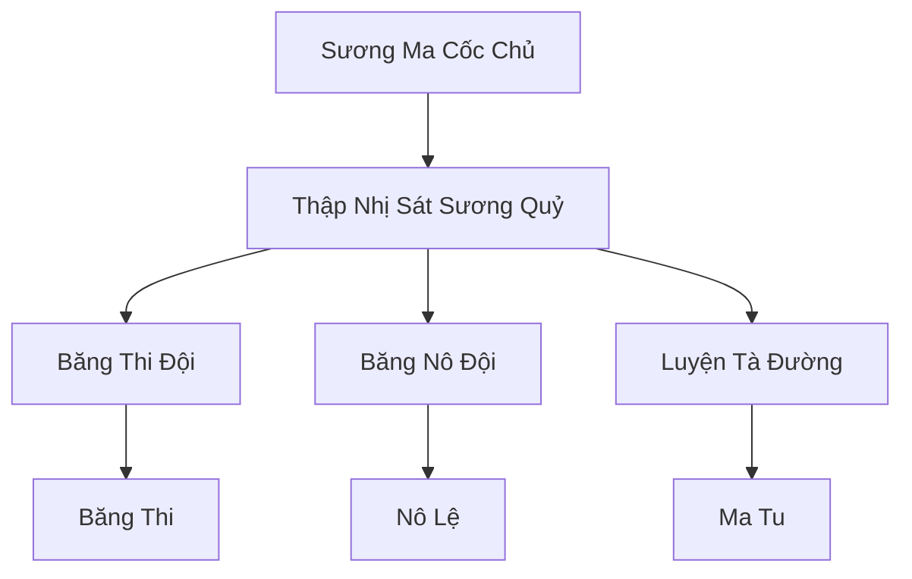

# SƯƠNG MA UYỂN (霜魔苑)

## I. Tổng Quan (总览)
Sương Ma Uyển là "vết sẹo đen" trên nền tuyết trắng của phương Bắc, một tông môn ma đạo tàn bạo chuyên tu luyện các loại tà thuật liên quan đến băng giá và cái chết. Thành viên của Uyển phần lớn là những kẻ bị trục xuất khỏi các tông môn chính đạo hoặc những sinh vật biến dị do hít phải chướng khí lạnh lẽo lâu ngày. Họ coi nhiệt lượng và sinh cơ của kẻ khác là nguồn tài nguyên để duy trì sự tồn tại và thăng tiến tu vi.

## II. Địa Lý & Tài Nguyên (地理 với tài nguyên)
Trụ sở chính là Lâu Đài Ma Sương, một pháo đài kiến trúc gai góc được xây dựng từ "Hắc Băng" nằm sâu trong một khe nứt sông băng vĩnh cửu. Nơi đây có "Huyết Băng Trì" - hồ nước chứa máu của hàng vạn sinh linh đã bị đóng băng, là nguồn cung cấp tà linh khí thủy hệ vô tận. Họ cũng kiểm soát các mạch sông băng ngầm chứa đầy tà linh thạch.

## III. Văn Hóa & Tín Ngưỡng (文化 với信仰)
Tôn thờ sự lạnh lẽo tuyệt đối và sự diệt vong. Thành viên Sương Ma Uyển tin rằng cảm xúc là thứ rác rưởi làm suy yếu con người, chỉ có sự vô tình như băng giá mới dẫn đến đỉnh cao sức mạnh. Văn hóa của họ cực kỳ điên loạn, nơi việc tra tấn và biến đổi cơ thể xác chết được coi là một loại hình nghệ thuật hắc ám.

## IV. Cơ Cấu Tổ Chức (组织结构)


## V. Công Pháp & Trận Pháp (功法 với阵法)
- **Công Pháp:** *Cửu U Băng Thi Quyết* (Luyện xác), *Đoạt Tủy Hàn Công* (Hút nhiệt lượng và linh lực).
- **Trận Pháp:** *Cửu U Hàn Sát Trận* - trận pháp bao phủ lâu đài, tạo ra một vùng không gian có nhiệt độ tuyệt đối âm, khiến mọi linh lực của đối phương bị đóng băng ngay khi vận hành.

## VI. Đặc Sản Môn Phái (门派特产)
- **Hắc Băng Châm:** Loại ám khí tàng hình trong tuyết, có khả năng đoạt mạng mục tiêu bằng cách làm đông máu tức thì.
- **Băng Nô:** Những tu sĩ chính đạo bị bắt và xóa sạch trí tuệ, biến thành những công cụ lao động và chiến đấu không biết mệt mỏi.

## VII. Cơ Sở Hạ Tầng (基础设施)
- **Lâu Đài Ma Sương:** Kiến trúc đen ngòm, lộng lẫy một cách đáng sợ giữa tuyết trắng.
- **Ngục Giam Hàn Băng:** Nơi giam giữ và "chế biến" các nạn nhân.

## VIII. Kinh Tế (経済)
Kinh tế dựa trên việc cướp phá các bộ lạc du mục và thương đoàn phương Bắc. Họ cũng là nhà cung cấp "Băng Thi" - những xác sống chiến đấu chất lượng cao cho các thế lực ma đạo khác trên lục địa để đổi lấy các tài nguyên tu luyện hiếm.

## IX. Lịch Sử Tóm Tắt (简史)
Sáng lập bởi Sương Ma Cốc Chủ, vốn là một Đại Trưởng Lão thiên tài của Huyền Băng Cung. Do quá ám ảnh với việc tìm kiếm sức mạnh băng hệ tối thượng mà ông đã sa đọa vào ma đạo, đánh cắp bí bảo tông môn và dẫn theo một nhóm đệ tử trung thành lập nên Sương Ma Uyển, trở thành nỗi kinh hoàng của toàn bộ Bắc Băng.

## X. Giai Thoại & Bí Mật (轶 sự với bí mật)
Tương truyền Sương Ma Cốc Chủ đã đóng băng trái tim của chính mình để đạt đến cảnh giới bất tử, và ông chỉ có thể cảm nhận được "sự ấm áp" khi nhìn thấy máu tươi đổ trên tuyết lạnh.

## XI. Quan Hệ Thế Lực (势力关系)
```mermaid
graph LR
    SMU[Sương Ma Uyển] -- Tử địch -- HBC[Huyền Băng Cung]
    SMU -- Đối địch -- CQTĐ[Cực Quang Thần Điện]
    SMU -- Giao dịch -- CUMT[Cửu U Ma Tông]
    SMU -- Săn đuổi -- BLBL[Băng Lang Bộ Lạc]
```
