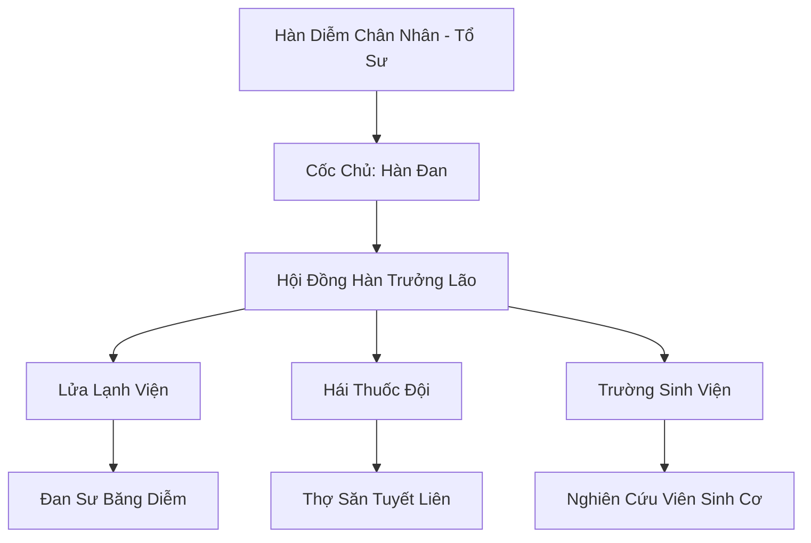

# THIÊN SƠN ĐÔNG CỐC (天山冬谷)

## I. Tổng Quan (总览)
Thiên Sơn Đông Cốc là thánh địa luyện đan đặc thù nhất khu vực Bắc Băng, nổi tiếng với việc sử dụng "Hàn Diễm" (ngọn lửa lạnh) thay vì hỏa diễm thông thường. Tông môn này chuyên trị những ca bệnh khó nhất liên quan đến hỏa ma, tẩu hỏa nhập ma và các loại thương tổn do nhiệt lượng cực cao gây ra. Với triết lý bảo tồn sự sống thông qua sự tĩnh lặng của băng giá, Đông Cốc giữ vị thế trung lập và là điểm đến cứu mạng của nhiều cường giả khắp lục địa.

## II. Địa Lý & Tài Nguyên (地理 với tài nguyên)
Trụ sở chính ẩn mình trong một thung lũng tuyết biệt lập trên dãy Thiên Sơn, nơi địa hình chia cắt khiến người ngoài gần như không thể tiếp cận bằng đường bộ. Nơi đây sở hữu các mạch "Hàn Diễm Mạch" rò rỉ từ lõi băng vạn năm và là môi trường duy nhất mà loài Tuyết Liên vạn năm có thể nở rộ. Tài nguyên linh khí thủy hệ tại đây cực kỳ ổn định, phù hợp cho việc luyện chế các loại đan dược cần sự tinh tế tuyệt đối.

## III. Văn Hóa & Tín Ngưỡng (文化 với信仰)
Tôn thờ Hàn Diễm Chân Nhân và tinh thần "Băng Tâm Tụ Linh". Đệ tử Đông Cốc có tính cách điềm đạm, kiên nhẫn và yêu chuộng hòa bình. Họ chung sống hòa hợp với các chủng tộc yêu thú phương Bắc như Thỏ Ngọc và Cáo Tuyết, coi chúng là những người bạn đồng hành trong việc tìm kiếm dược liệu. Văn hóa môn phái đề cao sự tỉ mỉ và khả năng kiểm soát linh lực vi mô.

## IV. Cơ Cấu Tổ Chức (组织结构)


## V. Công Pháp & Trận Pháp (功法 với阵法)
- **Công Pháp:** *Hàn Diễm Đan Pháp* (Kỹ thuật luyện đan bằng lửa lạnh), *Ngọc Thạch Cuốn Sinh Cảnh* (Phong ấn sinh mệnh).
- **Trận Pháp:** *Băng Diễm Tịnh Hóa Trận* - trận pháp có khả năng dập tắt mọi loại hỏa độc và ma hỏa xâm nhập vào cơ thể tu sĩ, đồng thời hồi phục kinh mạch bị thiêu đốt.

## VI. Đặc Sản Môn Phái (门派特产)
- **Hàn Tuyết Đan:** Đan dược cực phẩm trị liệu hỏa hối và cân bằng âm dương cho tu sĩ hỏa hệ.
- **Băng Phách Liên:** Loại hoa sen băng có tác dụng kéo dài thọ nguyên bằng cách đưa cơ thể vào trạng thái ngủ đông sâu.

## VII. Cơ Sở Hạ Tầng (基础设施)
- **Hàn Diễm Đàn:** Khu vực tập trung các lò luyện sử dụng lửa lạnh tự nhiên từ địa mạch.
- **Tuyết Liên Đài:** Các bệ đá trên vách núi cao dùng để chăm sóc và thu hoạch linh thảo quý.

## VIII. Kinh Tế (経済)
Kinh tế cực kỳ ổn định và giàu có nhờ vào việc độc quyền các loại đan dược "giải nhiệt" cao cấp. Mọi cường giả tu luyện lôi hệ hoặc hỏa hệ trên lục địa đều coi Thiên Sơn Đông Cốc là đối tác quan trọng nhất để đảm bảo an toàn cho con đường tu luyện của mình.

## IX. Lịch Sử Tóm Tắt (简史)
Sáng lập bởi Hàn Diễm Chân Nhân, một luyện đan sư từng bị tẩu hỏa nhập ma do hỏa diễm và được cứu sống bởi một mạch lửa lạnh dưới băng. Ông đã dành cả đời để nghiên cứu con đường luyện đan nghịch lý này và lập nên Thiên Sơn Đông Cốc, biến nơi đây thành cứu tinh cho hàng vạn tu sĩ trong suốt nhiều kỷ nguyên.

## X. Giai Thoại & Bí Mật (轶 sự với bí mật)
Tương truyền Cốc Chủ Hàn Đan đang bảo quản thi thể của một vị đại năng từ thời Thái Cổ bên trong một khối hỏa băng, chờ đợi ngày tìm ra phương thuốc hoàn hảo để hồi sinh vị đó.

## XI. Quan Hệ Thế Lực (势力关系)
```mermaid
graph LR
    TSĐC[Thiên Sơn Đông Cốc] -- Đối tác -- DVC[Dược Vương Cốc]
    TSĐC -- Cung cấp -- ĐHC[Đan Hà Cốc]
    TSĐC -- Cứu trợ -- LTTH[Lôi Trì Thánh Địa]
    TSĐC -- Thân thiện -- HBC[Huyền Băng Cung]
```
