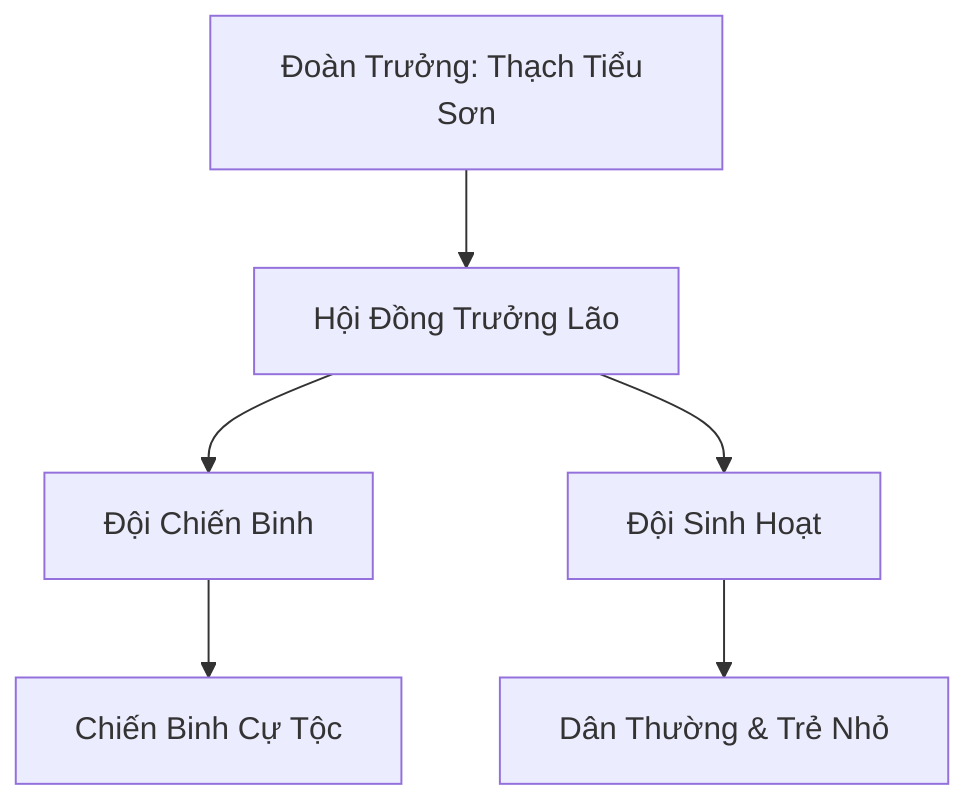
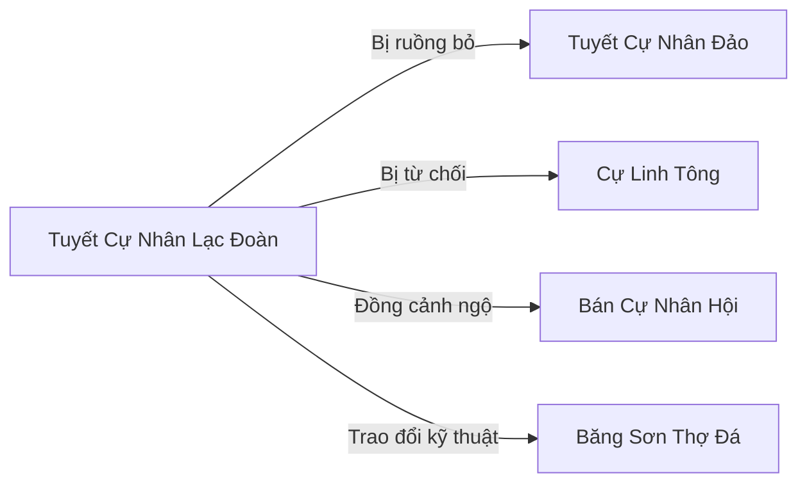

# Tuyết Cự Nhân Lạc Đoàn (雪巨人落团)

## I. Tổng Quan (总览)
Tuyết Cự Nhân Lạc Đoàn là một nhóm Cự Tộc tuyết bị trục xuất khỏi Tuyết Cự Nhân Đảo vì thể hình quá nhỏ — chỉ cao từ ba đến sáu trượng, trong khi đồng tộc thuần huyết cao tới hai mươi đến ba mươi trượng. Bị coi là "dị tật" và "huyết mạch thoái hóa", họ bị đuổi khỏi quê hương và buộc phải di cư xuống rìa nam Bắc Băng, nơi khí hậu bớt khắc nghiệt hơn để phù hợp với thể chất yếu ớt. Dưới sự dẫn dắt của Đoàn Trưởng đời thứ ba Thạch Tiểu Sơn — một Cự Tộc chỉ cao năm trượng nhưng thông minh vượt bậc — lạc đoàn gồm hai mươi tám thành viên đang gắng gượng sinh tồn bên lề xã hội tu chân, nơi mà kích thước cơ thể quyết định phẩm giá và vị thế.

## II. Địa Lý & Tài Nguyên (地理 与 资源)
Khu định cư Tiểu Thạch nằm tại rìa phía nam Bắc Băng, vùng chuyển tiếp giữa tundra đóng băng và đồng cỏ khô cằn. Địa hình chủ yếu là đồi thấp xen kẽ các khối đá lớn và hang tự nhiên vừa đủ cho Cự Tộc cỡ nhỏ trú ngụ. So với vùng lõi Bắc Băng, nhiệt độ nơi đây cao hơn đáng kể, cho phép các thành viên thể chất yếu có thể sống sót qua mùa đông mà không cần ngủ đông.

Tài nguyên của lạc đoàn cực kỳ nghèo nàn. Đá và khoáng sản thô là thứ dồi dào nhất — Cự Tộc vốn có bản năng đục đá bẩm sinh, nhưng Lạc Đoàn không biết luyện kim nên chỉ có thể chế tác các công cụ đá thô sơ. Thực phẩm phụ thuộc vào săn bắt thú nhỏ vùng tundra và hái lượm rêu tuyết — một nguồn lương thực bấp bênh khiến nạn đói là mối đe dọa thường trực mỗi mùa đông kéo dài.

## III. Văn Hóa & Tín Ngưỡng (文化 与 信仰)
Triết lý cốt lõi của Tuyết Cự Nhân Lạc Đoàn gói gọn trong bốn chữ: "Nhỏ không phải hèn". Dù chỉ cao năm sáu trượng, họ vẫn tự hào là con cháu Cự Tộc, mang trong mình dòng máu của những người khổng lồ thượng cổ từng chia đôi thiên hạ với Long Tộc. Quy tắc bất thành văn đầu tiên của lạc đoàn là không ai được chê bai thân hình đồng tộc — bất kỳ ai vi phạm sẽ bị phạt đứng ngoài hang qua một đêm bão tuyết.

Phong tục đặc trưng nhất là nghi thức "Trúc Thạch Tổ Tiên" — mỗi mùa đông, cả đoàn cùng nhau xếp đá thành tượng tổ tiên khổng lồ, có khi cao đến hai mươi trượng. Bức tượng được dựng lên rồi để mặc cho bão tuyết xói mòn trong suốt mùa đông, tượng trưng cho ký ức về một thời vàng son đang dần phai nhạt. Khi mùa xuân đến và tượng sụp đổ, họ lại thu gom đá để xây lại vào mùa đông sau — một vòng tuần hoàn của niềm tin và sự kiên nhẫn.

Lạc đoàn cũng duy trì truyền thống kể chuyện bên lửa vào mỗi đêm rằm, nơi các trưởng lão thuật lại truyền thuyết về "Cự Nhân Thời Sơ Khai" — thời kỳ mà Cự Tộc chỉ cao bằng Nhân Tộc nhưng sở hữu sức mạnh vô song. Thạch Tiểu Sơn tin rằng đây không chỉ là truyền thuyết mà là lịch sử thực sự, và rằng Cự Tộc nhỏ không phải thoái hóa mà đang tiến hóa theo hướng quay về nguồn cội.

## IV. Cơ Cấu Tổ Chức (组织结构)

Cơ cấu tổ chức của Tuyết Cự Nhân Lạc Đoàn theo mô hình bộ lạc truyền thống của Cự Tộc, tuy đơn giản nhưng gắn kết bởi tình thân. Đoàn Trưởng Thạch Tiểu Sơn giữ quyền quyết định tối cao, được hỗ trợ bởi một Hội Đồng Trưởng Lão chỉ gồm một thành viên duy nhất — vị Cự Tộc già nhất đoàn. Đội Chiến Binh có mười ba người, chịu trách nhiệm bảo vệ khu định cư, tuần tra lãnh thổ và săn bắt. Đội Sinh Hoạt gồm mười lăm người lo việc chăm sóc năm sáu Cự Tộc non (cao chưa đến ba trượng), thu thập thực phẩm, duy trì hang động và chế tác công cụ đá. Ranh giới giữa hai đội không cứng nhắc — khi cần, toàn bộ thành viên trưởng thành đều có thể chiến đấu.

## V. Công Pháp & Trận Pháp (功法 与 阵法)
- **Công Pháp:** Lạc đoàn tu luyện theo bản năng Huyết Mạch Cự Tộc — hấp thu linh khí băng qua da để cường hóa cơ thể. Tuy nhiên, do thể chất nhỏ, diện tích da tiếp xúc ít hơn đồng tộc thuần huyết, dẫn đến hiệu quả hấp thụ kém đi đáng kể. Thạch Tiểu Sơn đã cố gắng bổ sung bằng cách học hỏi một số kỹ thuật thở của Nhân Tộc từ thương nhân qua đường, giúp tăng tốc độ lưu chuyển huyết mạch linh lực. Phương pháp lai tạp này tuy thô sơ nhưng đã cải thiện đáng kể sức chiến đấu của Đội Chiến Binh.
- **Kỹ Năng Đặc Biệt:** Cự Tộc nhỏ có một lợi thế bất ngờ so với đồng tộc lớn: tốc độ. Họ nhanh hơn và linh hoạt hơn, có thể né tránh các đòn tấn công mà Cự Tộc lớn chỉ đứng chịu bằng thể phách. Thạch Tiểu Sơn đã phát triển một bộ *Thạch Quyền Tam Thức* tận dụng ưu thế này — ba chiêu đấm dựa trên nguyên lý "nhỏ mà nhanh, nhanh mà mạnh".
- **Trận Pháp:** Không có trận pháp chính thống. Chiến thuật phòng thủ chủ yếu là xếp đá thành tường chắn xung quanh khu định cư và dùng sức mạnh thể phách tự nhiên để ném đá vào kẻ thù từ xa.

## VI. Đặc Sản Môn Phái (门派特产)
- **Thạch Khí Cự Tộc:** Các công cụ bằng đá được đục đẽo bởi bàn tay Cự Tộc — dù thô sơ nhưng có độ bền và trọng lượng vượt trội so với đồ dùng Nhân Tộc thông thường. Những chiếc búa đá, dao đá của lạc đoàn được thương nhân phương Nam mua về làm vật trang trí hoặc bán lại cho những tu sĩ luyện thể cần dụng cụ nặng.
- **Rêu Tuyết Sấy Khô:** Loại rêu đặc hữu vùng chuyển tiếp, sau khi sấy khô có thể dùng làm thuốc giữ ấm cơ thể cho phàm nhân. Giá trị không cao nhưng là nguồn thu nhỏ giọt giúp đoàn trao đổi nhu yếu phẩm.
- **Tượng Đá Tổ Tiên Thu Nhỏ:** Các bức tượng đá mô phỏng Cự Nhân khổng lồ thời xưa, được Thạch Tiểu Sơn khắc trong lúc rảnh rỗi. Một vài thương nhân sưu tầm đồ cổ tỏ ra hứng thú, nhưng đây không phải nguồn thu ổn định.

## VII. Cơ Sở Hạ Tầng (基础设施)
- **Quần Thể Hang Đá Tiểu Thạch:** Hệ thống hang động tự nhiên đã được cải tạo sơ bộ, gồm hang chính (nơi sinh hoạt chung), hang kho (chứa lương thực và đá khoáng), và ba hang phụ dành cho các gia đình Cự Tộc. Trần hang thấp vừa đủ cho Cự Tộc năm trượng đứng thẳng, nhưng với đồng tộc lớn thì đây chỉ là cái hốc.
- **Bãi Tượng Tổ Tiên:** Khu vực đất trống phía trước hang chính, nơi mỗi mùa đông dựng tượng đá khổng lồ. Nền đất đã bị nén chặt qua bốn mươi năm xếp đá, cứng gần bằng đá tự nhiên. Xung quanh bãi có những phiến đá được khắc hình vẽ ghi lại lịch sử đoàn.
- **Tường Đá Phòng Thủ:** Hệ thống tường đá xếp chồng bao quanh khu định cư, cao khoảng bốn trượng. Không có trận pháp yểm trợ nhưng đủ để ngăn chặn yêu thú cấp thấp và gió bão mùa đông.
- **Bãi Khai Thác Đá:** Mỏ đá lộ thiên cách khu định cư nửa dặm, nơi cung cấp nguyên liệu cho mọi hoạt động xây dựng và chế tác.

## VIII. Kinh Tế (经济)
Nền kinh tế của Tuyết Cự Nhân Lạc Đoàn mang tính tự cung tự cấp và cực kỳ bấp bênh. Thực phẩm chính đến từ săn bắt thú nhỏ vùng tundra và hái lượm rêu tuyết, nhưng vào những mùa đông khắc nghiệt, nguồn thức ăn cạn kiệt đến mức đoàn phải chia nhau từng miếng thịt khô cuối cùng. Nguồn thu nhập duy nhất mang tính thương mại là trao đổi kỹ thuật đục đá và sản phẩm thạch khí với Băng Sơn Thợ Đá — đổi lấy thực phẩm, da thú và một ít dụng cụ kim loại mà lạc đoàn không thể tự sản xuất.

Thạch Tiểu Sơn đã nhiều lần cân nhắc việc cho thành viên đi làm thuê cho các tông môn lớn để kiếm thêm thu nhập, nhưng lo ngại rằng Cự Tộc nhỏ sẽ bị bóc lột như trường hợp của Băng Sơn Thợ Đá bị Cực Quang Thần Điện đối xử. Vì vậy, đoàn vẫn duy trì lối sống nghèo khó nhưng tự do.

## IX. Lịch Sử Tóm Tắt (简史)
Bốn mươi năm trước, Tuyết Cự Nhân Đảo ban hành một đạo luật tàn khốc: mọi Cự Tộc cao dưới mười trượng đều bị coi là "dị tật huyết mạch" và phải rời khỏi đảo. Nhóm bị trục xuất đầu tiên gồm chín Cự Tộc nhỏ, do Thạch Đại Sơn — Đoàn Trưởng đời thứ nhất — dẫn dắt. Họ từng tìm đến Cự Linh Tông cầu xin thu nhận, nhưng tông môn này cũng từ chối vì cho rằng huyết mạch quá loãng, không đáng để đào tạo.

Không còn nơi nương tựa, nhóm di chuyển xuống rìa nam Bắc Băng, nơi khí hậu ôn hòa hơn, và tìm được quần thể hang đá Tiểu Thạch làm nơi định cư. Thạch Đại Sơn qua đời sau mười năm vì bệnh hàn xâm — thể chất nhỏ không đủ sức kháng cự hàn khí tích tụ lâu ngày. Đoàn Trưởng đời thứ hai chết trong một trận tấn công của yêu thú khi bảo vệ đàn trẻ nhỏ. Thạch Tiểu Sơn lên thay khi mới tương đương Trúc Cơ Trung Kỳ, và đã lãnh đạo đoàn suốt hai mươi năm qua.

Dưới thời Thạch Tiểu Sơn, đoàn dần ổn định hơn. Hắn thiết lập quan hệ trao đổi với Băng Sơn Thợ Đá, tìm được đồng minh nơi Bán Cự Nhân Hội, và phát triển phương pháp tu luyện lai giúp nâng cao sức chiến đấu. Dân số cũng tăng dần khi đoàn tiếp nhận thêm những Cự Tộc nhỏ bị các bộ lạc khác ruồng bỏ.

## X. Giai Thoại & Bí Mật (轶事 与 秘密)
- **Giả thuyết tiến hóa:** Thạch Tiểu Sơn nghi ngờ rằng Cự Tộc nhỏ không phải thoái hóa mà là tiến hóa theo hướng khác — quay trở lại hình dạng "Cự Nhân Thời Sơ Khai" khi Cự Tộc chỉ cao bằng Nhân Tộc nhưng mạnh vô song. Hắn lén thu thập mọi truyền thuyết và bích họa thượng cổ liên quan, hy vọng tìm ra bằng chứng. Nếu giả thuyết này đúng, nó sẽ lật đổ hoàn toàn hệ thống giá trị "to là mạnh" của Cự Tộc.
- **Đứa trẻ nói chuyện với đá:** Trong đoàn có một Cự Tộc trẻ sở hữu năng lực kỳ lạ — có thể cảm ứng và giao tiếp với đá tảng, khiến chúng di chuyển hoặc thay đổi hình dạng theo ý muốn. Năng lực này được Thạch Tiểu Sơn nhận định là liên quan đến *Thạch Linh Huyết Mạch* thượng cổ đã thất truyền từ lâu — một dòng máu trước cả thời Cự Tộc trở nên khổng lồ. Hắn giấu kín thông tin này vì sợ các thế lực lớn sẽ bắt đứa trẻ đi nghiên cứu hoặc lợi dụng.
- **Lá thư từ Tuyết Cự Nhân Đảo:** Gần đây, một con chim tuyết mang theo một phiến đá nhỏ có khắc ký hiệu của Tuyết Cự Nhân Đảo bay đến khu định cư. Nội dung dường như là lời xin lỗi từ một trưởng lão già trên đảo, nhưng Thạch Tiểu Sơn không chắc đây là thiện chí thật hay bẫy dụ quay lại. Hắn chưa trả lời và cũng chưa cho đoàn biết.
- **Bí mật dưới lòng đất:** Khi đào mở rộng hang kho, đoàn tình cờ phát hiện một lớp đá kỳ lạ ở sâu bên dưới — mịn màng bất thường, như thể được mài giũa bởi bàn tay có chủ đích. Thạch Tiểu Sơn nghi ngờ bên dưới khu định cư có di tích của Cự Tộc thượng cổ, nhưng với nhân lực hiện tại, đoàn không đủ khả năng khai quật.

## XI. Quan Hệ Thế Lực (势力关系)

