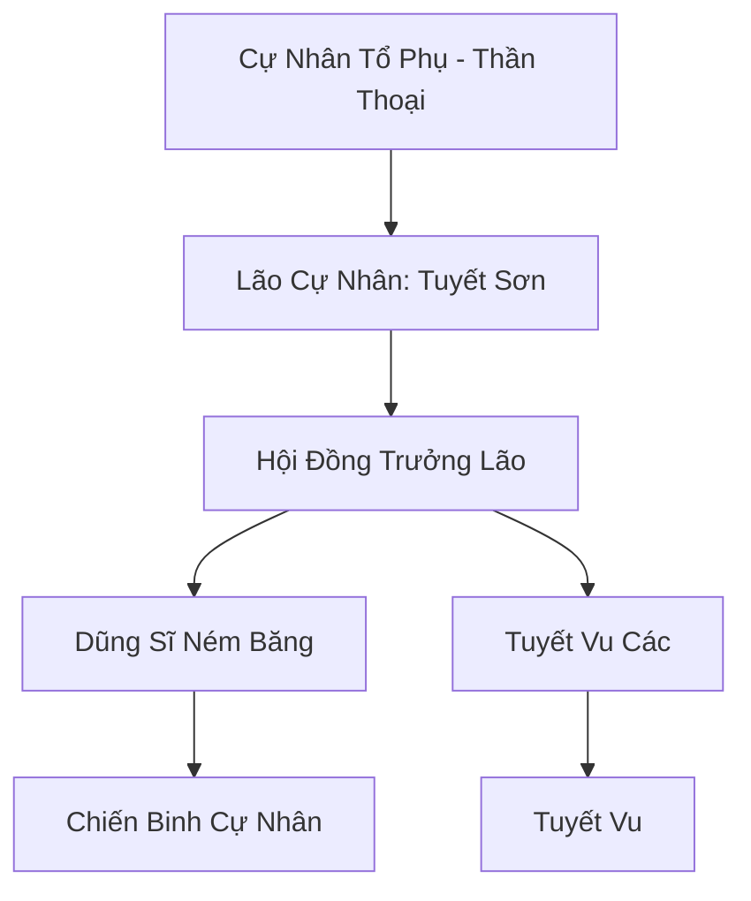

# TUYẾT CỰ NHÂN ĐẢO (雪巨人岛)

## I. Tổng Quan (总览)
Tuyết Cự Nhân Đảo là nơi trú ngụ cuối cùng của chủng tộc Tuyết Cự Nhân thuần huyết tại phương Bắc. Đây là một bộ lạc nguyên thủy, sống tách biệt với thế giới tu chân hiện đại. Những người khổng lồ tại đây cao tới 20-30 trượng, có làn da trắng như tuyết và sức mạnh thể chất có thể dời núi lấp biển. Dù có ngoại hình đáng sợ, họ vốn là chủng tộc hiền lành, chỉ mong muốn cuộc sống bình yên giữa băng giá vĩnh cửu.

## II. Địa Lý & Tài Nguyên (地理 với tài nguyên)
Trụ sở chính là hòn đảo Tuyết Cự Nhân nằm cô độc giữa biển Bắc Băng, nơi có nhiệt độ thấp đến mức linh khí có thể đóng băng thành tinh thể. Tài nguyên của đảo bao gồm các mỏ "Băng Tinh Linh Thạch" lộ thiên và các loại rêu tuyết chứa linh lực thủy hệ đậm đặc. Hòn đảo cũng là nơi tập trung xác của nhiều loài yêu thú biển khổng lồ do dòng hải lưu đưa tới.

## III. Văn Hóa & Tín Ngưỡng (文化 với信仰)
Tôn thờ Cự Nhân Tổ Phụ và linh hồn của Bão Tuyết. Cư dân tin rằng họ là những mảnh vỡ của núi băng có linh hồn. Văn hóa cự nhân rất đơn giản, không có chữ viết phức tạp mà truyền đạt thông qua các hình vẽ trên vách đá và tiếng gầm trầm hùng. Họ có tập tục ngủ đông kéo dài hàng chục năm để hấp thụ linh khí đất trời.

## IV. Cơ Cấu Tổ Chức (组织结构)


## V. Công Pháp & Trận Pháp (功法 với阵法)
- **Công Pháp:** Không có công pháp nhân tạo, sức mạnh đến từ *Huyết Mạch Tuyết Thần* (Tự động hấp thụ băng khí để cường hóa cơ thể).
- **Trận Pháp:** *Tuyết Vực Hộ Đảo Trận* - một trận pháp tự nhiên được các Tuyết Vu duy trì, tạo ra các trận đại bão tuyết vây quanh đảo để ngăn chặn tàu thuyền tiếp cận.

## VI. Đặc Sản Môn Phái (门派特产)
- **Băng Thạch Chùy:** Vũ khí thô sơ nhưng nặng hàng vạn cân, có khả năng đập tan mọi kết giới phòng thủ cấp thấp.
- **Tuyết Tinh Nhựa:** Nhựa cây từ rừng băng trên đảo, có tác dụng chữa lành vết thương nhục thân cực nhanh.

## VII. Cơ Sở Hạ Tầng (基础设施)
- **Đỉnh Núi Băng Vĩnh Cửu:** Nơi trú ngụ của Lão Cự Nhân và là điểm cao nhất để quan sát quân địch.
- **Hang Trú Đông:** Hệ thống hang động khổng lồ dưới lòng đất được lót bằng da thú và cỏ khô.

## VIII. Kinh Tế (経済)
Kinh tế tự cung tự cấp. Họ săn bắt cá voi và các loài thú biển để lấy thực phẩm. Thỉnh thoảng, họ trao đổi băng tinh thạch cho Hải Tộc để lấy các loại gia vị hoặc vật dụng bằng kim loại mà họ không thể tự chế tạo.

## IX. Lịch Sử Tóm Tắt (简史)
Là tàn dư của đại gia đình Cự Tộc thời Thái Cổ đã từ chối tham gia vào các cuộc chiến giành quyền lực của Cự Linh Tông. Họ di cư về phương Bắc lạnh giá để tìm kiếm sự tĩnh lặng. Qua hàng vạn năm, dòng máu của họ dần hòa quyện với băng tuyết, tạo nên chủng tộc Tuyết Cự Nhân như ngày nay.

## X. Giai Thoại & Bí Mật (轶 sự với bí mật)
Tương truyền trái tim của hòn đảo này là một viên "Băng Phách" khổng lồ, và nếu nó bị đánh cắp, toàn bộ tộc Tuyết Cự Nhân sẽ tan chảy thành nước biển.

## XI. Quan Hệ Thế Lực (势力关系)
```mermaid
graph LR
    TCNĐ[Tuyết Cự Nhân Đảo] -- Thân thiện -- HTC[Hải Thần Cung]
    TCNĐ -- Tử địch -- HHHT[Hắc Hải Hải Tặc]
    TCNĐ -- Đồng minh -- CKB[Cự Kình Bảo]
    TCNĐ -- Tránh né -- CQTĐ[Cực Quang Thần Điện]
```
