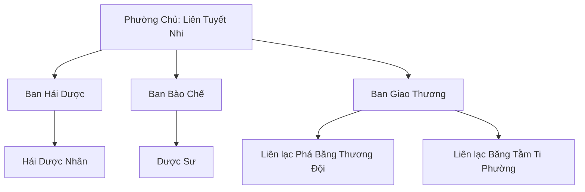

# TUYẾT LIÊN DƯỢC PHƯỜNG (雪莲药坊)

## I. Tổng Quan (总览)
Tuyết Liên Dược Phường là một hội nghề dược liệu nhỏ hoạt động trên sườn phía đông Tuyết Sơn, chuyên hái và bào chế các loại băng linh thảo hoang dã. Được sáng lập cách đây gần trăm năm bởi Liên Bạch Vân — bà ngoại của Phường Chủ hiện tại Liên Tuyết Nhi — Phường đã trở thành nguồn cung dược liệu kháng hàn chính cho các tu sĩ tầng thấp và phàm nhân vùng Bắc Băng.

Với triết lý "Thuốc cứu người, không cứu mệnh", Phường chỉ chuyên trị các bệnh thường và thương tích nhẹ, không dám động đến những vết thương do cường giả gây ra hay các loại đan độc cấp cao. Quy mô nhỏ bé và sản phẩm hạ phẩm khiến Phường hoàn toàn vô hình trong mắt Huyền Băng Cung, nhưng chính sự "vô hình" này lại là lá chắn bảo vệ tốt nhất cho họ. Dưới sự lãnh đạo tĩnh lặng nhưng tận tụy của Liên Tuyết Nhi, Phường đang dần mở rộng phạm vi hoạt động thông qua hợp tác với các thế lực nhỏ khác trong vùng.

## II. Địa Lý & Tài Nguyên (地理 与 资源)
Trụ sở chính của Phường nằm trên sườn phía đông Tuyết Sơn, ở độ cao vừa đủ để các loại băng linh thảo sinh trưởng tự nhiên nhưng không quá cao để chạm vào lãnh thổ của Huyền Băng Cung phía trên đỉnh. Địa hình xung quanh là vách đá dựng đứng phủ tuyết quanh năm, xen kẽ những khe suối đóng băng theo mùa và các vỉa đá nhô ra giữa sương mù dày đặc.

Tài nguyên chính của Phường là các loại băng linh thảo hoang dã mọc trên vách đá: Tuyết Liên thường phẩm — loại phổ biến nhất, dùng bào chế thuốc kháng hàn; Hàn Thảo — loại cỏ xanh đen chuyên mọc ở kẽ nứt đá, có tác dụng giảm đau; Băng Hoa Cỏ — loại hoa nhỏ chỉ nở vào đêm trăng tròn mùa đông, dùng thanh lọc linh lực tạp; và vài chủng nấm chịu lạnh mọc trong các hang đá ẩm ướt. Tất cả đều là dược thảo cấp thấp, nhưng với sự khan hiếm tài nguyên ở Bắc Băng, chúng vẫn có giá trị thương mại đáng kể đối với các tu sĩ tầng thấp và thương đội phương Nam.

## III. Văn Hóa & Tín Ngưỡng (文化 与 信仰)
Phường đề cao triết lý "Thuốc cứu người, không cứu mệnh" — nghĩa là họ sẵn sàng chữa trị cho bất kỳ ai đau ốm, nhưng không can dự vào những tranh đấu sinh tử giữa các thế lực. Khi một tu sĩ bị thương trong giao chiến tìm đến xin thuốc, Phường sẽ chữa trị nhưng không hỏi ai đánh ai, không đứng về bên nào. Sự trung lập này đã giúp Phường tồn tại yên ổn giữa vùng đất đầy rẫy hiểm nguy.

Quy tắc hái dược nghiêm ngặt nhất của Phường là "Không được hái tận gốc — phải để lại rễ cho thảo dược tái sinh." Mỗi hái dược nhân phải thuộc lòng nguyên tắc này trước khi được phép leo vách đá. Ai vi phạm sẽ bị đuổi khỏi Phường vĩnh viễn, không có ngoại lệ. Triết lý bền vững này đảm bảo rằng nguồn dược thảo hoang dã không bao giờ cạn kiệt, dù sản lượng thu hoạch mỗi mùa có hạn chế hơn so với khai thác triệt để.

Mỗi mùa xuân khi tuyết bắt đầu tan, cả Phường cùng leo lên sườn núi tổ chức lễ cúng tế Sơn Thần để xin phép hái thuốc cho mùa mới. Đây vừa là nghi thức tâm linh, vừa là dịp để toàn Phường khảo sát địa hình sau mùa đông, đánh dấu những vùng thảo dược mới mọc và những khu vực nguy hiểm cần tránh.

## IV. Cơ Cấu Tổ Chức (组织结构)


Cơ cấu tổ chức của Phường chia thành ba ban rõ ràng. Ban Hái Dược gồm hai mươi lăm đến ba mươi thành viên, đa phần là phàm nhân khỏe mạnh hoặc tu sĩ Luyện Khí Sơ Kỳ, chuyên leo vách đá trong điều kiện tuyết giá để thu hoạch dược thảo. Công việc này cực kỳ nguy hiểm, mỗi năm đều có người bị thương nặng do trượt chân hay bão tuyết bất chợt. Ban Bào Chế gồm năm Dược Sư ở cảnh giới Luyện Khí, chịu trách nhiệm phơi sấy, tán nhuyễn, chiết xuất và bào chế đan dược cấp thấp từ nguyên liệu thu về. Ban Giao Thương phụ trách liên lạc với các đối tác thương mại, chủ yếu là Phá Băng Thương Đội và Băng Tằm Ti Phường.

Đứng đầu tất cả là Phường Chủ Liên Tuyết Nhi — nữ tu sĩ Trúc Cơ Hậu Kỳ có hiểu biết sâu rộng về dược lý băng hệ, thừa kế kiến thức từ bà ngoại và phát triển thêm qua nhiều năm tự nghiên cứu.

## V. Công Pháp & Trận Pháp (功法 与 阵法)
- **Công Pháp:** Phường Chủ Liên Tuyết Nhi nắm giữ *Băng Tức Bảo Dược Công* — một bài công pháp đặc thù cho phép người tu luyện phóng ra hàn khí cực nhẹ từ lòng bàn tay, giúp bảo quản dược thảo tươi lâu hơn gấp ba lần so với phương pháp thông thường. Ngoài ra, các hái dược nhân được huấn luyện kỹ thuật *Tuyết Bích Bộ Pháp* — một bộ thân pháp leo vách đá trên bề mặt tuyết trơn trượt, kết hợp giữa kỹ thuật phàm nhân và chút vận khí cơ bản để bám chắc vào đá.
- **Trận Pháp:** Phường không sở hữu trận pháp phòng thủ chính quy nào. Phòng thủ chủ yếu dựa vào địa hình tự nhiên — vách đá dựng đứng và đường lên sườn núi quanh co hiểm trở khiến kẻ thù khó tiếp cận. Phòng Bào Chế có một kết giới nhiệt độ nhỏ do Liên Tuyết Nhi tự thiết lập, duy trì môi trường ổn định cho quá trình chế dược, nhưng không có giá trị phòng thủ chiến đấu.

## VI. Đặc Sản Môn Phái (门派特产)
- **Tuyết Liên Kháng Hàn Hoàn:** Loại đan dược phổ thông nhất của Phường, viên tròn màu trắng sữa, uống vào giúp cơ thể chịu được nhiệt độ cực thấp trong vài canh giờ. Rẻ tiền, dễ sử dụng, là sản phẩm bán chạy nhất cho các thương đội và hành khách qua vùng Bắc Băng.
- **Hàn Thảo Cao:** Một loại cao dán chế từ Hàn Thảo nghiền nhuyễn trộn với mỡ thú, dán lên vết thương có tác dụng giảm đau, kháng viêm và ngăn hoại tử do giá lạnh. Phàm nhân và tu sĩ tầng thấp đều có thể sử dụng.
- **Băng Hoa Tịnh Linh Dịch:** Sản phẩm cao cấp nhất của Phường, chiết xuất từ Băng Hoa Cỏ hái vào đêm trăng tròn, dạng dung dịch trong suốt có ánh xanh nhạt. Dùng để thanh lọc linh lực tạp trong kinh mạch cho tu sĩ Luyện Khí, sản lượng rất hạn chế nên giá khá cao.

## VII. Cơ Sở Hạ Tầng (基础设施)
- **Sơn Trang Dược Phường:** Tổ hợp nhà gỗ và hang đá trên sườn núi, bao gồm phòng ở, kho chứa nguyên liệu và khu vực phơi sấy dược thảo ngoài trời. Kiến trúc giản dị, hòa mình vào vách đá tự nhiên, khó nhận ra từ xa.
- **Phòng Bào Chế:** Một hang đá tự nhiên được cải tạo thành phòng thí nghiệm, bên trong có bếp luyện đan nhỏ, các dụng cụ nghiền, chiết xuất và hệ thống giá gỗ lưu trữ thành phẩm. Nhiệt độ và độ ẩm được duy trì ổn định nhờ kết giới của Phường Chủ.
- **Vườn Ươm Băng Linh Thảo:** Một khu vườn thử nghiệm nhỏ nơi Liên Tuyết Nhi cố gắng thuần hóa và nhân giống một số loại dược thảo hoang dã. Kết quả còn hạn chế, nhưng vài loại Hàn Thảo đã bắt đầu mọc ổn định.

## VIII. Kinh Tế (经济)
Kinh tế của Phường dựa trên mô hình thu hoạch — bào chế — xuất khẩu đơn giản. Mỗi mùa hái dược, Ban Hái Dược thu về nguyên liệu thô, Ban Bào Chế chế tác thành phẩm, sau đó giao cho Phá Băng Thương Đội vận chuyển đi bán tại các chợ rìa nam Bắc Băng và Trung Thổ. Doanh thu chính đến từ Tuyết Liên Kháng Hàn Hoàn — sản phẩm giá rẻ nhưng nhu cầu cao. Bên cạnh đó, Phường trao đổi hàng hóa trực tiếp với Băng Tằm Ti Phường — cung cấp thảo dược làm thức ăn cho tằm và nhận lại tơ băng tằm dùng bọc thuốc cao cấp.

Một phần nhỏ doanh thu được Liên Tuyết Nhi trích ra để tặng dược liệu miễn phí cho Tuyết Trung Cô Viện mỗi mùa, coi đây là trách nhiệm đạo đức chứ không phải nghĩa vụ thương mại. Nhìn chung, Phường không giàu có nhưng duy trì được sự ổn định tài chính nhờ vào việc kiểm soát tốt chi phí và giữ quan hệ thương mại bền vững với các đối tác.

## IX. Lịch Sử Tóm Tắt (简史)
Gần trăm năm trước, Liên Bạch Vân — một nữ dược sư lang thang — phát hiện một vùng băng linh thảo dồi dào trên sườn phía đông Tuyết Sơn. Bà dựng căn lều đầu tiên tại đây, bắt đầu hái và bào chế thuốc cho phàm nhân vùng chân núi. Dần dần, tiếng lành đồn xa, những hái dược nhân và dược sư nghèo tìm đến gia nhập, hình thành nên Tuyết Liên Dược Phường.

Liên Bạch Vân qua đời khi Liên Tuyết Nhi mới mười lăm tuổi, để lại cho cháu gái toàn bộ kiến thức dược lý và một sơn trang nhỏ bé trên sườn núi. Liên Tuyết Nhi kế thừa vị trí Phường Chủ, vừa tu luyện vừa phát triển Phường từ một nhóm hái thuốc lẻ tẻ thành một hội nghề có tổ chức. Bà thiết lập quan hệ thương mại ổn định với Phá Băng Thương Đội, kết nối cộng sinh với Băng Tằm Ti Phường, và mới đây bắt đầu hợp tác với Hàn Độc Vi Trùng Đoàn để thanh lọc các vùng đất nhiễm hàn độc — mở rộng diện tích hái dược an toàn.

Huyền Băng Cung biết sự tồn tại của Phường từ lâu nhưng chưa bao giờ quan tâm, bởi những thảo dược mà Phường thu hoạch chỉ là hạ phẩm tầm thường trong mắt đại tông môn thống trị phương Bắc.

## X. Giai Thoại & Bí Mật (轶事 与 秘密)
Bí mật lớn nhất của Liên Tuyết Nhi là việc cô tình cờ phát hiện một gốc Tuyết Liên ngàn năm ẩn sâu trong khe đá hẹp gần đỉnh Tuyết Sơn. Đây là loại linh thảo cực phẩm mà Huyền Băng Cung sẵn sàng giết người để đoạt, có thể dùng luyện chế Tuyết Liên Đan — loại đan dược tịnh hóa tâm ma và hồi phục linh lực thượng phẩm. Liên Tuyết Nhi không dám hái, không dám báo cáo, chỉ âm thầm ghi nhớ vị trí và cầu nguyện rằng không ai khác tìm thấy nó. Cô biết rằng nếu tin tức lộ ra, cả Phường sẽ bị cuốn vào vòng xoáy tranh đoạt mà không có cách nào thoát thân.

Phường âm thầm cung cấp dược liệu cho Tuyết Trung Cô Viện mà không thu một đồng nào. Đây không phải là bí mật — ai trong Phường cũng biết — nhưng Liên Tuyết Nhi không bao giờ nói về nó với người ngoài, vì cô không muốn sự từ thiện trở thành công cụ đánh bóng danh tiếng.

Liên Tuyết Nhi đang bí mật nghiên cứu kết hợp Băng Tằm Ti với băng linh thảo để bào chế một loại đan dược hoàn toàn mới — loại thuốc có thể hồi phục linh căn bị tổn thương nhẹ. Nếu thành công, đây sẽ là bước đột phá không chỉ cho Phường mà cho toàn bộ ngành dược đạo Bắc Băng. Tuy nhiên, nghiên cứu vẫn đang ở giai đoạn sơ khai, và cô chưa dám chia sẻ với bất kỳ ai ngoài Tằm Mẫu của Băng Tằm Ti Phường.

## XI. Quan Hệ Thế Lực (势力关系)
```mermaid
graph LR
    TLDP[Tuyết Liên Dược Phường] -- Vận chuyển -- PBTD[Phá Băng Thương Đội]
    TLDP -- Cộng sinh -- BTTP[Băng Tằm Ti Phường]
    TLDP -- Từ thiện -- TTCV[Tuyết Trung Cô Viện]
    TLDP -- Hợp tác -- HDVTD[Hàn Độc Vi Trùng Đoàn]
    TLDP -- Bị phớt lờ -- HBC[Huyền Băng Cung]
```
