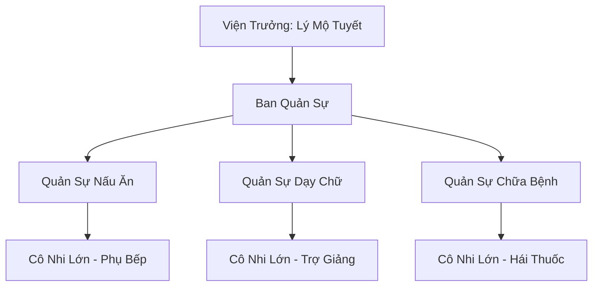

# TUYẾT TRUNG CÔ VIỆN (雪中孤院)

## I. Tổng Quan (总览)
Tuyết Trung Cô Viện là một viện mồ côi nhỏ bé nằm giữa vùng tundra hẻo lánh phía bắc, do lão tu sĩ Lý Mộ Tuyết — cựu ngoại môn đệ tử Huyền Băng Cung — một tay dựng nên hơn trăm năm trước. Viện thu nhận mọi đứa trẻ bị bỏ rơi, bất kể xuất thân là phàm nhân, phế linh căn hay thậm chí con lai yêu tộc. Với tôn chỉ "Mọi sinh linh đều xứng đáng được sống", Cô Viện tồn tại như một đốm lửa nhỏ giữa băng nguyên vô tận, nơi tình thương của một người phụ nữ già chống chọi lại sự tàn khốc của thiên nhiên và sự thờ ơ của thế giới tu tiên.

Dù không có bất kỳ thế lực hay tài nguyên đáng kể nào, Cô Viện vẫn âm thầm tồn tại qua hàng trăm mùa đông khắc nghiệt nhờ vào kết giới giữ ấm của Viện Trưởng, sự viện trợ lẻ tẻ từ các tổ chức tốt bụng, và nghị lực phi thường của bà Lý Mộ Tuyết. Tuy nhiên, kết giới đang yếu dần theo tuổi tác của Viện Trưởng, và câu hỏi ai sẽ kế tục sứ mệnh này khi bà qua đời vẫn chưa có lời đáp.

## II. Địa Lý & Tài Nguyên (地理 与 资源)
Cô Viện tọa lạc giữa vùng tundra Bắc Băng bằng phẳng, cách rìa nam hàng trăm dặm, xa rời mọi tuyến đường thương mại và lãnh thổ của các tông môn lớn. Địa hình xung quanh là đồng cỏ đóng băng vĩnh cửu, gió rít không ngừng suốt chín tháng trong năm, chỉ ba tháng ngắn ngủi mùa hè tuyết mới giảm bớt để lộ ra những thảm rêu địa y xám xịt.

Tài nguyên của viện gần như không tồn tại. Không có mạch linh khí, không có mỏ linh thạch, không có dược thảo quý giá. Nguồn sống chính đến từ việc săn bắt thỏ tuyết và chim gà lôi hoang dã xung quanh, cùng với viện trợ lương thực từ Băng Nguyên Tán Tu Hội và dược liệu miễn phí từ Tuyết Liên Dược Phường. Nguồn nước uống là tuyết tan được đun sôi trên bếp lửa linh lực trung tâm — thứ tài sản quý giá nhất mà viện sở hữu.

## III. Văn Hóa & Tín Ngưỡng (文化 与 信仰)
Triết lý cốt lõi của Cô Viện cực kỳ đơn giản: "Mọi sinh linh đều xứng đáng được sống." Lý Mộ Tuyết không phân biệt xuất thân chủng tộc, không ép buộc tu luyện, không đòi hỏi trung thành. Những đứa trẻ lớn lên trong viện được tự do ra đi bất cứ lúc nào, và nhiều đứa đã làm vậy — trở thành phàm nhân bình thường ở các làng chân núi, hoặc may mắn được các tông môn nhỏ thu nhận làm đệ tử.

Phong tục nổi bật nhất của viện là "Đêm Kể Chuyện Bên Bếp Lửa". Mỗi đêm tuyết rơi dày, Viện Trưởng ngồi bên bếp lửa trung tâm kể cho lũ trẻ nghe những câu chuyện về thế giới tu tiên — về các bậc tiên nhân bay lượn trên chín tầng trời, về những trận chiến long trời lở đất, về những bài học nhân quả và lòng nhân ái. Với nhiều đứa trẻ, đây là giây phút hạnh phúc nhất trong ngày, và những câu chuyện này đã gieo mầm ước mơ trong không ít trái tim nhỏ bé.

Viện không theo bất kỳ tín ngưỡng hay giáo phái nào. Lý Mộ Tuyết tin vào sự tử tế giữa con người với nhau, không cần thần phật hay thiên đạo phải phán xét.

## IV. Cơ Cấu Tổ Chức (组织结构)


Cơ cấu tổ chức của Cô Viện cực kỳ đơn giản, gần như mang tính gia đình hơn là một thế lực chính quy. Viện Trưởng Lý Mộ Tuyết đứng đầu mọi quyết định, bên dưới là ba Quản Sự — đều là tu sĩ Trúc Cơ đã từ bỏ con đường tu luyện vì nhiều lý do khác nhau, chọn ở lại Cô Viện phụ giúp bà chăm sóc lũ trẻ. Một người phụ trách nấu ăn và hậu cần, một người dạy chữ và kiến thức cơ bản, người còn lại lo việc chữa bệnh và thuốc thang. Các cô nhi lớn tuổi hơn (từ mười hai trở lên) được phân công phụ giúp các Quản Sự, vừa học nghề vừa giảm bớt gánh nặng cho người lớn. Tổng cộng viện có khoảng sáu mươi đến tám mươi đứa trẻ, đa số là phàm nhân hoặc mang linh căn phế, chỉ vài đứa có chút thiên phú tu luyện.

## V. Công Pháp & Trận Pháp (功法 与 阵法)
- **Công Pháp:** Viện Trưởng nắm giữ vài bài công pháp Băng hệ cơ bản từ thời còn là ngoại môn đệ tử Huyền Băng Cung, bao gồm *Hàn Tức Dưỡng Thân Công* dùng để giữ ấm cơ thể và *Băng Trần Chỉ* — một chiêu công kích đơn giản bằng linh lực hàn băng tụ lại đầu ngón tay. Bà chỉ dạy những phần cơ bản nhất cho các đứa trẻ có chút thiên phú, không phải để đào tạo chiến binh mà để giúp chúng sinh tồn trong môi trường khắc nghiệt.
- **Trận Pháp:** *Ôn Noãn Kết Giới* — một kết giới ấm áp bao quanh toàn bộ khu vực viện, giữ cho nhiệt độ bên trong không xuống dưới mức nguy hiểm. Trận pháp này tiêu tốn phần lớn linh lực của Viện Trưởng để duy trì, và đang ngày càng yếu dần theo tuổi tác của bà. Đây là thứ duy nhất giữ cho Cô Viện tồn tại giữa mùa đông Bắc Băng, nếu kết giới sụp đổ, viện sẽ không thể chống chọi nổi cái lạnh cực hạn.

## VI. Đặc Sản Môn Phái (门派特产)
- **Cháo Tuyết Linh:** Một loại cháo nóng nấu từ hạt cốc hoang dã và vài lá dược thảo chịu lạnh, tuy đơn giản nhưng có tác dụng sưởi ấm lục phủ ngũ tạng và tăng cường sức đề kháng cho trẻ nhỏ trong mùa bão tuyết. Công thức do Quản Sự chữa bệnh tự nghiên cứu, được Tuyết Liên Dược Phường đánh giá là "thô sơ nhưng hiệu quả đáng ngạc nhiên".
- **Tuyết Nhân Phù:** Những tấm phù lục vẽ bằng mực than trên vỏ cây, do Viện Trưởng tự tay vẽ cho mỗi đứa trẻ khi chúng rời viện. Phù lục mang theo một chút linh lực hàn băng của bà, có thể bảo vệ người mang khỏi giá rét trong vài ngày — đủ để một đứa trẻ đi bộ đến làng gần nhất. Nhiều cựu cô nhi vẫn giữ tấm phù này bên mình như vật kỷ niệm thiêng liêng.

## VII. Cơ Sở Hạ Tầng (基础设施)
- **Đại Sảnh Bếp Lửa:** Phòng chính của viện, trung tâm là một bếp lửa linh lực được Viện Trưởng duy trì bằng chính linh lực của mình. Đây vừa là nơi ăn uống, vừa là nơi dạy học, vừa là nơi kể chuyện và ngủ nghỉ của lũ trẻ vào những đêm lạnh nhất.
- **Nhà Ở Gỗ Thông:** Ba căn nhà gỗ nhỏ xây từ gỗ thông tuyết — loại cây duy nhất mọc được ở tundra — dùng làm phòng ngủ cho các nhóm trẻ theo độ tuổi. Tường được trét bùn đất trộn rêu để giữ ấm, mái lợp da thú.
- **Vườn Rau Kết Giới:** Một mảnh vườn nhỏ bên trong phạm vi kết giới, nơi Quản Sự trồng vài loại rau và dược thảo chịu lạnh. Sản lượng rất hạn chế nhưng giúp bổ sung dinh dưỡng cho lũ trẻ.

## VIII. Kinh Tế (经济)
Cô Viện không có nền kinh tế theo đúng nghĩa. Toàn bộ nguồn sống phụ thuộc vào sự từ thiện và tự cung tự cấp. Lương thực chính đến từ viện trợ của Băng Nguyên Tán Tu Hội — các tán tu thỉnh thoảng mang theo gạo, muối và thịt khô khi đi ngang qua. Dược liệu do Tuyết Liên Dược Phường tặng miễn phí mỗi mùa, đủ để chữa trị các bệnh vặt cho lũ trẻ. Một số cựu cô nhi đã trưởng thành quay lại thăm viện, mang theo vải vóc, dụng cụ và đôi khi cả vài viên linh thạch vụn.

Ngoài ra, Quản Sự và các cô nhi lớn thỉnh thoảng đi săn thỏ tuyết và gà lôi hoang dã quanh viện để bổ sung thực phẩm. Tuy nhiên, mỗi mùa đông khắc nghiệt, viện luôn phải đối mặt với nguy cơ thiếu lương thực trầm trọng, và Viện Trưởng nhiều lần phải nhịn ăn để nhường phần cho lũ trẻ.

## IX. Lịch Sử Tóm Tắt (简史)
Hơn một trăm hai mươi năm trước, Lý Mộ Tuyết còn là ngoại môn đệ tử Huyền Băng Cung, tu luyện cần mẫn nhưng thiên phú tầm thường. Trong một lần tuần tra ngoại vi tông môn, bà phát hiện một đứa trẻ yêu tộc bị thương nặng giữa tuyết. Thay vì tiêu diệt như quy định của tông môn, bà đã cứu chữa và giấu đứa trẻ. Khi sự việc bại lộ, Huyền Băng Cung trục xuất bà ra khỏi tông môn, xóa sạch danh tịch, tịch thu mọi pháp khí — chỉ chừa lại bộ công pháp cơ bản mà bà đã thuộc lòng.

Lang thang trên tundra, Lý Mộ Tuyết bắt gặp ngày càng nhiều đứa trẻ bị bỏ rơi — con của phàm nhân chết vì bão tuyết, trẻ phế linh căn bị tông môn từ bỏ, thậm chí cả những đứa trẻ nửa người nửa yêu không nơi nương tựa. Bà dựng Cô Viện từ vài tấm ván gỗ và một tấm lòng, âm thầm nuôi nấng hàng trăm đứa trẻ qua nhiều thế hệ. Phần lớn lớn lên thành phàm nhân bình thường, vài đứa may mắn được tông môn nhỏ thu nhận.

Viện đã trải qua ba lần suýt bị xóa sổ: lần thứ nhất do đại bão tuyết năm 99.910 phá hủy gần như toàn bộ nhà cửa, lần thứ hai do bầy yêu thú tuyết lang tấn công năm 99.940, lần thứ ba do tuyết tặc cướp sạch lương thực năm 99.960. Cả ba lần đều nhờ sự giúp đỡ kịp thời của Hàn Dân Hộ Vệ Đội hoặc các tán tu qua đường mà viện mới sống sót.

## X. Giai Thoại & Bí Mật (轶事 与 秘密)
Có tin đồn rằng Lý Mộ Tuyết từng có cơ hội đột phá Nguyên Anh khi còn trẻ. Bà đã tích lũy đủ tài nguyên và đạt đến ngưỡng Kim Đan Hậu Kỳ, nhưng vào đúng thời khắc quyết định, một đứa trẻ trong viện mắc bệnh nặng cần một loại linh dược cực kỳ đắt đỏ để cứu mạng. Bà dùng toàn bộ tài nguyên tu luyện để mua thuốc, từ bỏ vĩnh viễn cơ hội tiến cảnh. Kể từ đó, tu vi của bà dừng lại ở Kim Đan Trung Kỳ và bắt đầu suy giảm theo tuổi tác.

Trong viện có một đứa trẻ đặc biệt — đôi mắt của nó đổi màu khi trời xuất hiện cực quang, từ đen thường chuyển sang lam ngọc rực rỡ. Chưa ai biết đó là dấu hiệu của huyết mạch gì, và Viện Trưởng cố ý giấu kín hiện tượng này để tránh sự dòm ngó của các thế lực bên ngoài.

Trong ngăn kéo bàn của Viện Trưởng có một phong thư đóng dấu sáp của Huyền Băng Cung, được gửi đến cách đây ba mươi năm bởi một sứ giả ẩn danh. Bà chưa bao giờ mở nó, không phải vì sợ hãi, mà vì bà không muốn bất kỳ thứ gì từ tông môn cũ can thiệp vào cuộc sống yên bình mà bà đã gây dựng cho lũ trẻ.

## XI. Quan Hệ Thế Lực (势力关系)
```mermaid
graph LR
    TTCV[Tuyết Trung Cô Viện] -- Nhận dược liệu -- TLDP[Tuyết Liên Dược Phường]
    TTCV -- Nhận lương thực -- BNTTH[Băng Nguyên Tán Tu Hội]
    TTCV -- Được bảo vệ -- HDHVĐ[Hàn Dân Hộ Vệ Đội]
    TTCV -- Bị coi thường -- HBC[Huyền Băng Cung]
```
