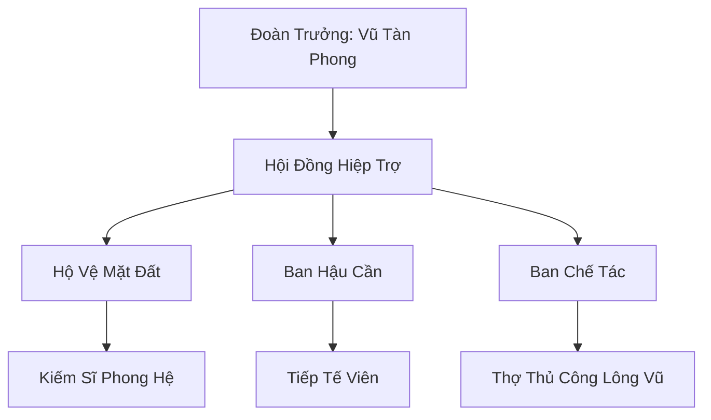

# ĐOẢN DỰC LẠC ĐOÀN (断翼落团)

## I. Tổng Quan (总览)
Đoản Dực Lạc Đoàn là một cộng đồng gồm những cá thể Vũ Tộc (người có cánh) nhưng không còn khả năng bay lượn do chấn thương hoặc dị tật bẩm sinh. Bị coi là nỗi ô nhục của chủng tộc và bị trục xuất khỏi Vũ Hoàng Các, họ đã tập hợp lại tại chân Tuyết Sơn để cùng nhau học cách sống sót trên mặt đất - một môi trường hoàn toàn xa lạ với bản năng của họ. Với tinh thần "Mất cánh không mất hồn", họ đang dần khẳng định giá trị của mình thông qua những kỹ thuật chiến đấu và sinh tồn mới.

## II. Địa Lý & Tài Nguyên (地理 với tài nguyên)
Trụ sở chính là một khu trại dựng dưới những vách đá chắn gió phía tây chân núi Tuyết Sơn. Địa hình tại đây vừa có rừng tuyết bao phủ vừa có các hang đá kiên cố để tránh bão. Tài nguyên của đoàn bao gồm các loại gỗ rừng tuyết quý hiếm và nguồn lông vũ linh lực tự nhiên thu thập được từ các loài phi cầm cư ngụ trên vách đá cao.

## III. Văn Hóa & Tín Ngưỡng (文化 với信仰)
Đề cao sự kiên cường và lòng tự trọng. Thành viên đoàn coi việc sống tiếp dù không bay được là một thử thách tâm linh tối cao. Văn hóa của họ mang đậm tính hoài niệm về bầu trời nhưng cũng vô cùng thực dụng trong việc thích nghi với mặt đất. Mỗi ngày, họ duy trì tập tục đứng trên đỉnh vách đá nhìn về phía xa như một lời nhắc nhở về nguồn gốc và động lực để vươn lên.

## IV. Cơ Cấu Tổ Chức (组织结构)


## V. Công Pháp & Trận Pháp (功法 với阵法)
- **Công Pháp:** *Lạc Địa Phong Quyền* - quyền pháp do Vũ Tàn Phong sáng tạo, nén linh lực phong hệ vào đôi tay và đôi chân để tạo ra tốc độ và lực sát thương cực lớn mà không cần bay.
- **Trận Pháp:** Sử dụng hệ thống bẫy dây linh lực và đá tảng để tạo ra các vùng hạn chế tốc độ đối với yêu thú hoang dã xâm nhập trại.

## VI. Đặc Sản Môn Phái (门派特产)
- **Lông Vũ Phù:** Các loại bùa chú được khắc trực tiếp lên lông vũ linh cầm, có tác dụng tăng tốc độ di chuyển hoặc làm nhẹ trọng lượng cơ thể.
- **Tuyết Sơn Mộc Khí:** Các vật dụng làm từ gỗ linh mộc có khả năng giữ ấm và dẫn truyền phong linh khí.

## VII. Cơ Sở Hạ Tầng (基础设施)
- **Trại Vách Đá:** Tổ hợp các căn nhà gỗ áp sát vào vách đá để tận dụng sự che chắn tự nhiên.
- **Đài Vọng Không:** Điểm cao nhất của trại dùng để quan sát kẻ thù từ xa và thực hiện các nghi lễ văn hóa.

## VIII. Kinh Tế (経済)
Nguồn thu nhập đến từ việc bán lông vũ rụng thu thập được cho các phường luyện khí và việc trao đổi gỗ linh mộc lấy lương thực từ các làng nhân tộc. Họ cũng thỉnh thoảng hợp tác phòng thủ với Hàn Dân Hộ Vệ Đội để đổi lấy sự hỗ trợ về tài liệu tu luyện cơ bản.

## IX. Lịch Sử Tóm Tắt (简史)
Sáng lập 15 năm trước bởi Vũ Tàn Phong, một cựu chiến binh Vũ Tộc bị gãy cánh trong một cuộc đại chiến. Thay vì tự kết liễu theo tập tục truyền thống, ông đã chọn ở lại mặt đất và giúp đỡ những Vũ Tộc đồng cảnh ngộ, biến một đám người tàn phế thành một cộng đồng có tổ chức và đầy nghị lực.

## X. Giai Thoại & Bí Mật (轶 sự với bí mật)
Tương truyền trong đoàn đang bí mật bảo vệ một Vũ Tộc trẻ bẩm sinh không có cánh nhưng lại sở hữu Phong Linh Căn ở mức độ thần thánh, thực thể được kỳ vọng sẽ tìm ra cách giúp toàn đoàn "bay" lại bằng chính linh lực của mình.

## XI. Quan Hệ Thế Lực (势力关系)
```mermaid
graph LR
    ĐDLD[Đoản Dực Lạc Đoàn] -- Bị khinh bỉ -- VHC[Vũ Hoàng Các]
    ĐDLD -- Hợp tác -- HDHVĐ[Hàn Dân Hộ Vệ Đội]
    ĐDLD -- Đồng cảnh -- BLTĐ[Băng Lang Tàn Đội]
    ĐDLD -- Tránh né -- HBC[Huyền Băng Cung]
```
