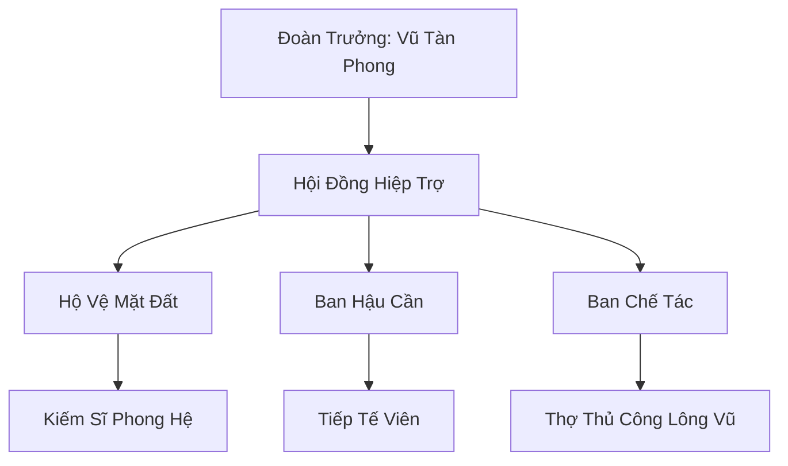

# ĐOẢN DỰC LẠC ĐOÀN (断翼落团)

## I. Tổng Quan (总览)
Đoản Dực Lạc Đoàn là một cộng đồng gồm những cá thể Vũ Tộc (người có cánh) nhưng không còn khả năng bay lượn do chấn thương hoặc dị tật bẩm sinh. Bị coi là nỗi ô nhục của chủng tộc và bị trục xuất khỏi Vũ Hoàng Các, họ đã tập hợp lại tại chân Tuyết Sơn để cùng nhau học cách sống sót trên mặt đất — một môi trường hoàn toàn xa lạ với bản năng của họ. Với tinh thần *"Mất cánh không mất hồn"*, họ đang dần khẳng định giá trị của mình thông qua những kỹ thuật chiến đấu và sinh tồn mới mà không Vũ Tộc nào từng nghĩ đến. Vũ Tàn Phong thường nói với đồng đội: *"Trời cao không phải là nơi duy nhất có tự do — đất này cũng đủ rộng cho ta đi."* Ba mươi đôi cánh gãy ấy đã tìm được một con đường riêng, dù đầy chông gai.

## II. Địa Lý & Tài Nguyên (地理 với tài nguyên)
Trụ sở chính là khu trại "Đoản Dực Trại" dựng dưới những vách đá chắn gió mang tên "Lạc Vũ Nhai" phía tây chân núi Tuyết Sơn — nơi các vách đá dựng đứng tạo ra một vùng trũng tự nhiên ít gió, thích hợp cho việc cư trú. Địa hình tại đây vừa có "Bạch Tùng Lâm" — rừng thông tuyết cổ thụ bao phủ — vừa có các hang đá kiên cố gọi là "Thạch Sào" để tránh đại bão. Tài nguyên của đoàn bao gồm các loại gỗ rừng tuyết quý hiếm — đặc biệt là gỗ "Hàn Tùng" có khả năng dẫn truyền phong linh khí — và nguồn lông vũ linh lực tự nhiên thu thập được từ các loài phi cầm cư ngụ trên vách đá cao. Khu vực "Vũ Lạc Thác" — thác nước đóng băng một nửa gần trại — là nguồn cung cấp nước sinh hoạt chính.

## III. Văn Hóa & Tín Ngưỡng (文化 với信仰)
Đề cao sự kiên cường và lòng tự trọng. Thành viên đoàn coi việc sống tiếp dù không bay được là một thử thách tâm linh tối cao — họ gọi đó là "Lạc Địa Tu Hành". Văn hóa của họ mang đậm tính hoài niệm về bầu trời nhưng cũng vô cùng thực dụng trong việc thích nghi với mặt đất. Mỗi ngày, họ duy trì tập tục "Vọng Thiên Lễ" — đứng trên đỉnh vách đá nhìn về phía xa khi bình minh lên, dang hai cánh gãy đón gió, như một lời nhắc nhở về nguồn gốc và động lực để vươn lên. Nghi thức quan trọng nhất là "Lễ Đoạn Dực" — khi có thành viên mới gia nhập, toàn đoàn sẽ cùng cắt một sợi lông vũ từ cánh gãy và đan thành vòng tay mang suốt đời, tượng trưng cho sự đoàn kết giữa những kẻ bị ruồng bỏ. Bài hát truyền thống *"Vũ Lạc Ca"* — *"Cánh gãy trời không thương, đất này ta tự bước"* — được hát mỗi tối bên lửa trại.

## IV. Cơ Cấu Tổ Chức (组织结构)


## V. Công Pháp & Trận Pháp (功法 với阵法)
- **Công Pháp:** *Lạc Địa Phong Quyền* - quyền pháp do Vũ Tàn Phong sáng tạo sau mười năm khổ luyện trên mặt đất, nén linh lực phong hệ vào đôi tay và đôi chân để tạo ra tốc độ và lực sát thương cực lớn mà không cần bay. Mỗi đòn đánh tạo ra một luồng gió cắt sắc như lưỡi kiếm, và khi thi triển liên tục, xung quanh người dùng sẽ hình thành một "Phong Giáp" vô hình có khả năng chặn đòn tấn công vật lý.
- **Trận Pháp:** Sử dụng hệ thống bẫy "Phong Dây Trận" kết hợp dây linh lực và đá tảng để tạo ra các vùng hạn chế tốc độ đối với yêu thú hoang dã xâm nhập trại. Khi kẻ thù vướng vào bẫy, hệ thống dây sẽ siết chặt và đồng thời giải phóng phong linh khí tạo ra các lưỡi gió cắt — đơn giản nhưng hiệu quả đáng ngạc nhiên với yêu thú cấp Luyện Khí.

## VI. Đặc Sản Môn Phái (门派特产)
- **Lông Vũ Phù "Phong Vũ Phù":** Các loại bùa chú được khắc trực tiếp lên lông vũ linh cầm bằng mực chế từ nhựa Hàn Tùng, có tác dụng tăng tốc độ di chuyển hoặc làm nhẹ trọng lượng cơ thể. Mỗi bùa dùng được ba lần, giá mười linh thạch hạ phẩm — rẻ và tiện dụng, rất được lữ khách ưa chuộng.
- **Tuyết Sơn Mộc Khí "Hàn Tùng Khí":** Các vật dụng làm từ gỗ Hàn Tùng có khả năng giữ ấm và dẫn truyền phong linh khí — từ bát đũa đến gậy chống, đều mang theo một lớp phong khí nhẹ nhàng. Các thương nhân phương Nam coi đây là quà lưu niệm độc đáo từ Bắc Băng.
- **Vòng Tay Đoản Dực:** Vòng tay đan từ lông vũ cánh gãy, mang ý nghĩa tinh thần hơn giá trị vật chất — tượng trưng cho sự kiên cường, được một số tu sĩ mua về làm vật nhắc nhở bản thân.

## VII. Cơ Sở Hạ Tầng (基础设施)
- **Đoản Dực Trại "Lạc Vũ Thôn":** Tổ hợp mười lăm căn nhà gỗ Hàn Tùng áp sát vào vách đá Lạc Vũ Nhai để tận dụng sự che chắn tự nhiên, mái nhà phủ da thú và cỏ tuyết chống bão. Giữa trại là bãi đất trống "Quyền Trường" — nơi Vũ Tàn Phong dạy Lạc Địa Phong Quyền mỗi sáng sớm, mặt đất in đầy dấu chân và vết chém gió.
- **Đài Vọng Không "Nhớ Trời Đài":** Điểm cao nhất của trại — một mỏm đá nhô ra từ vách núi — dùng để quan sát kẻ thù từ xa và thực hiện nghi lễ "Vọng Thiên". Vào những ngày trời quang, từ đây có thể nhìn thấy bóng dáng xa xăm của Vũ Hoàng Các bay lượn trên cao — cảnh tượng vừa đẹp vừa xót xa đối với mọi thành viên.

## VIII. Kinh Tế (経済)
Nguồn thu nhập đến từ việc bán lông vũ rụng thu thập được cho các phường luyện khí — đặc biệt là lông vũ "Bạch Ưng Tuyết Sơn" cực hiếm có giá năm mươi linh thạch hạ phẩm mỗi chiếc — và việc trao đổi gỗ Hàn Tùng lấy lương thực từ các làng nhân tộc. Họ cũng thỉnh thoảng hợp tác phòng thủ với Hàn Dân Hộ Vệ Đội để đổi lấy sự hỗ trợ về tài liệu tu luyện cơ bản. Gần đây, việc bán "Phong Vũ Phù" đã trở thành nguồn thu quan trọng mới — sản phẩm nhỏ gọn, giá rẻ, và cực kỳ hữu ích cho lữ khách, giúp đoàn thoát khỏi cảnh phải sống hoàn toàn phụ thuộc vào săn bắn.

## IX. Lịch Sử Tóm Tắt (简史)
Sáng lập 15 năm trước bởi Vũ Tàn Phong, một cựu chiến binh Vũ Tộc bị gãy cánh trong trận "Phong Sát Đại Chiến" khi hộ tống một đoàn thương thuyền không trung qua bão. Theo tập tục Vũ Hoàng Các, Vũ Tộc mất cánh phải tự kết liễu bằng cách nhảy từ "Tuyệt Vọng Nhai" — nhưng Vũ Tàn Phong đã chọn rơi xuống đất và sống. Ông mất ba năm để học cách đi bộ, năm năm để sáng tạo ra Lạc Địa Phong Quyền, và sau đó bắt đầu tìm kiếm những Vũ Tộc đồng cảnh ngộ. Từ một người, hai người, đến ba mươi — biến một đám người tàn phế thành một cộng đồng có tổ chức và đầy nghị lực mà ngay cả Vũ Hoàng Các cũng phải thầm thừa nhận.

## X. Giai Thoại & Bí Mật (轶 sự với bí mật)
Tương truyền trong đoàn đang bí mật bảo vệ một Vũ Tộc trẻ tên "Vũ Vô Dực" — bẩm sinh không có cánh nhưng lại sở hữu Phong Linh Căn ở mức độ thần thánh, thực thể được kỳ vọng sẽ tìm ra cách giúp toàn đoàn "bay" lại bằng chính linh lực của mình thay vì đôi cánh vật lý. Vũ Tàn Phong đã dành riêng một căn nhà gỗ kín đáo ở rìa trại — "Vô Dực Thất" — để bảo vệ và dạy dỗ đứa trẻ này, tránh xa mọi con mắt tò mò. Ngoài ra, trên vách đá Lạc Vũ Nhai có một bích họa cổ đại bị rêu che phủ, mô tả một Vũ Tộc không có cánh đang bay lên trời bằng luồng gió — phát hiện này khiến Vũ Tàn Phong tin rằng việc bay không cần cánh từng tồn tại trong lịch sử Vũ Tộc.

## XI. Quan Hệ Thế Lực (势力关系)
```mermaid
graph LR
    ĐDLD[Đoản Dực Lạc Đoàn] -- Bị khinh bỉ -- VHC[Vũ Hoàng Các]
    ĐDLD -- Hợp tác -- HDHVĐ[Hàn Dân Hộ Vệ Đội]
    ĐDLD -- Đồng cảnh -- BLTĐ[Băng Lang Tàn Đội]
    ĐDLD -- Tránh né -- HBC[Huyền Băng Cung]
```
