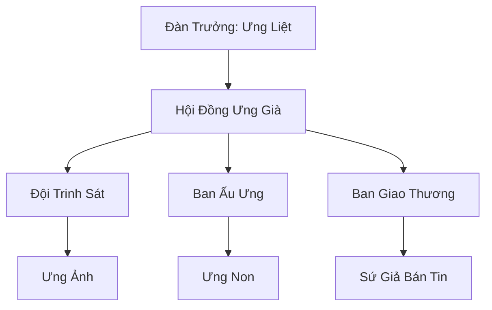

# ĐẠI BÀNG TUYẾT ĐÀN (雪鹰团)

## I. Tổng Quan (总览)
Đại Bàng Tuyết Đàn là một nhóm các ưng yêu chuyên nghiệp hoạt động tại vùng trời phía Bắc Bắc Băng. Với tầm nhìn sắc bén và khả năng bay lượn thượng thừa, họ đã biến bản năng săn mồi thành một dịch vụ cung cấp tin tức và trinh sát vô giá. Dù quân số không đông, đàn đóng vai trò là "đôi mắt trên cao" cho mọi cuộc hành trình xuyên qua vùng tundra đầy rẫy hiểm nguy.

## II. Địa Lý & Tài Nguyên (地理 với tài nguyên)
Hoạt động chủ yếu trên bầu trời tundra mở, nơi có tầm nhìn rộng nhất Bắc Băng. Họ không có căn cứ cố định dưới đất mà thường xuyên di chuyển theo các luồng gió ấm. Tài nguyên quý giá nhất của đàn là hệ thống "Thông Tin Không Trung" - các bản ghi chép chi tiết về sự phân bố của yêu thú và các vết nứt linh mạch rò rỉ dưới lớp băng.

## III. Văn Hóa & Tín Ngưỡng (文化 với信仰)
Đề cao triết lý: "Mắt trên trời, giá trên đất". Thành viên đàn coi sự chính xác của tin tức là danh dự hàng đầu. Văn hóa của họ mang đậm tính kỷ luật và sự kiên nhẫn, đề cao tinh thần độc lập nhưng tuyệt đối trung thành với lộ trình đã phân công. Nghi lễ lớn nhất là cuộc bay xuyên bão tuyết dành cho các ấu ưng để chứng minh tư cách gia nhập đàn.

## IV. Cơ Cấu Tổ Chức (组织结构)


## V. Công Pháp & Trận Pháp (功法 với阵法)
- **Công Pháp:** Dựa trên *Huyết Mạch Ưng Vương*, tập trung vào việc cường hóa nhãn lực và khả năng nương theo sức gió để tiết kiệm linh lực khi bay xa.
- **Trận Pháp:** *Phong Linh Gia Tốc Trận* - trận pháp sơ cấp giúp cả đàn tăng tốc độ bay gấp đôi trong thời gian ngắn để thoát khỏi các trận đại bão đột ngột.

## VI. Đặc Sản Môn Phái (门派特产)
- **Ưng Nhãn Phù:** Loại bùa chú giúp tu sĩ tạm thời có được tầm nhìn cực xa và khả năng nhìn xuyên qua sương mù mỏng.
- **Lông Ưng Tuyết:** Vật liệu nhẹ chứa phong linh khí, thường được dùng để chế tạo cánh phi thuyền hoặc ám khí.

## VII. Cơ Sở Hạ Tầng (基础设施)
- **Tổ Ưng Vách Đá:** Các điểm dừng chân bí mật trên các vách đá cao nhất Bắc Băng, nơi lót bằng cỏ linh sương ấm áp.
- **Đài Vọng Gió:** Các cột đá được khắc phù văn chỉ hướng gió tại các điểm nút giao thông đường không.

## VIII. Kinh Tế (経済)
Nguồn thu nhập chính đến từ việc bán tin tức trinh sát cho các thương đoàn và các hội tán tu. Họ cũng nhận các hợp đồng giao bưu kiện nhỏ cần tốc độ cao hoặc thám thính các khu vực bí cảnh mới lộ diện sau bão.

## IX. Lịch Sử Tóm Tắt (简史)
Được sáng lập bởi Ưng Liệt, một ưng yêu già từng bị thương nặng và mất khả năng chiến đấu đỉnh cao. Thay vì bỏ cuộc, ông nhận ra tiềm năng kinh tế từ việc quan sát và đã tập hợp những đồng loại có chung hoàn cảnh để xây dựng nên Đại Bàng Tuyết Đàn, biến sự suy yếu về thể chất thành sự vượt trội về thông tin.

## X. Giai Thoại & Bí Mật (轶 sự với bí mật)
Tương truyền Ưng Liệt từng nhìn thấy một thực thể khổng lồ đang ngủ say bên dưới lớp băng Bắc Hải, và toàn bộ lộ trình tuần tra của đàn hiện nay thực chất là để âm thầm giám sát sự thức tỉnh của thực thể đó.

## XI. Quan Hệ Thế Lực (势力关系)
```mermaid
graph LR
    ĐBTĐ[Đại Bàng Tuyết Đàn] -- Cung cấp tin -- PBTĐ[Phá Băng Thương Đội]
    ĐBTĐ -- Hợp tác -- HTQTCĐ[Hàn Tinh Quan Trắc Đài]
    ĐBTĐ -- Theo dõi -- BCH[Bạch Cốt Hội]
    ĐBTĐ -- Tránh né -- CQTĐ[Cực Quang Thần Điện]
```
