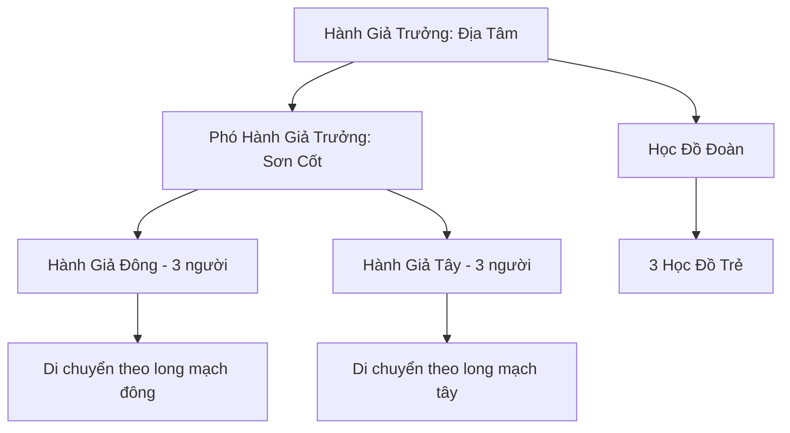

# ĐẠI ĐỊA HÀNH GIẢ (大地行者)

## I. Tổng Quan (总览)
Đại Địa Hành Giả là một hội lỏng lẻo gồm những Cự Tộc lang thang khắp Đông Hoang với một sứ mệnh duy nhất: chữa lành long mạch đang dần suy kiệt. Trong khi các tông phái lớn tranh giành nhau khai thác linh mạch để tu luyện và đúc luyện pháp bảo, những vị Hành Giả khổng lồ này âm thầm đi dọc theo các đường long mạch ngầm dưới lòng đất, đặt bàn tay to lớn lên mặt đất và truyền sinh lực vào những điểm nứt gãy.

Dẫn đầu bởi Địa Tâm — một lão Cự Tộc cao 15 mét với tu vi tương đương Kim Đan — hội chỉ có vẻn vẹn 11 thành viên nhưng sở hữu kiến thức về hệ thống long mạch toàn Đông Hoang mà không một tông phái nào có được. Công việc của họ hoàn toàn âm thầm, không ai biết ơn, không ai ghi nhận. Nhưng nếu không có Đại Địa Hành Giả, long mạch Đông Hoang sẽ suy kiệt nhanh gấp ba lần so với hiện tại, và nhiều vùng đất sẽ trở thành hoang mạc tuyệt linh trong vòng vài trăm năm tới.

## II. Địa Lý & Tài Nguyên (地理 与 资源)
Đại Địa Hành Giả không có trụ sở cố định — bản chất của họ là lang thang. Các Hành Giả di chuyển theo đường long mạch khắp Đông Hoang, dừng chân tại bất kỳ nơi nào long mạch bị tổn thương: có khi là giữa đồng cỏ hoang vu, có khi là dưới chân một ngọn núi đá, có khi là ngay cạnh lãnh thổ của một đại tông phái mà không ai hay biết. Mỗi nơi dừng chân thường là một điểm nút long mạch — nơi các nhánh mạch giao nhau và cũng là nơi dễ bị tổn thương nhất khi bị khai thác quá mức.

Điểm hẹn duy nhất mà tất cả thành viên biết là "Thánh Địa Địa Tâm" — một thung lũng ẩn sâu trong dãy núi giáp ranh Bắc Băng, nơi một long mạch cổ đại vẫn còn nguyên vẹn và phát ra nhịp đập đều đặn như trái tim của đại địa. Hội tụ họp tại đây mỗi năm một lần vào ngày Đông Chí để trao đổi thông tin và huấn luyện học đồ. Tài nguyên vật chất của hội gần như không có gì — chỉ có linh thạch thô nhặt được dọc đường và kiến thức vô giá về long mạch tích lũy qua 200 năm.

## III. Văn Hóa & Tín Ngưỡng (文化 与 信仰)
Triết lý cốt lõi của Đại Địa Hành Giả nằm gọn trong một câu: "Đại địa nuôi ta, ta chữa lành đại địa." Họ coi long mạch không phải là tài nguyên để khai thác mà là huyết quản của một sinh mệnh khổng lồ — chính đại địa — và việc chữa lành long mạch là nghĩa vụ thiêng liêng mà Cự Tộc phải gánh vác.

Quy tắc tối cao của hội là: không bao giờ được khai thác long mạch vì lợi ích cá nhân. Mỗi Hành Giả trước khi lấy bất kỳ thứ gì từ đất đều phải chữa lành trước — dù chỉ là nhặt một viên linh thạch cũng phải trả lại bằng cách truyền một phần sinh lực xuống đất. Quy tắc thứ hai là mỗi Hành Giả có nghĩa vụ truyền dạy ít nhất một học đồ trước khi chết, đảm bảo kiến thức về long mạch không bao giờ thất truyền.

Nghi lễ quan trọng nhất diễn ra trước mỗi lần chữa lành: toàn bộ Cự Tộc có mặt quỳ xuống, đặt cả hai bàn tay khổng lồ lên mặt đất, nhắm mắt và lắng nghe nhịp đập của đại địa. Nghi lễ này có thể kéo dài từ vài khắc đến vài ngày tùy mức độ tổn thương của long mạch, và đối với người ngoài trông giống như một nhóm người khổng lồ đang ngủ gục giữa đồng hoang.

## IV. Cơ Cấu Tổ Chức (组织结构)


Cơ cấu tổ chức của Đại Địa Hành Giả cực kỳ phẳng, phản ánh bản chất của một hội lang thang. Hành Giả Trưởng Địa Tâm là lão Cự Tộc cao 15 mét, người có khả năng cảm nhận long mạch bẩm sinh mạnh nhất trong hội, với tu vi tương đương Kim Đan Trung Kỳ. Lão không ra lệnh mà chỉ hướng dẫn — mỗi Hành Giả tự quyết định đi đâu và chữa gì, chỉ cần tuân thủ các quy tắc cốt lõi.

Bảy Hành Giả chính thức thường hoạt động đơn lẻ hoặc theo nhóm nhỏ 2-3 người, tản ra khắp Đông Hoang theo các tuyến long mạch khác nhau. Khi phát hiện long mạch lớn cần nhiều người chữa, họ gửi tín hiệu qua đất (rung chấn có nhịp điệu mà chỉ Cự Tộc mới cảm nhận được) để triệu tập đồng đội. Ba Học Đồ trẻ luôn đi theo một Hành Giả kinh nghiệm để học cách cảm nhận long mạch, quá trình đào tạo thường kéo dài ít nhất 30 năm.

## V. Công Pháp & Trận Pháp (功法 与 阵法)
- **Công Pháp:** *Đại Địa Cảm Ứng Thuật* — công pháp độc đáo do Địa Tâm sáng tạo dựa trên mối liên hệ bẩm sinh giữa Cự Tộc và đại địa. Tu luyện bằng cách kết nối thể phách với long mạch, cho phép Hành Giả cảm nhận được dòng chảy linh khí trong lòng đất ở bán kính hàng trăm dặm. Khi chữa lành, Hành Giả truyền sinh lực từ cơ thể vào các điểm nứt gãy của long mạch, khiến linh khí tự nhiên khôi phục lưu thông. Đây không phải công pháp chiến đấu — mỗi lần chữa lành đều tiêu hao đáng kể tuổi thọ và sinh lực của Hành Giả.
- **Trận Pháp:** Đại Địa Hành Giả không sử dụng trận pháp nhân tạo. Thay vào đó, họ dùng chính long mạch tự nhiên làm phương tiện — khi nhiều Hành Giả cùng đặt tay lên các điểm nút khác nhau của một long mạch và đồng thời truyền sinh lực, hiệu ứng cộng hưởng tạo ra thứ mà họ gọi là *Đại Địa Cảm Ứng Trận*. Đây là trận pháp mượn sức đất trời, không thể tái tạo bằng bất kỳ phù văn hay trận kỳ nào.

## VI. Đặc Sản Môn Phái (门派特产)
- **Địa Tâm Thạch:** Những viên đá nhỏ được Hành Giả ngậm trong miệng hàng chục năm, thấm đẫm khí tức đại địa. Có thể dùng làm la bàn tìm long mạch hoặc nhận biết linh mạch ẩn. Vô cùng hiếm vì mỗi Hành Giả cả đời chỉ tạo ra được vài viên.
- **Bản Đồ Long Mạch:** Các tấm bản đồ khắc trên đá phẳng ghi chép chi tiết hệ thống long mạch từng vùng, bao gồm cả tình trạng tổn thương và dự đoán xu hướng suy kiệt. Đây là tài sản trí tuệ quý giá nhất của hội, nếu rơi vào tay các tông phái khai thác sẽ là thảm họa cho đại địa.
- **Thuốc Đắp Địa Dược:** Hỗn hợp đất, thảo dược hoang và linh khí đại địa do Hành Giả bào chế, có khả năng chữa lành vết thương ngoại thương và phục hồi kinh mạch tổn thương. Không bán ra ngoài — chỉ tặng cho những ai gặp trên đường.

## VII. Cơ Sở Hạ Tầng (基础设施)
- **Thánh Địa Địa Tâm:** Thung lũng ẩn trong dãy núi giáp ranh Bắc Băng, nơi long mạch cổ đại còn nguyên vẹn. Đây là điểm hội ngộ hàng năm, nơi huấn luyện học đồ và lưu giữ toàn bộ bản đồ long mạch trên các phiến đá lớn.
- **Điểm Nghỉ Dọc Đường:** Các hang động tự nhiên hoặc hốc đá rải rác dọc theo các tuyến long mạch chính, được Hành Giả đánh dấu bằng ký hiệu riêng. Cự Tộc bình thường có thể đi qua mà không nhận ra, nhưng người đã tu Đại Địa Cảm Ứng Thuật sẽ cảm nhận được dấu hiệu qua rung chấn đất.
- **Trụ Đá Ghi Chép:** Các cột đá lớn do Hành Giả dựng tại những điểm nút long mạch quan trọng, khắc ghi tình trạng long mạch và thời điểm chữa lần gần nhất. Người ngoài chỉ thấy đó là những tảng đá bình thường giữa hoang dã.

## VIII. Kinh Tế (经济)
Nền kinh tế của Đại Địa Hành Giả gần như không tồn tại theo nghĩa thông thường. Họ không mua bán, không tích lũy, không giao thương. Linh thạch thô nhặt được dọc đường long mạch chỉ đủ để duy trì tu luyện cơ bản. Lương thực chủ yếu đến từ săn bắt hái lượm trên đường lang thang — với thể hình khổng lồ, một Cự Tộc có thể ăn cả nửa con yêu thú lớn cho một bữa.

Thỉnh thoảng, khi đi qua các bộ lạc Cự Tộc nhỏ hoặc thôn trang hẻo lánh, Hành Giả sẽ đổi công chữa lành đất đai (giúp mùa màng tốt hơn, nguồn nước sạch hơn) để lấy lương thực và vật dụng sinh hoạt. Một số thôn trang coi sự xuất hiện của Hành Giả là điềm lành, vì mỗi lần họ dừng chân, đất đai xung quanh sẽ phì nhiêu hơn trong nhiều năm sau đó. Nhưng đây không phải nguồn thu ổn định — Hành Giả đi đâu, dừng đâu hoàn toàn tùy thuộc vào tình trạng long mạch.

## IX. Lịch Sử Tóm Tắt (简史)
Cự Tộc vốn có mối liên hệ bẩm sinh với đại địa — trong huyết mạch của họ vẫn còn tàn dư từ thời Thượng Cổ khi tổ tiên Cự Tộc được sinh ra trực tiếp từ lòng đất. Tuy nhiên, qua hàng vạn năm, phần lớn Cự Tộc đã quên đi mối liên hệ này, chuyển sang theo đuổi sức mạnh vật lý và luyện thể thuần túy tại Cự Linh Tông.

200 năm trước, Địa Tâm — khi đó là một Cự Tộc trẻ — bắt đầu cảm nhận được nỗi đau lan tỏa từ lòng đất. Long mạch Đông Hoang đang dần suy yếu do sự khai thác ngày càng tàn bạo của các tông phái lớn. Trong khi đồng tộc không ai hiểu lão đang nói gì, Địa Tâm quyết định rời Cự Linh Tông và bắt đầu cuộc hành trình chữa lành đầu tiên. Một mình lang thang suốt 50 năm đầu, lão dần dần hiểu được cấu trúc phức tạp của hệ thống long mạch và phát triển Đại Địa Cảm Ứng Thuật.

Dần dần, một số Cự Tộc trẻ có cùng thiên phú cảm nhận đại địa tìm đến xin theo học. Hội Đại Địa Hành Giả hình thành một cách tự nhiên, không có ngày thành lập chính thức, không có lễ khai sơn — chỉ đơn giản là những kẻ cùng nghe thấy tiếng kêu của đất tụ lại bên nhau. Công việc âm thầm, không ai biết ơn, nhưng nếu không có họ, nhiều vùng đất tại Đông Hoang đã trở thành tử địa từ lâu.

## X. Giai Thoại & Bí Mật (轶事 与 秘密)
Bí mật lớn nhất mà Địa Tâm giữ kín chỉ cho riêng mình là việc phát hiện một long mạch cổ đại khổng lồ bị phong ấn sâu dưới lòng Đông Hoang. Long mạch này không giống bất kỳ mạch nào lão từng gặp — nó cổ xưa hơn cả nền văn minh tu chân hiện tại, và vẫn đang đập theo nhịp chậm rãi như một trái tim đang ngủ. Nếu giải phong ấn, linh khí Đông Hoang sẽ dồi dào chưa từng thấy, nhưng Địa Tâm cảm nhận rằng dưới long mạch đó có thứ gì đó đang bị giam giữ — thứ gì đó khiến ngay cả một lão Cự Tộc Kim Đan cũng phải run sợ khi chạm vào.

Ít ai biết rằng các tông phái lớn khai thác long mạch trong suốt hàng trăm năm qua không hề biết rằng Đại Địa Hành Giả đang âm thầm sửa chữa phần lớn thiệt hại mà họ gây ra. Nếu một ngày Hành Giả ngừng hoạt động, tốc độ suy kiệt long mạch sẽ tăng vọt và toàn bộ hệ thống tu luyện dựa trên linh khí của lục địa sẽ sụp đổ trong vòng vài trăm năm. Đây là một nghịch lý đau đớn: chính sự âm thầm của Hành Giả lại khiến các tông phái tưởng rằng long mạch vẫn ổn và tiếp tục khai thác không thương tiếc.

Ngoài ra, Địa Tâm nghi ngờ rằng sự suy kiệt long mạch không chỉ đến từ việc khai thác — có một thế lực bí ẩn nào đó đang cố tình phá hoại long mạch từ bên trong, nhưng lão chưa tìm ra chứng cứ. Điều này ám ảnh lão trong mỗi giấc ngủ, và lão đang dần hướng cuộc hành trình về phía nguồn cội của long mạch cổ đại để tìm câu trả lời.

## XI. Quan Hệ Thế Lực (势力关系)
```mermaid
graph LR
    ĐĐHG[Đại Địa Hành Giả] -- Tôn kính / Không phục tùng -- CLT[Cự Linh Tông]
    ĐĐHG -- Âm thầm chữa lành -- HKC[Hàn Kiếm Cốc]
    ĐĐHG -- Sửa chữa thiệt hại -- HBC[Huyền Băng Cung]
    ĐĐHG -- Phiền muộn -- CQTĐ[Cực Quang Thần Điện]
```
