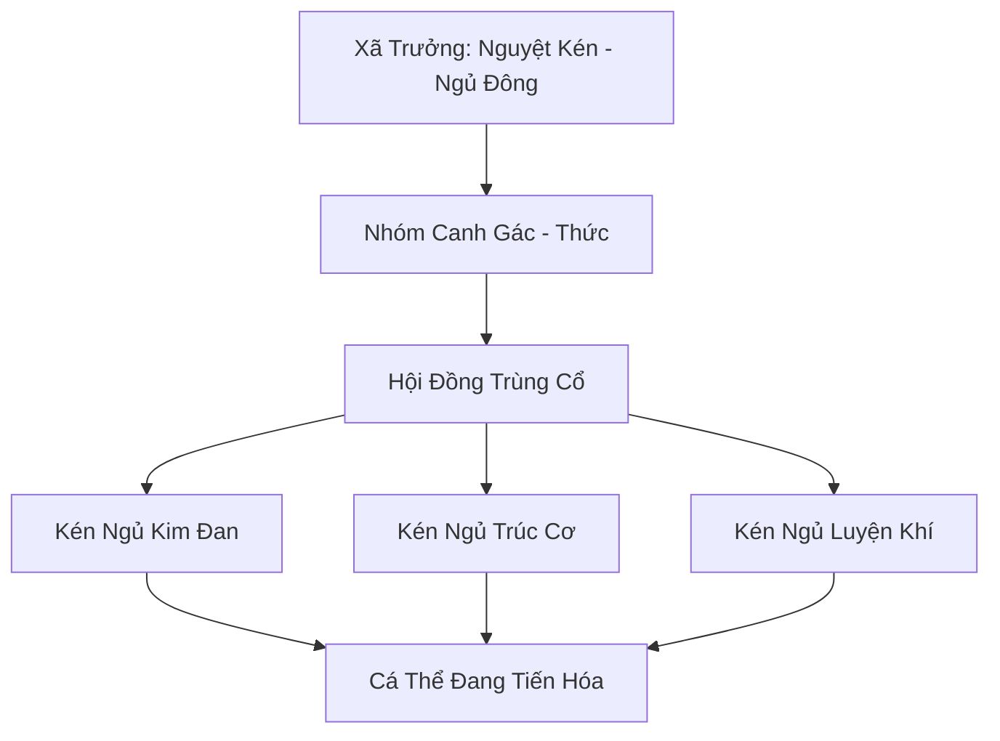

# CỔ KÉN TU LUYỆN XÃ (古茧修炼社)

## I. Tổng Quan (总览)
Cổ Kén Tu Luyện Xã là một tổ chức kỳ lạ và bí ẩn nhất trong lòng Nam Cương, bao gồm các cá thể Trùng Tộc cổ đại còn sót lại từ thời kỳ khai thiên lập địa. Khác với sự hung hãn của bầy trùng thông thường, thành viên của xã chọn con đường tu luyện thâm trầm thông qua việc ngủ đông kéo dài hàng ngàn năm bên trong những chiếc kén linh lực. Họ tin rằng sự biến đổi vĩ đại nhất của sinh mệnh chỉ có thể diễn ra trong sự tĩnh lặng tuyệt đối và thời gian chính là chất xúc tác mạnh mẽ nhất.

## II. Địa Lý & Tài Nguyên (地理 với tài nguyên)
Nằm sâu trong một khoang đá biệt lập dưới lõi của Vạn Trùng Cốc, được ngăn cách bởi hàng tầng hang động trùng điệp và các trận pháp tự nhiên. Tài nguyên quý giá nhất là "Tơ Kén Cổ" - loại tơ bạc có độ bền và tính dẫn linh vượt xa các vật liệu luyện khí hiện đại. Linh khí bên trong hang động luôn ở trạng thái cô đặc và tinh thuần, do được lọc qua các lớp kén vạn năm.

## III. Văn Hóa & Tín Ngưỡng (文化 với信仰)
Đề cao triết lý: "Giấc ngủ là con đường tu luyện vững chắc nhất". Thành viên xã coi việc thức giấc là một sự hy sinh cần thiết để bảo vệ giấc ngủ của đồng đạo. Văn hóa của xã mang đậm tính tâm linh, kết nối với nhau thông qua mạng lưới thần thức mỏng manh tỏa ra từ các kén ngủ. Họ tôn thờ quy luật tiến hóa tự nhiên và sự kiên nhẫn cực hạn.

## IV. Cơ Cấu Tổ Chức (组织结构)


## V. Công Pháp & Trận Pháp (功法 với阵法)
- **Công Pháp:** *Kén Hóa Quyết* - bí thuật tu luyện trong trạng thái đình trệ sinh cơ, giúp linh hồn đạt đến trạng thái hư không và hấp thụ linh khí một cách tự nhiên mà không cần vận hành kinh mạch.
- **Trận Pháp:** *Tâm Linh Liên Kết Trận* - một mạng lưới tơ ma thuật kết nối mọi chiếc kén, truyền tải rung động và cảnh báo tức thì cho những cá thể đang thức canh gác nếu có bất kỳ sự xâm nhập nào.

## VI. Đặc Sản Môn Phái (门派特产)
- **Tơ Linh Bạc:** Sợi tơ thu được từ các kén đã mở, là nguyên liệu tối thượng để chế tác các loại giáp trụ kháng ma và lưới bắt hồn.
- **Trùng Ký Ngọc Giản:** Các khối ngọc thạch chứa đựng ký ức di truyền của Trùng Tộc thượng cổ, dùng để giải mã các bí mật lịch sử.

## VII. Cơ Sở Hạ Tầng (基础设施)
- **Hang Cổ Kén:** Khoang đá hình cầu khổng lồ với hệ thống thạch nhũ phát quang tự nhiên.
- **Đài Trạm Thần Thức:** Vị trí trung tâm nơi các cá thể canh gác tập trung để điều phối mạng lưới bảo vệ.

## VIII. Kinh Tế (経済)
Không tham gia vào bất kỳ hoạt động kinh tế thế tục nào. Sự tồn tại của xã hoàn toàn dựa trên việc tích lũy linh khí địa mạch. Tuy nhiên, bất kỳ mảnh tơ kén nào rơi ra ngoài cũng có giá trị liên thành trên thị trường chợ đen của ma đạo.

## IX. Lịch Sử Tóm Tắt (简史)
Được coi là tàn tích cuối cùng của vương quốc Trùng Tộc thời Thái Cổ đã sụp đổ. Khi Trùng Mẫu mới trỗi dậy thống trị Vạn Trùng Cốc, các vị trưởng lão cổ đại đã quyết định rút vào vùng lõi này, phong ấn chính mình trong kén để chờ đợi một kỷ nguyên mà họ có thể tái sinh trong hình hài hoàn hảo nhất.

## X. Giai Thoại & Bí Mật (轶 sự với bí mật)
Tương truyền kén của Xã trưởng Nguyệt Kén thực chất là một "Quả Trứng Long", nơi một thực thể Trùng Long thượng cổ đang dần thành hình thông qua việc dung hợp hàng vạn năm khí vận của địa mạch.

## XI. Quan Hệ Thế Lực (势力关系)
```mermaid
graph LR
    CKTX[Cổ Kén Tu Luyện Xã] -- Tránh né -- VTC[Vạn Trùng Cốc]
    CKTX -- Tử địch -- VDM[Vạn Độc Môn]
    CKTX -- Đồng đạo -- LKDV[Linh Khuẩn Dược Viên]
    CKTX -- Cảnh giác -- HSM[Huyết Sát Minh]
```
