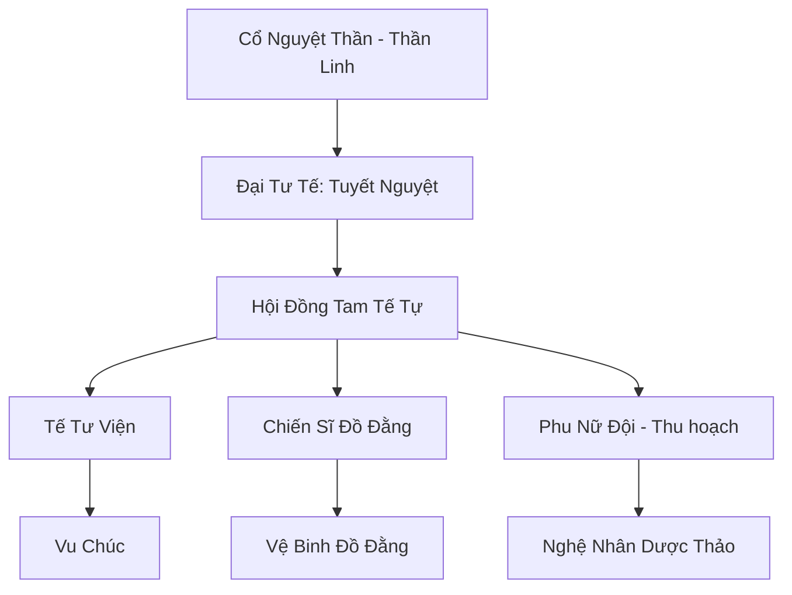

# CỔ NGUYỆT THẦN GIÁO (古月神教)

## I. Tổng Quan (总览)
Cổ Nguyệt Thần Giáo là một thế lực tôn giáo lâu đời và bí ẩn nhất phương Nam, ngự trị sâu trong dãy Thập Vạn Đại Sơn. Khác với các tông môn tu tiên chính thống, thần giáo tập trung vào việc thờ phụng thực thể tối cao là "Cổ Nguyệt Thần" và sử dụng các loại vu thuật, nguyền rủa kết hợp với sức mạnh của ánh trăng. Họ sống biệt lập, gìn giữ những truyền thống cổ xưa và coi mình là những người canh giữ linh hồn của rừng già và bóng đêm.

## II. Địa Lý & Tài Nguyên (地理 với tài nguyên)
Trụ sở chính nằm tại Thung Lũng Trăng Khuyết, một khu vực có địa hình lòng chảo giúp hội tụ ánh sáng mặt trăng một cách tối đa. Thần giáo kiểm soát những vùng rừng rậm nguyên sinh chứa đựng vô số loài linh thảo quý hiếm và các mạch "Nguyệt Thạch" - loại khoáng thạch chỉ phát sáng và tỏa năng lượng khi về đêm.

## III. Văn Hóa & Tín Ngưỡng (文化 với信仰)
Tôn thờ Cổ Nguyệt Thần và chu kỳ của mặt trăng. Tín đồ tin rằng ánh trăng là nguồn gốc của mọi trí tuệ và quyền năng. Văn hóa thần giáo mang đậm tính nghi lễ với các buổi tế trăng vào đêm rằm, việc sử dụng hình xăm đồ đằng để biểu thị sức mạnh và cấp bậc. Họ coi trọng sự tĩnh lặng, bí mật và lòng trung thành tuyệt đối với giáo phái.

## IV. Cơ Cấu Tổ Chức (组织结构)


## V. Công Pháp & Trận Pháp (功法 với阵法)
- **Công Pháp:** *Cổ Nguyệt Tâm Kinh* (Hấp thụ nguyệt khí), *Vạn Đồ Đằng Thuật* (Mượn sức mạnh linh thú).
- **Trận Pháp:** *Vạn Cổ Nguyệt Ảnh Trận* - trận pháp ảo giác diện rộng bao trùm Thung Lũng Trăng Khuyết, khiến quân địch lạc vào những mê cung ký ức và dần bị hút cạn tinh thần lực dưới ánh trăng mờ ảo.

## VI. Đặc Sản Môn Phái (门派特产)
- **Nguyệt Quang Lộ:** Linh dịch ngưng tụ từ ánh trăng, có tác dụng tăng cường thần thức và chữa lành các vết thương linh hồn.
- **Đồ Đằng Phù:** Những mảnh da thú khắc phù văn đồ đằng, giúp người sử dụng tạm thời sở hữu sức mạnh của loài yêu thú tương ứng.

## VII. Cơ Sở Hạ Tầng (基础设施)
- **Nguyệt Quang Tế Đàn:** Công trình đá cổ đại khổng lồ nằm ở trung tâm thung lũng, nơi diễn ra các nghi lễ quan trọng nhất.
- **Hang Động Ký Ức:** Nơi lưu giữ lịch sử và tri thức của giáo phái thông qua các bích họa phù văn.

## VIII. Kinh Tế (経済)
Nền kinh tế tự cung tự cấp kết hợp với việc trao đổi các dược liệu hiếm thu thập được từ Thập Vạn Đại Sơn. Họ cũng bán các loại bùa hộ mệnh có khả năng kháng nguyền rủa cho các bộ lạc và thương đoàn có quan hệ tốt.

## IX. Lịch Sử Tóm Tắt (简史)
Sáng lập bởi Thánh Nữ Cổ Nguyệt vào thời kỳ Khởi Nguyên, người được cho là đã nhận được khải huyền từ mặt trăng để dẫn dắt con người thoát khỏi bóng tối của ma tộc nguyên thủy. Thần giáo đã trải qua hàng vạn năm tồn tại thầm lặng, đứng ngoài các cuộc tranh chấp quyền lực lục địa để bảo vệ tín ngưỡng của mình.

## X. Giai Thoại & Bí Mật (轶 sự với bí mật)
Tương truyền Đại Tư Tế Tuyết Nguyệt có khả năng trò chuyện trực tiếp với mặt trăng và mỗi khi có một ngôi sao rơi, thần giáo sẽ biết trước được một đại sự sắp xảy ra trên lục địa.

## XI. Quan Hệ Thế Lực (势力关系)
```mermaid
graph LR
    CGTG[Cổ Nguyệt Thần Giáo] -- Thân thiện -- TLVD[Tinh Linh Vương Đình]
    CGTG -- Cảnh giác -- VDM[Vạn Độc Môn]
    CGTG -- Trung lập -- DCHH[Đại Càn Hoàng Triều]
    CGTG -- Đối tác -- QTNC[Quỷ Thị Nam Cương]
```
