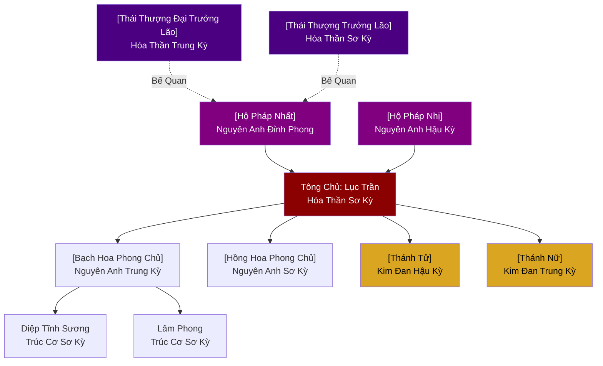
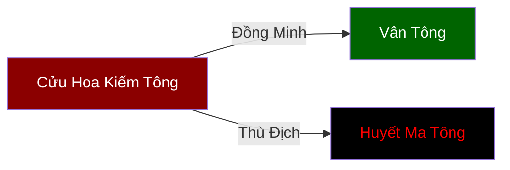

# CỬU HOA KIẾM TÔNG (九花劍宗)

## I. Tổng Quan
- **Tên:** Cửu Hoa Kiếm Tông.
- **Loại Hình:** Tông Môn (Chính Đạo).
- **Cấp Bậc:** Hạng Nhất (Thế lực hàng đầu tại Đông Hoang).
- **Trụ Sở:** Cửu Hoa Sơn (Nine Flowers Mountain).
- **Người Đứng Đầu:** Tông Chủ - [Cửu Hoa Kiếm Tôn (Lục Trần)](../Nhân_Vật/Lục_Trần.md) (Hóa Thần Sơ Kỳ).

## II. Địa Lý & Tài Nguyên
- **Vị Trí:** Tọa lạc tại phía Đông của Cố Nguyên Lục Địa (thuộc vùng Đông Hoang).
- **Đặc Điểm Địa Hình:**
    - Gồm 9 ngọn núi cao chọc trời, xếp thành hình vòng tròn như một đóa hoa sen nở rộ.
    - Đỉnh chính giữa gọi là **Thiên Hoa Phong**, 8 đỉnh xung quanh lần lượt là Bạch Hoa, Hồng Hoa, Lam Hoa, Tử Hoa, Kim Hoa, Mộc Hoa, Thủy Hoa, Hỏa Hoa.
    - Quanh năm mây mù bao phủ, linh khí nồng đậm, đặc biệt là Kim linh khí thích hợp cho kiếm tu.
- **Tài Nguyên:**
    - **Mỏ Huyền Thiết:** Nằm sâu dưới lòng núi, cung cấp nguyên liệu rèn kiếm thượng hạng.
    - **Kiếm Thảo:** Một loại linh thảo hình lưỡi kiếm, mọc trên vách đá dựng đứng, dùng để luyện đan tăng cường kiếm ý.

## III. Văn Hóa & Tín Ngưỡng
- **Triết Lý:** "Kiếm là sinh mạng, hoa là vô thường". Tông môn dạy đệ tử coi trọng thanh kiếm như tính mạng mình, nhưng cũng phải hiểu lẽ vô thường của vạn vật (như hoa nở hoa tàn) để không chấp niệm vào thắng thua.
- **Quy Tắc (Môn Quy):**
    - Nghiêm cấm rút kiếm vì tư thù nhỏ nhặt.
    - Nghiêm cấm ức hiếp phàm nhân. Kẻ vi phạm sẽ bị phế bỏ tu vi, trục xuất khỏi tông môn.
    - Đệ tử phản bội sẽ bị "Kiếm Khí Quán Thể" (ngàn vạn kiếm khí xuyên qua người) cho đến chết.
- **Phong Tục:**
    - **Táng Kiếm Trì (Hồ Chôn Kiếm):** Nơi an nghỉ của những thanh kiếm gãy hoặc của tiền nhân đã khuất. Đệ tử mới nhập môn phải đến đây ngồi thiền 7 ngày để cảm nhận kiếm ý của người đi trước.
    - **Luận Kiếm Đại Hội:** Tổ chức 10 năm một lần, nơi các đệ tử tỷ thí để chọn ra người đứng đầu (Đại Sư Huynh/Đại Sư Tỷ).

## IV. Cơ Cấu Tổ Chức
1.  **Tông Chủ:** Nắm quyền điều hành chung, trấn giữ Thiên Hoa Phong.
2.  **Bát Đại Phong Chủ (Trưởng Lão):**
    - 8 vị Nguyên Anh kỳ tu sĩ, mỗi người cai quản một ngọn núi (phụ trách một nhánh tu luyện như Luyện Đan, Luyện Khí, Trận Pháp, Chiến Đấu...).
3.  **Hệ Thống Đệ Tử:**
    - **Chân Truyền:** Đệ tử ruột của Tông Chủ hoặc Phong Chủ, được truyền dạy bí kíp cốt lõi.
    - **Nội Môn:** Tu sĩ Trúc Cơ trở lên, được vào Tàng Kinh Các tầng 2.
    - **Ngoại Môn:** Tu sĩ Luyện Khí kỳ, lo việc vặt và tu luyện cơ bản.
    - **Tạp Dịch:** Người phàm hoặc tu sĩ tư chất kém, làm việc chân tay để đổi lấy linh thạch.

## V. Công Pháp & Trận Pháp
- **Công Pháp Trấn Phái:** [Cửu Hoa Kiếm Quyết](../Công_Pháp/Cửu_Hoa_Kiếm_Quyết.md)
    - Thiên cấp hạ phẩm, thiên về tốc độ và sát thương diện rộng.
- **Hộ Sơn Đại Trận:** [Cửu Hoa Tru Tiên Trận](../Trận_Pháp/Cửu_Hoa_Tru_Tiên_Trận.md)
    - Cửu cấp trận pháp, có khả năng chống lại tu sĩ Hóa Thần kỳ tấn công liên tục trong 1 tháng.

## VI. Đặc Sản Môn Phái

## VII. Cơ Sở Hạ Tầng

## VIII. Kinh Tế

## IX. Lịch Sử Tóm Tắt
- **Sáng Lập:** 3000 năm trước bởi **Cửu Hoa Chân Nhân**, một kiếm tu lang thang ngộ đạo khi ngắm hoa nở trên đỉnh núi tuyết hoang vu.
- **Biến Cố:** 500 năm trước, Tông môn từng bị Ma Tộc tấn công (Trận chiến Huyết Hoa). Nhờ Hộ Sơn Đại Trận và sự hy sinh của Tông chủ đời trước, tông môn mới trụ vững.
- **Hiện Tại:** Đang trong giai đoạn phục hưng mạnh mẽ, là một trong "Tam Đại Kiếm Phái" của Đông Hoang.

## X. Giai Thoại & Bí Mật
- **Thất Lạc Kiếm Phong (Đệ Thập Phong):**
    - Tương truyền Cửu Hoa Kiếm Tông vốn dĩ có 10 ngọn núi, nhưng ngọn núi thứ 10 ("Vô Ảnh Phong") đã biến mất chỉ sau một đêm cùng với vị Kiếm Tôn đời thứ 3. Có người nói ngọn núi đã bị chém đứt gốc và ném vào hư không, mang theo bí mật về "Cửu Hoa Đệ Thập Kiếm".
- **Táng Kiếm Trì (Hồ Chôn Kiếm):**
    - Đáy hồ Táng Kiếm Trì được cho là nơi an nghỉ của thanh "Cửu Hoa Thần Kiếm" - binh khí của tổ sư khai sơn. Hàng vạn năm qua, vô số thiên tài đã thử lặn xuống đáy hồ nhưng đều bị kiếm khí vô hình đẩy ngược trở lại. Chỉ có người được kiếm chọn mới có thể đánh thức nó.
- **Huyết Hoa Kiếm (Cấm Thuật):**
    - Một nhánh tu luyện bị cấm đoán trong tông môn, thay vì dùng linh khí nuôi dưỡng kiếm ý, lại dùng tinh huyết bản mệnh để tế luyện "Huyết Hoa". Người luyện thành công kiếm pháp này có sức mạnh vượt cấp nhưng tuổi thọ sẽ giảm đi một nửa sau mỗi lần xuất kiếm.

## XI. Quan Hệ Thế Lực

