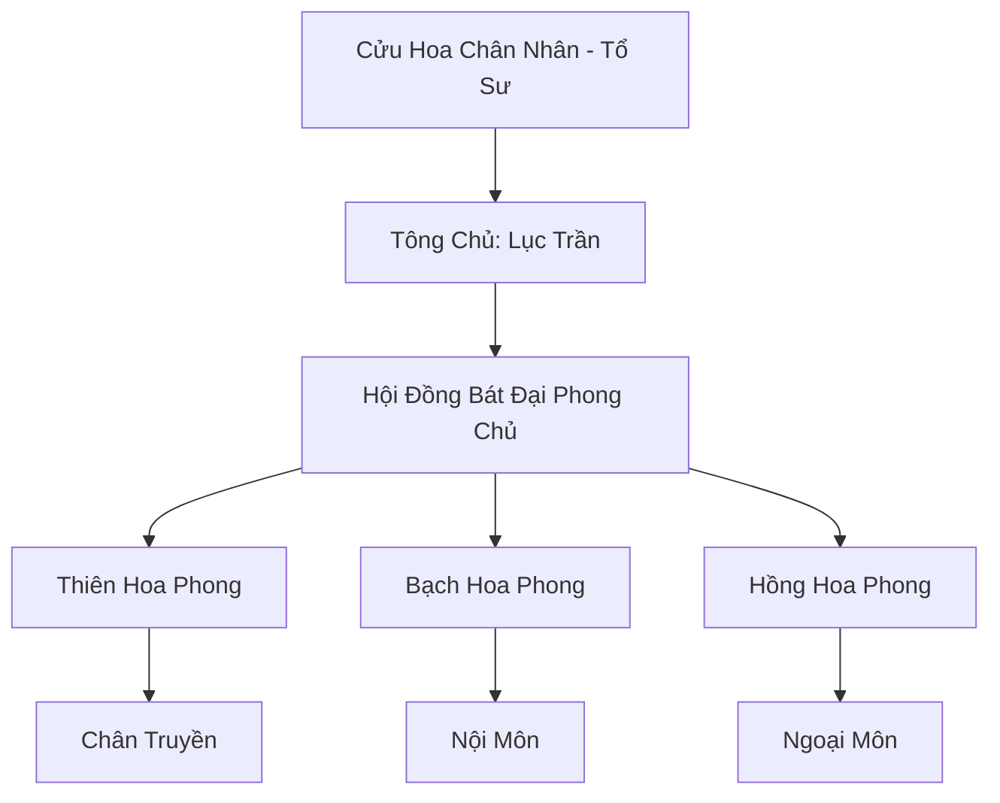

# CỬU HOA KIẾM TÔNG (九花劍宗)

## I. Tổng Quan (总览)
Cửu Hoa Kiếm Tông là một trong "Tam Đại Kiếm Phái" lừng lẫy nhất Đông Hoang, nổi tiếng với sự kết hợp giữa sức mạnh sắc bén của kiếm đạo và vẻ đẹp vô thường của vạn hoa. Với triết lý "Kiếm là sinh mạng, hoa là vô thường", tông môn đào tạo nên những kiếm tu không chỉ có chiến lực kinh người mà còn có tâm cảnh vững vàng. Đây là cột trụ vững chắc của Chính Đạo, luôn tiên phong trong việc trấn áp các thế lực ma đạo trỗi dậy.

## II. Địa Lý & Tài Nguyên (地理 với tài nguyên)
Ngự trị trên dãy Cửu Hoa Sơn, gồm 9 ngọn núi cao chọc trời xếp thành hình đóa hoa sen nở rộ giữa biển mây. Đỉnh chính giữa là Thiên Hoa Phong, bao quanh bởi 8 đỉnh phụ mang thuộc tính ngũ hành và biến dị khác nhau. Tông môn nắm giữ mỏ Huyền Thiết thượng hạng và là nơi duy nhất trồng được "Kiếm Thảo" - loại linh thảo quý hiếm dùng để nuôi dưỡng kiếm ý.

## III. Văn Hóa & Tín Ngưỡng (文化 với信仰)
Tôn thờ Cửu Hoa Chân Nhân và tinh thần kiếm đạo thuần túy. Đệ tử tông môn được dạy phải coi thanh kiếm như một phần cơ thể và linh hồn. Văn hóa Cửu Hoa đề cao sự công bằng, lòng dũng cảm và tâm thế bình thản trước sinh tử. Nghi lễ quan trọng nhất là "Táng Kiếm", nơi đệ tử gửi gắm ý chí vào những thanh kiếm gãy để học cách buông bỏ và tái sinh kiếm ý.

## IV. Cơ Cấu Tổ Chức (组织结构)


## V. Công Pháp & Trận Pháp (功法 với阵法)
- **Công Pháp:** *Cửu Hoa Kiếm Quyết* (Chấn phái, thiên về tốc độ và sát thương), *Kiếm Tâm Thông Minh*.
- **Trận Pháp:** *Cửu Hoa Tru Tiên Trận* - trận pháp hộ sơn cấp 9, có khả năng ngưng tụ kiếm khí của toàn bộ dãy núi để tiêu diệt ngay cả cường giả Hóa Thần kỳ xâm phạm.

## VI. Đặc Sản Môn Phái (门派特产)
- **Cửu Hoa Phi Kiếm:** Các thanh phi kiếm đúc từ Huyền Thiết và tinh hoa vạn hoa, có độ linh hoạt và sắc bén cực cao.
- **Kiếm Thảo Đan:** Đan dược hỗ trợ tu sĩ đột phá các tầng thứ của kiếm ý.

## VII. Cơ Sở Hạ Tầng (基础设施)
- **Táng Kiếm Trì:** Một hồ nước chứa hàng vạn thanh kiếm cổ, nơi tỏa ra kiếm khí nồng đậm quanh năm.
- **Tàng Kinh Các:** Tòa tháp lưu trữ hàng vạn bí kíp kiếm đạo và đan đạo từ thời cổ đại.

## VIII. Kinh Tế (経済)
Nguồn thu ổn định từ việc khai thác và cung cấp Huyền Thiết cho các thế lực luyện khí. Họ cũng kinh doanh các loại phi kiếm đặt hàng và linh dược Kiếm Thảo. Tông môn nhận phí bảo hộ từ nhiều thành bang và gia tộc nhỏ tại Đông Hoang để duy trì trật tự.

## IX. Lịch Sử Tóm Tắt (简史)
Sáng lập cách đây 3000 năm bởi Cửu Hoa Chân Nhân sau khi ngài ngộ đạo từ một đóa hoa nở giữa bão tuyết. Tông môn đã trải qua nhiều thăng trầm, đặc biệt là trận "Huyết Hoa Chiến" 500 năm trước với ma tộc, nơi tông môn đã hy sinh rất nhiều để bảo vệ lục địa. Hiện nay, dưới sự dẫn dắt của Lục Trần, Cửu Hoa Kiếm Tông đang bước vào thời kỳ phục hưng rực rỡ.

## X. Giai Thoại & Bí Mật (轶 sự với bí mật)
Tương truyền Cửu Hoa Sơn vốn có ngọn núi thứ 10 mang tên "Vô Ảnh Phong", nơi cất giấu nhát kiếm mạnh nhất thế gian, nhưng nó đã biến mất bí ẩn cùng với một vị Kiếm Tôn đời trước.

## XI. Quan Hệ Thế Lực (势力关系)
```mermaid
graph LR
    CHKT[Cửu Hoa Kiếm Tông] -- Đồng minh -- VT[Vân Tông]
    CHKT -- Đối địch -- HMT[Huyết Ma Tông]
    CHKT -- Đối tác -- DVC[Dược Vương Cốc]
    CHKT -- Tôn trọng -- HKC[Hàn Kiếm Cốc]
```
