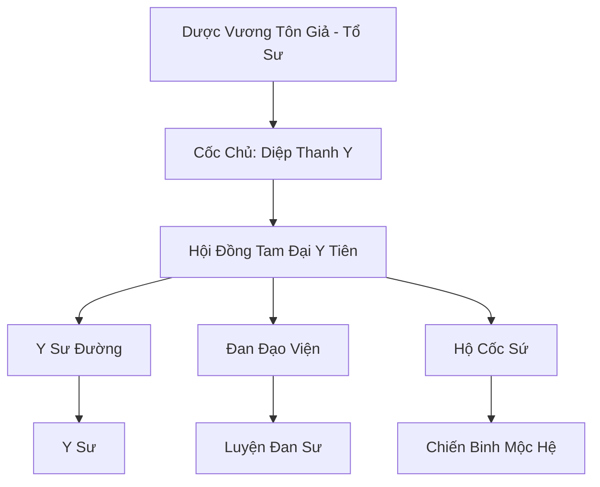

# DƯỢC VƯƠNG CỐC (药王谷)

## I. Tổng Quan (总览)
Dược Vương Cốc là thánh địa y học uy tín nhất Cố Nguyên Giới, nơi hội tụ của những bậc thầy đan đạo và y sư tài năng nhất. Với tôn chỉ "Huyền Hồ Tế Thế, Cứu Nhân Độ Mệnh", cốc không chỉ là nơi tu luyện mà còn là trung tâm cứu trợ nhân đạo, nơi mọi sinh linh đều có quyền được chữa trị. Tông môn nắm giữ những bí thuật trường sinh và hồi phục huyền diệu, khiến họ nhận được sự kính trọng tuyệt đối từ cả chính đạo lẫn trung lập.

## II. Địa Lý & Tài Nguyên (地理 với tài nguyên)
Tọa lạc trong một thung lũng biệt lập phía Nam chân núi Thiên Trụ, nơi khí hậu bốn mùa ôn hòa và linh khí mộc hệ tinh thuần. Trung tâm thung lũng là "Cửu Thiên Linh Mộc" - cây cổ thụ khổng lồ tỏa ra linh khí giúp thảo dược phát triển thần tốc. Cốc sở hữu "Sinh Mệnh Chi Tuyền", dòng suối có khả năng chữa lành vết thương và hàng ngàn mẫu dược điền trồng đủ loại linh thảo từ phàm cấp đến tiên cấp.

## III. Văn Hóa & Tín Ngưỡng (文化 với信仰)
Tôn thờ sự sống và triết lý y đức cao cả. Đệ tử Dược Vương Cốc phải tuyên thệ không bao giờ sử dụng kiến thức để hại người. Văn hóa tông môn đề cao sự tỉ mỉ, lòng từ bi và tinh thần nghiên cứu khoa học. Họ thường xuyên tổ chức các buổi "Nghĩa Chẩn" xuống núi để chữa bệnh miễn phí cho phàm nhân, xây dựng hình ảnh tốt đẹp trong mắt vạn dân.

## IV. Cơ Cấu Tổ Chức (组织结构)


## V. Công Pháp & Trận Pháp (功法 với阵法)
- **Công Pháp:** *Thanh Nang Trường Sinh Quyết* (Chấn phái, tăng thọ nguyên và hồi phục), *Bách Thảo Tâm Kinh*.
- **Trận Pháp:** *Vạn Mộc Hồi Xuân Trận* - đại trận phòng thủ cấp Hạng Nhất, có khả năng biến toàn bộ thực vật trong thung lũng thành các vệ binh mộc nhân và liên tục tịnh hóa mọi loại độc tố xâm nhập.

## VI. Đặc Sản Môn Phái (门派特产)
- **Hồi Xuân Đan:** Đan dược cực phẩm có thể kéo dài hơi tàn của người sắp chết.
- **Thanh Mộc Châm:** Bộ kim châm làm từ lõi linh mộc, dùng để châm cứu khai thông kinh mạch hoặc tấn công huyệt đạo kẻ thù.

## VII. Cơ Sở Hạ Tầng (基础设施)
- **Thanh Nang Điện:** Nơi lưu giữ các bộ y thư cổ và diễn ra các cuộc luận y cao cấp.
- **Vườn Dược Cấm Địa:** Khu vực trồng các loài tiên dược ngàn năm, được canh giữ bởi các linh thú thực vật.

## VIII. Kinh Tế (経済)
Kinh tế cực kỳ vững mạnh dựa trên việc cung cấp đan dược chữa bệnh và dịch vụ y tế chuyên sâu cho các đại tông môn và hoàng gia. Họ cũng nắm giữ mạng lưới xuất khẩu dược liệu thô lớn nhất, là đối tác quan trọng của các thương hội hàng đầu như Bách Bảo Các.

## IX. Lịch Sử Tóm Tắt (简史)
Sáng lập bởi Dược Vương Tôn Giả, một tán tu đắc đạo nhờ việc cứu giúp hàng vạn người trong một trận đại dịch thời Khởi Nguyên. Sau biến cố phản bội của Độc Cô Thiên Sát (người sau này lập ra Vạn Độc Môn), Dược Vương Cốc đã siết chặt quy tắc môn quy và thề sẽ tiêu diệt mọi loại độc thuật gây hại cho thế gian.

## X. Giai Thoại & Bí Mật (轶 sự với bí mật)
Tương truyền mỗi đời Cốc Chủ đều có khả năng nghe thấy tiếng nói của các loài cây cỏ, và dưới gốc Cửu Thiên Linh Mộc có chôn cất một viên "Mộc Linh Châu" có khả năng hồi sinh cả một vùng đất chết.

## XI. Quan Hệ Thế Lực (势力关系)
```mermaid
graph LR
    DVC[Dược Vương Cốc] -- Đồng minh -- CHKT[Cửu Hoa Kiếm Tông]
    DVC -- Tử địch -- VDM[Vạn Độc Môn]
    DVC -- Hợp tác -- TAM[Thái Ất Môn]
    DVC -- Cung cấp -- DCHH[Đại Càn Hoàng Triều]
```
