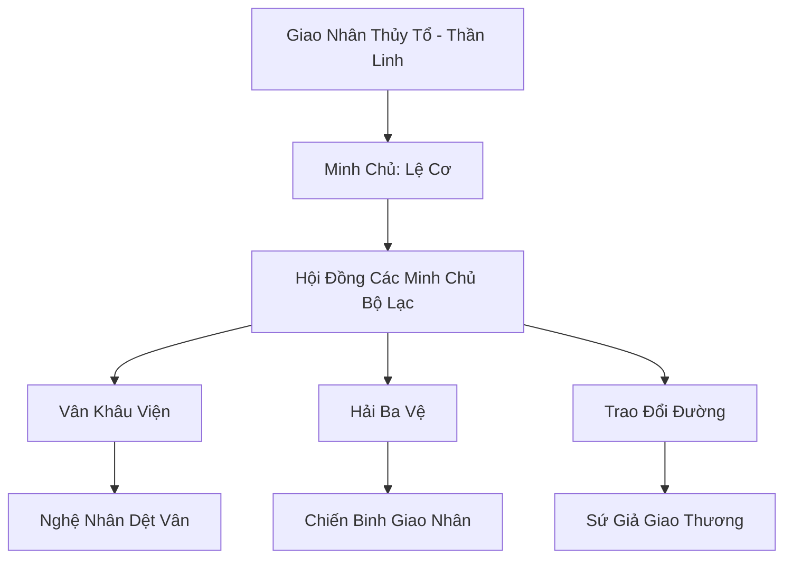

# GIAO NHÂN TỘC LIÊN MINH (鲛人族联盟)

## I. Tổng Quan (总览)
Giao Nhân Tộc Liên Minh là tổ chức tự vệ của chủng tộc Giao Nhân (người cá) cư ngụ tại các vùng biển sâu trù phú của Vô Tận Hải. Nổi tiếng với vẻ đẹp và khả năng chế tác ra những kỳ vật vô giá như Ngọc trai giao nhân (nước mắt hóa thành) và Lụa Vân (dệt từ ráng chiều phản chiếu trên mặt nước), liên minh này luôn phải đấu tranh để bảo vệ giống loài khỏi nạn săn trộm và sự bóc lột của các thế lực hùng mạnh hơn như Long Cung.

## II. Địa Lý & Tài Nguyên (地理 với tài nguyên)
Trụ sở chính là các Thành phố Thủy Tinh nằm sâu dưới đáy biển, nơi ánh sáng từ ngọc trai và san hô phát sáng thay thế mặt trời. Liên minh kiểm soát các rạn san hô Nguyệt Quang - nơi tập trung linh khí thủy hệ tinh khiết nhất và là nguồn nguyên liệu để dệt nên Lụa Vân huyền thoại.

## III. Văn Hóa & Tín Ngưỡng (文化 với信仰)
Tôn thờ Giao Nhân Thủy Tổ và vẻ đẹp của sự tự do. Cư dân tin rằng nước mắt của họ là tinh hoa của linh hồn và chỉ nên rơi vì những điều cao cả. Văn hóa giao nhân mang đậm tính nghệ thuật với các điệu múa đuôi dưới nước và kỹ thuật thêu thùa phù văn trên vải lụa biển.

## IV. Cơ Cấu Tổ Chức (组织结构)


## V. Công Pháp & Trận Pháp (功法 với阵法)
- **Công Pháp:** *Thủy Vân Nhu Thuật* (Chiến đấu uyển chuyển), *Giao Nhân Khấp Lệ Quyết* (Chuyển hóa cảm xúc thành sức mạnh linh lực).
- **Trận Pháp:** *Thủy Diệu Kết Giới* - trận pháp phòng thủ đa tầng sử dụng áp suất nước và ánh sáng ngọc trai để phản xạ các đòn tấn công thần thức và vật lý.

## VI. Đặc Sản Môn Phái (门派特产)
- **Lụa Vân (Cloud Silk):** Loại vải cực nhẹ, bền và có khả năng kháng phép cao, là nguyên liệu chính để may pháp y cho các bậc đại năng.
- **Ngọc Trai Giao Nhân:** Tinh túy từ nước mắt, có tác dụng định tâm, trừ tà và là nguyên liệu quý cho các loại đan dược cấp cao.

## VII. Cơ Sở Hạ Tầng (基础设施)
- **Thành phố Thủy Tinh:** Kiến trúc hình vòm bằng pha lê biển chịu áp suất cực lớn.
- **Xưởng Dệt Dưới Nước:** Nơi hàng ngàn nghệ nhân làm việc trong môi trường không trọng lực của nước.

## VIII. Kinh Tế (経済)
Kinh tế dựa trên việc xuất khẩu Lụa Vân và Ngọc trai giao nhân cho các thương hội lớn trên mặt đất (như Bách Bảo Các). Tuy nhiên, họ thường bị ép giá do vị thế chính trị yếu kém và sự đe dọa từ Long Cung.

## IX. Lịch Sử Tóm Tắt (简史)
Được thành lập sau cuộc đại di cư của các bộ lạc Giao Nhân rời khỏi các vùng biển nông bị tàn phá bởi chiến tranh. Liên minh ra đời để tập hợp sức mạnh của mọi cá nhân, chống lại sự săn lùng của con người muốn chiếm đoạt nước mắt giao nhân và sự cai trị tàn bạo của Long Vương.

## X. Giai Thoại & Bí Mật (轶 sự với bí mật)
Tương truyền nếu một giao nhân thật lòng yêu một người tộc khác và dâng hiến "Ngọc Trai Bản Mệnh", người đó sẽ có khả năng hít thở và bất tử dưới đại dương.

## XI. Quan Hệ Thế Lực (势力关系)
```mermaid
graph LR
    GNTLM[Giao Nhân Tộc Liên Minh] -- Lệ thuộc -- LC[Long Cung]
    GNTLM -- Đối tác -- BBC[Bách Bảo Các]
    GNTLM -- Thù địch -- HHHT[Hắc Hải Hải Tặc]
    GNTLM -- Thân thiện -- SHĐQ[San Hô Đảo Quốc]
```
