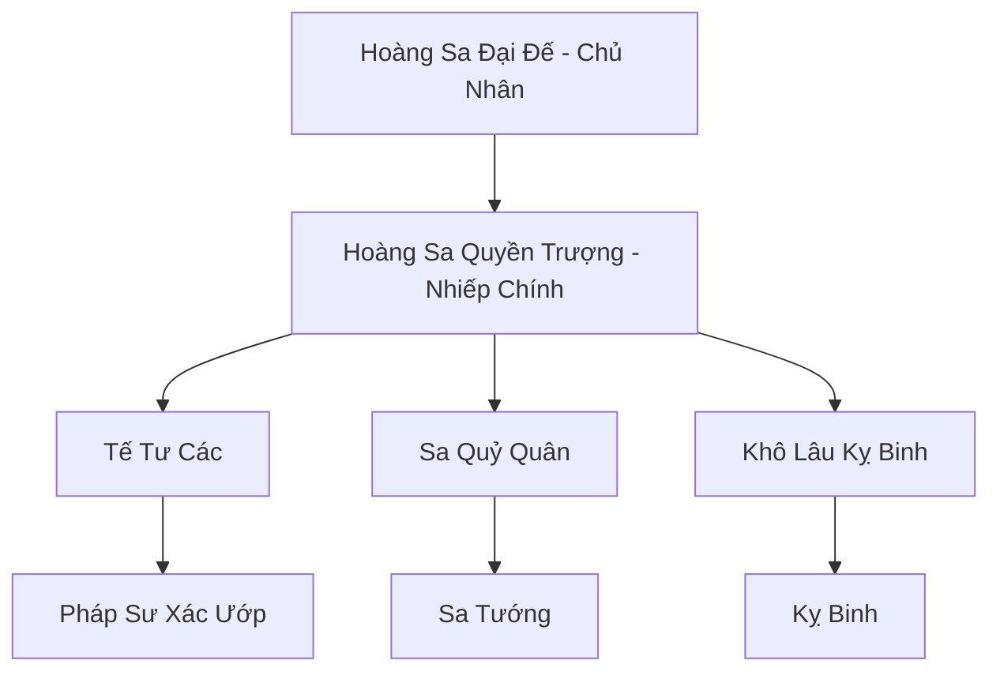

# HOÀNG SA CỔ QUỐC (黄沙古国)

## I. Tổng Quan (总览)
Hoàng Sa Cổ Quốc là một vương quốc xác sống (Undead) trỗi dậy từ đống đổ nát của kỷ nguyên Thái Cổ. Tọa lạc sâu dưới lòng cát Tây Mạc, thế lực này đại diện cho nỗi ám ảnh về một quá khứ huy hoàng muốn nuốt chửng hiện tại. Họ không chỉ là những chiến binh bất tử mà còn là những bậc thầy về tà thuật liên quan đến linh hồn và cát bụi.

## II. Địa Lý & Tài Nguyên (地理 với tài nguyên)
Trụ sở chính là Hoàng Sa Địa Cung, một mê cung khổng lồ gồm các lăng mộ, đền đài và thành quách chôn vùi dưới cồn cát. Nơi đây sở hữu "Tử Sa Mạch" - nguồn linh khí chết chóc cung cấp năng lượng cho quân đoàn xác sống và "Kim Tự Tháp Vĩnh Hằng" - trung tâm điều khiển khí vận của toàn vương quốc.

## III. Văn Hóa & Tín Ngưỡng (文化与信仰)
Tôn thờ Hoàng Sa Đại Đế như một vị thần bất tử. Cư dân cổ quốc tin rằng sự sống chỉ là một giai đoạn tạm thời và cái chết mới là sự khởi đầu của vinh quang vĩnh cửu. Văn hóa của họ mang đậm màu sắc tang tóc, lễ nghi ướp xác và các cuộc hiến tế linh hồn.

## IV. Cơ Cấu Tổ Chức (组织结构)


## V. Công Pháp & Trận Pháp (功法与阵法)
- **Công Pháp:** *Hoàng Sa Nghịch Thiên Quyết* (Chống lại quy luật sinh tử), *Tử Sa Thực Hồn Thuật* (Ăn mòn linh hồn).
- **Trận Pháp:** *Hoàng Sa Thực Cốt Trận* - trận pháp bao trùm vùng sa mạc chết, khiến bất kỳ sinh vật sống nào đi vào đều bị hút cạn sinh cơ và biến thành một phần của cát bụi.

## VI. Đặc Sản Môn Phái (门派特产)
- **Tử Sa Châu:** Viên ngọc chứa đựng tử khí cực nồng, dùng để đầu độc linh mạch đối phương.
- **Băng Quấn Cổ Đại:** Loại vải được yểm bùa có khả năng phục hồi cơ thể xác sống và kháng lại các đòn tấn công vật lý.

## VII. Cơ Sở Hạ Tầng (基础设施)
- **Kim Tự Tháp Vĩnh Hằng:** Nơi ngự trị của Đại Đế và là trạm thu phát tín hiệu tâm linh cho quân đoàn.
- **Hầm Mộ Vô Tận:** Khu vực lưu trữ hàng triệu xác ướp binh lính đang chờ được đánh thức.

## VIII. Kinh Tế (经济)
Kinh tế mang tính chất chiếm đoạt. Họ thu thập các cổ vật thượng cổ từ chính các lăng mộ của mình và chiếm đoạt tài sản của những thương đoàn xấu số đi lạc. Họ không cần linh thạch thông thường mà cần "Linh Hồn Tinh Thạch" để duy trì sự tồn tại.

## IX. Lịch Sử Tóm Tắt (简史)
Vốn là đế quốc hùng mạnh nhất Tây Mạc thời Thái Cổ, bị diệt vong do một lời nguyền không gian khiến toàn bộ vương quốc bị chôn vùi trong một đêm. Hàng vạn năm sau, khi phong ấn suy yếu, ý chí của Hoàng Sa Đại Đế đã đánh thức các thần dân của mình để thực hiện kế hoạch khôi phục đế chế.

## X. Giai Thoại & Bí Mật (轶 sự với bí mật)
Tương truyền Hoàng Sa Đại Đế không phải là người, mà là một thực thể sinh ra từ oán niệm của sa mạc đối với ánh mặt trời quá gay gắt.

## XI. Quan Hệ Thế Lực (势力关系)
```mermaid
graph LR
    HSCQ[Hoàng Sa Cổ Quốc] -- Tử địch -- KST[Kim Sa Tự]
    HSCQ -- Thao túng -- STLM[Sa Tặc Liên Minh]
    HSCQ -- Cạnh tranh -- LSHC[Lưu Sa Huyễn Cung]
```
