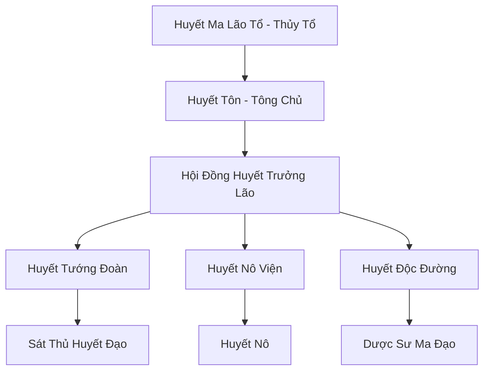

# HUYẾT MA TÔNG (血魔宗)

## I. Tổng Quan (总览)
Huyết Ma Tông từng là một trong những đại tông môn ma đạo hàng đầu lục địa trước khi bị chính đạo liên thủ vây quét và đẩy lùi về vùng rừng rậm Nam Cương. Hiện nay, tông môn đang trong trạng thái ẩn nấp và âm thầm tích lũy sức mạnh. Họ nổi tiếng với các công pháp tà ác dựa trên việc thao túng máu (Huyết Đạo), có khả năng nhanh chóng gia tăng tu vi bằng cách tước đoạt sinh mạng của kẻ khác, khiến họ trở thành đối tượng bị săn lùng gắt gao nhất bởi các lực lượng hành pháp.

## II. Địa Lý & Tài Nguyên (地理 với tài nguyên)
Trụ sở chính ẩn mình sâu trong Rừng Huyết Độc, một khu vực mà cây cối và nguồn nước đều bị ô nhiễm bởi sát khí màu đỏ. Trung tâm tông môn là "Huyết Hải Trì" - một hồ chứa máu khổng lồ được duy trì bằng việc hiến tế sinh linh, là nguồn linh khí ma đạo cốt lõi. Họ cũng nắm giữ các mạch "Huyết Linh Thạch" chỉ mọc trong môi trường tử khí nồng nặc.

## III. Văn Hóa & Tín Ngưỡng (文化 với信仰)
Tôn thờ Huyết Ma Lão Tổ và triết lý "Huyết Hỏa Trùng Sinh". Họ tin rằng máu là tinh hoa của sự sống và ai nắm giữ máu của kẻ khác sẽ nắm giữ vận mệnh của kẻ đó. Văn hóa môn phái cực kỳ điên cuồng và tôn sùng bạo lực. Sự thăng tiến trong tông môn hoàn toàn dựa trên số lượng "chiến tích máu" mà mỗi đệ tử thu thập được.

## IV. Cơ Cấu Tổ Chức (组织结构)


## V. Công Pháp & Trận Pháp (功法 với阵法)
- **Công Pháp:** *Huyết Hải Chân Kinh* (Thao túng máu diện rộng), *Hóa Huyết Thần Chưởng* (Ăn mòn nhục thân).
- **Trận Pháp:** *Huyết Sát Vạn Linh Trận* - trận pháp tà ác bao phủ địa bàn, có khả năng rút cạn máu của tất cả sinh vật bên trong kết giới để cường hóa cho thành viên tông môn.

## VI. Đặc Sản Môn Phái (门派特产)
- **Huyết Ma Đan:** Đan dược nén tinh huyết cường giả, giúp tăng vọt tu vi trong thời gian ngắn nhưng để lại di chứng nặng nề.
- **Huyết Ấn:** Một loại bùa chú găm vào tim để điều khiển ý chí kẻ khác (biến thành Huyết Nô).

## VII. Cơ Sở Hạ Tầng (基础设施)
- **Huyết Ma Điện:** Kiến trúc màu đỏ thẫm lộng lẫy và đáng sợ, nơi đặt ngai vàng của Huyết Tôn.
- **Ngục Dưỡng Xác:** Khu vực lưu trữ và luyện chế các loại huyết thi và nô lệ.

## VIII. Kinh Tế (経済)
Nguồn thu không ổn định từ việc cướp phá và giao dịch ngầm tại Quỷ Thị Nam Cương. Họ cũng bán các loại độc dược máu và dịch vụ ám sát bí mật cho những kẻ muốn thủ tiêu đối thủ mà không để lại dấu vết tiên đạo chính thống.

## IX. Lịch Sử Tóm Tắt (简史)
Đỉnh cao hưng thịnh vào thời kỳ Trung Cổ, Huyết Ma Tông từng suýt thống trị toàn bộ phương Nam. Sau thất bại thảm hại trước liên quân Chính Đạo do Vô Tranh Tự dẫn đầu, tàn quân của họ đã rút vào bóng tối, thay đổi danh tính và âm thầm xây dựng lại mạng lưới, chờ đợi ngày "Huyết Nguyệt" xuất hiện để thực hiện kế hoạch phục thù.

## X. Giai Thoại & Bí Mật (轶 sự với bí mật)
Tương truyền Huyết Tôn hiện tại thực chất chỉ là một phân thân máu của Huyết Ma Lão Tổ, và chân thân của ông ta vẫn đang ngủ say dưới đáy Huyết Hải Trì chờ ngày thức tỉnh.

## XI. Quan Hệ Thế Lực (势力关系)
```mermaid
graph LR
    HMT[Huyết Ma Tông] -- Phụ thuộc -- CUMT[Cửu U Ma Tông]
    HMT -- Đối địch -- VDM[Vạn Độc Môn]
    HMT -- Tử địch -- VTT[Vô Tranh Tự]
    HMT -- Giao dịch -- STLM[Sa Tặc Liên Minh]
```
