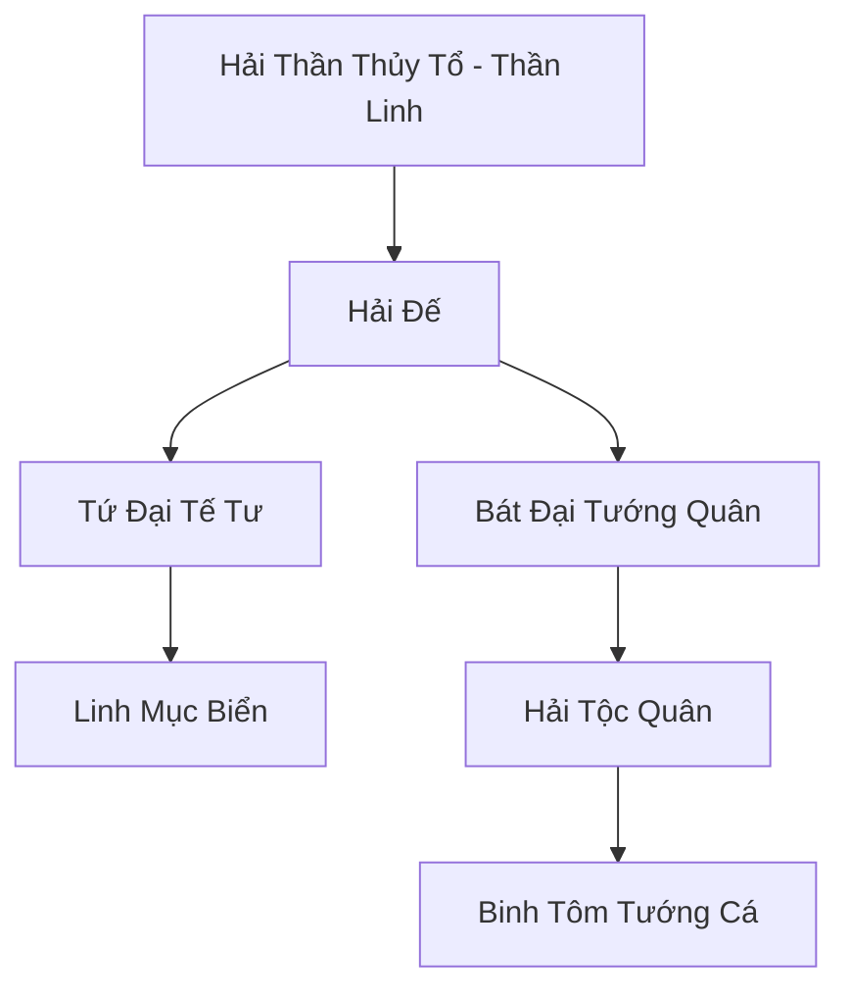

# HẢI THẦN CUNG (海神宫)

## I. Tổng Quan (总览)
Hải Thần Cung là thực thể chính trị và tôn giáo hùng mạnh nhất dưới lòng Vô Tận Hải, được coi là người bảo hộ chính thống của mọi cư dân biển. Với niềm tin tuyệt đối vào Hải Thần, cung điện này duy trì trật tự cho hàng triệu sinh linh và là lá chắn vững chắc chống lại những quái vật khổng lồ của đại dương. Hải Thần Cung đại diện cho sự uy nghiêm, chính nghĩa và sức mạnh vô tận của nước, giữ vai trò cân bằng khí vận cho toàn bộ hệ sinh thái biển sâu.

## II. Địa Lý & Tài Nguyên (地理 với tài nguyên)
Trụ sở chính là Thủy Tinh Cung, một tổ hợp kiến trúc lộng lẫy xây dựng từ pha lê tự nhiên nằm tại điểm sâu nhất và giàu linh khí nhất của Vô Tận Hải. Cung điện kiểm soát "Hải Thần Mạch" - mạch linh khí thủy hệ nguyên thủy, cùng với các khu vực bảo tồn trân châu linh thạch và san hô ma thuật quy mô lớn. Nơi đây còn có "Hải Thần Cấm Địa", nơi giam giữ những bí mật cổ đại về nguồn gốc của đại dương.

## III. Văn Hóa & Tín Ngưỡng (文化 với信仰)
Tôn thờ Hải Thần Thủy Tổ. Cư dân tin rằng biển cả là nguồn sống và mọi hành vi xúc phạm đến đại dương đều phải trả giá. Văn hóa Hải Thần Cung mang đậm tính tôn nghiêm, nghi lễ và lòng tự hào chủng tộc. Họ đề cao sự trung thành, lòng dũng cảm và khả năng phối hợp tập thể. Lễ hội "Triều Tịch Đại Điển" hàng năm là dịp để vạn dân hướng về Thủy Tinh Cung cầu nguyện bình an.

## IV. Cơ Cấu Tổ Chức (组织结构)


## V. Công Pháp & Trận Pháp (功法 với阵法)
- **Công Pháp:** *Hải Thần Lộ* (Chuyển hóa nước thành linh lực tối cao), *Vạn Thủy Quy Tông* (Điều khiển dòng chảy diện rộng).
- **Trận Pháp:** *Vạn Hải Triều Tịch Trận* - trận pháp hộ môn siêu cấp, có khả năng điều khiển toàn bộ hải lưu của Vô Tận Hải để tạo ra những vòng xoáy khổng lồ nghiền nát bất kỳ hạm đội nào xâm lược.

## VI. Đặc Sản Môn Phái (门派特产)
- **Hải Thần Trân Châu:** Loại ngọc chứa đựng tinh hoa của đại dương, có tác dụng tăng cường tuổi thọ và kháng lại mọi loại độc tố nước.
- **Thủy Tinh Khải:** Bộ giáp làm từ pha lê biển sâu, cực kỳ bền chắc và giúp người mặc di chuyển nhanh gấp đôi dưới nước.

## VII. Cơ Sở Hạ Tầng (基础设施)
- **Thủy Tinh Cung:** Cung điện vòm khổng lồ rực rỡ ánh sáng linh lực.
- **Quảng Trường Hải Thần:** Nơi đặt pho tượng Hải Thần bằng vàng ròng cao hàng trăm trượng.

## VIII. Kinh Tế (経済)
Nền kinh tế vững mạnh dựa trên việc thu thuế và phí bảo hộ từ các bộ lạc hải tộc và thương thuyền. Họ cũng nắm giữ nguồn cung ứng ngọc trai linh khí và các dược liệu biển sâu quý giá cho đất liền. Hải Thần Cung là đơn vị điều tiết giá cả của các vật phẩm thủy hệ trên toàn thế giới.

## IX. Lịch Sử Tóm Tắt (简史)
Được thành lập từ thời kỳ Khởi Nguyên bởi vị Thần Nước đầu tiên để tập hợp các chủng tộc biển nhỏ bé chống lại sự tàn sát của các yêu quái biển cổ đại khổng lồ. Qua hàng triệu năm, Hải Thần Cung đã phát triển từ một liên minh tự vệ thành một đế chế hải dương không thể lay chuyển, chứng kiến sự hưng vong của hàng nghìn vương triều trên mặt đất.

## X. Giai Thoại & Bí Mật (轶 sự với bí mật)
Tương truyền dưới Hải Thần Cấm Địa có phong ấn trái tim của một vị thần ma cổ đại, và Hải Đế mỗi đời đều phải dùng linh hồn của mình để gia cố phong ấn này.

## XI. Quan Hệ Thế Lực (势力关系)
```mermaid
graph LR
    HTC[Hải Thần Cung] -- Cạnh tranh -- LC[Long Cung]
    HTC -- Tử địch -- HHHT[Hắc Hải Hải Tặc]
    HTC -- Bảo hộ -- SHĐQ[San Hô Đảo Quốc]
    HTC -- Trung lập -- DCHH[Đại Càn Hoàng Triều]
```
