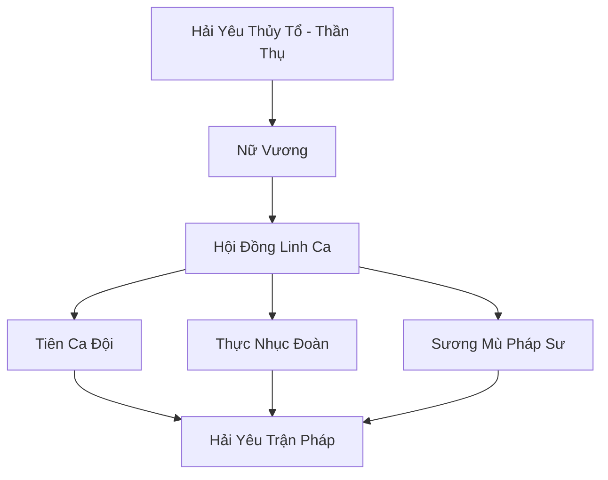

# HẢI YÊU MÊ CUNG (海妖迷宫)

## I. Tổng Quan (总览)
Hải Yêu Mê Cung là sào huyệt của loài Hải Yêu (Siren) khát máu, nằm tại vùng biển nguy hiểm nhất Vô Tận Hải. Đây không phải là một tông môn tu tiên truyền thống mà là một cộng đồng sinh vật săn mồi có tổ chức, sử dụng giọng hát và sương mù ma thuật để dẫn dụ lữ khách vào chỗ chết. Mê cung này là nỗi khiếp đảm của mọi thủy thủ đoàn và thương đội biển.

## II. Địa Lý & Tài Nguyên (地理 với tài nguyên)
Tọa lạc tại vùng biển Tam Giác Chết, nơi có dòng hải lưu xoáy và hàng vạn bãi đá ngầm sắc nhọn ẩn dưới làn sương mù dày đặc. Tài nguyên của mê cung bao gồm lượng tài sản khổng lồ từ hàng nghìn con tàu đắm qua nhiều kỷ nguyên và các loài thực vật biển đột biến chỉ mọc trong vùng tử khí đại dương.

## III. Văn Hóa & Tín Ngưỡng (文化 với信仰)
Tôn thờ Hải Yêu Thủy Tổ và bản năng săn mồi tự nhiên. Họ tin rằng tiếng hát là ngôn ngữ của linh hồn và việc ăn thịt kẻ sống là một nghi lễ để duy trì vẻ đẹp và sức mạnh. Văn hóa của họ rất tàn bạo nhưng đầy tính nghệ thuật âm nhạc hắc ám.

## IV. Cơ Cấu Tổ Chức (组织结构)


## V. Công Pháp & Trận Pháp (功法 với阵法)
- **Công Pháp:** *Mê Hồn Khúc* (Tấn công linh hồn), *Thủy Sát Ảnh Thuật* (Ẩn thân dưới nước).
- **Trận Pháp:** *Sương Mù Ảo Ảnh Vĩnh Cửu* - đại trận bao phủ toàn bộ Tam Giác Chết, khiến các la bàn linh lực mất tác dụng và tạo ra các huyễn cảnh về đất liền hoặc người thân để lừa gạt mục tiêu.

## VI. Đặc Sản Môn Phái (门派特产)
- **San Hô Máu:** Loại san hô hấp thụ tinh huyết người chết, dùng để chế tạo pháp bảo ma đạo.
- **Nước Mắt Siren:** Loại tinh thể chứa đựng nỗi buồn ảo giác, dùng làm nguyên liệu thuốc mê cực mạnh.

## VII. Cơ Sở Hạ Tầng (基础设施)
- **Ngai Vàng Xương Cá:** Nơi ở của Nữ Vương, xây dựng từ bộ xương của một con kình ngư Thái Cổ.
- **Vườn Đá Ngầm:** Hệ thống bẫy tự nhiên và nhân tạo dùng để phá hủy tàu thuyền.

## VIII. Kinh Tế (経済)
Kinh tế hoàn toàn dựa trên việc chiếm đoạt từ các vụ đắm tàu. Họ sở hữu những kho báu vật chất và linh thạch khổng lồ bị chôn vùi dưới đáy biển, đôi khi dùng chúng để trao đổi bí mật với các thế lực hải tặc hoặc ma đạo mặt đất.

## IX. Lịch Sử Tóm Tắt (简史)
Truyền thuyết kể rằng hải yêu vốn là những tiên cá bị biển cả nguyền rủa do đã đánh cắp một giọt lệ của Hải Thần. Họ bị tước đi linh hồn thuần khiết và phải sống dựa vào việc nuốt chửng linh hồn kẻ khác. Hải Yêu Mê Cung được xây dựng để làm pháo đài bảo vệ giống loài khỏi sự truy sát của Long Cung.

## X. Giai Thoại & Bí Mật (轶 sự với bí mật)
Đồn rằng mỗi bản nhạc mà Hải Yêu hát lên đều chứa đựng một phần sinh mạng của họ, và nếu ai có thể hát át đi tiếng hát của Nữ Vương, toàn bộ mê cung sương mù sẽ tan biến.

## XI. Quan Hệ Thế Lực (势力关系)
```mermaid
graph LR
    HYMC[Hải Yêu Mê Cung] -- Đối địch -- HHHT[Hắc Hải Hải Tặc]
    HYMC -- Tử địch -- HTC[Hải Thần Cung]
    HYMC -- Cảnh giác -- LC[Long Cung]
    HYMC -- Giao dịch ngầm -- DLB[Độc Long Bảo]
```
