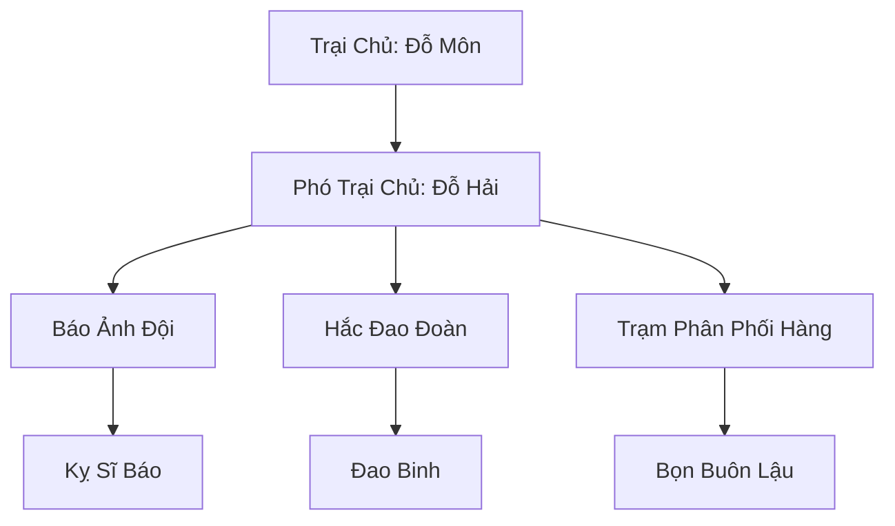

# HẮC BÁO TRẠI (黑豹寨)

## I. Tổng Quan (总览)
Hắc Báo Trại là một sơn trại tội phạm quy mô lớn nằm tại vùng rừng rậm hiểm trở ngoại vi Đầm Lầy Tử Thần của Nam Cương. Tập hợp những kẻ tán tu bần cùng, đào binh và cả những yêu tộc cấp thấp, sơn trại này hoạt động như một băng nhóm lính đánh thuê và cướp đường khét tiếng. Họ nổi tiếng với sự tàn nhẫn, tinh ranh và khả năng điều khiển loài báo đen (Hắc Báo) để săn lùng con mồi trong bóng tối.

## II. Địa Lý & Tài Nguyên (地理 với tài nguyên)
Trụ sở chính được xây dựng từ gỗ và đá thô trên các vách núi của Dãy núi Hắc Báo, nơi có tầm nhìn chiến lược để quan sát các tuyến đường buôn bán. Tài nguyên chính là đàn Hắc Báo hoang dã được thuần hóa và các loại độc dược tự nhiên thu thập từ đầm lầy. Họ cũng nắm giữ các kho bãi bí mật chứa hàng buôn lậu.

## III. Văn Hóa & Tín Ngưỡng (文化 với信仰)
Tôn thờ sức mạnh của thú tính và sự sinh tồn tàn khốc. Tại Hắc Báo Trại, luật rừng là luật duy nhất: kẻ mạnh có tất cả, kẻ yếu là thức ăn. Họ có văn hóa đeo nanh báo và uống máu thú tươi để thể hiện sự dũng mãnh. Không có môn quy, chỉ có lòng trung thành ép buộc bằng bạo lực đối với hai anh em họ Đỗ.

## IV. Cơ Cấu Tổ Chức (组织结构)


## V. Công Pháp & Trận Pháp (功法 với阵法)
- **Công Pháp:** *Hắc Báo Cuồng Nộ Quyết* (Tăng tốc độ và sát thương vật lý), *Ảnh Đao Pháp* (Kỹ thuật chém lén).
- **Trận Pháp:** *Hắc Ám Sát Cơ Trận* - trận pháp đơn giản sử dụng khói độc và bóng tối để làm mù mục tiêu, tạo điều kiện cho đàn báo và sát thủ đồng loạt tấn công.

## VI. Đặc Sản Môn Phái (门派特产)
- **Rượu Máu Báo:** Loại rượu kích thích hung tính, tạm thời làm mất cảm giác đau đớn.
- **Bẫy Răng Cưa:** Loại bẫy cơ khí tẩm kịch độc chuyên dùng để chặn chân các đoàn ngựa thồ linh lực.

## VII. Cơ Sở Hạ Tầng (基础设施)
- **Hang Báo Đen:** Khu vực nuôi dưỡng và nhân giống đàn báo chiến đấu.
- **Tháp Canh Cây:** Hệ thống trạm quan sát ẩn mình trên các ngọn cây cổ thụ bao quanh sơn trại.

## VIII. Kinh Tế (経済)
Nguồn thu không ổn định từ việc cướp bóc và bảo kê các đường dây buôn lậu. Tuy nhiên, họ thường xuyên rơi vào tình trạng thiếu hụt tài nguyên do phải cống nạp một phần lớn lợi nhuận cho Vạn Độc Môn để đổi lấy sự tồn tại.

## IX. Lịch Sử Tóm Tắt (简史)
Được thành lập bởi hai anh em Đỗ Môn và Đỗ Hải, vốn là hai thợ săn bị phá sản sau khi gia đình bị yêu thú giết hại. Họ đã giết chết trại chủ cũ và thâu tóm toàn bộ sơn trại, biến nó thành một thế lực đáng gờm tại vùng ngoại vi Nam Cương bằng sự liều lĩnh và xảo quyệt.

## X. Giai Thoại & Bí Mật (轶 sự với bí mật)
Đồn rằng Đỗ Môn đã thực hiện một khế ước tà ác với một thực thể bóng tối trong đầm lầy để có được khả năng nhìn thấu màn đêm, đổi lại hắn phải hiến tế một lượng máu người định kỳ.

## XI. Quan Hệ Thế Lực (势力关系)
```mermaid
graph LR
    HBT[Hắc Báo Trại] -- Lệ thuộc -- VDM[Vạn Độc Môn]
    HBT -- Đối địch -- ĐHC[Đan Hà Cốc]
    HBT -- Giao dịch -- QTNC[Quỷ Thị Nam Cương]
    HBT -- Sợ hãi -- HSM[Huyết Sát Minh]
```
