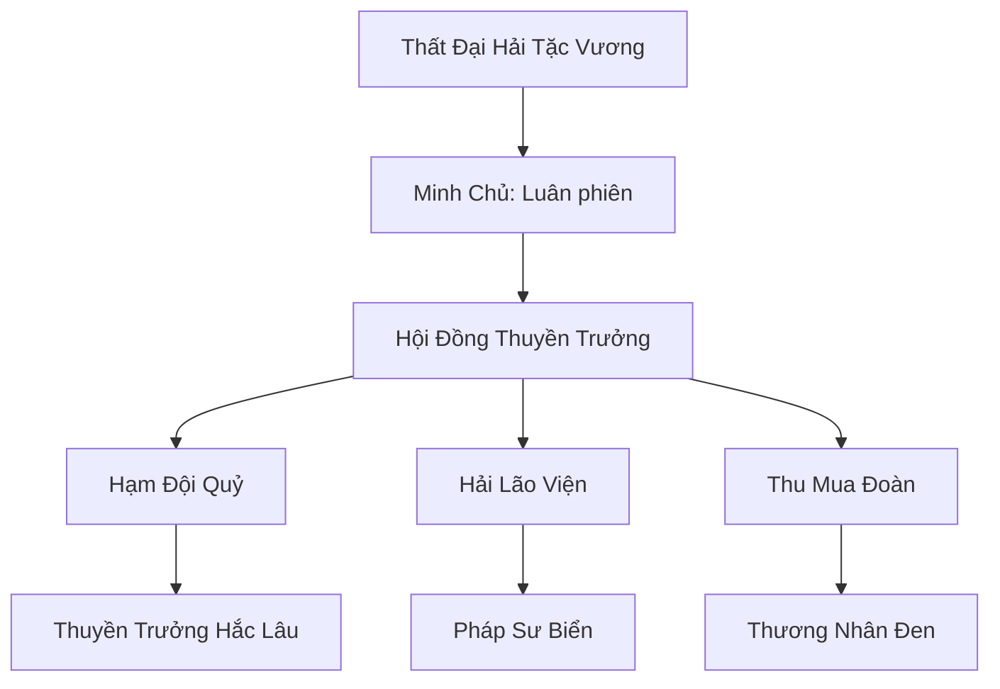

# LIÊN MINH HẮC HẢI (黑海海贼) - HẮC HẢI HẢI TẶC

## I. Tổng Quan (总览)
Liên Minh Hắc Hải là tổ chức tội phạm có quy mô lớn nhất trên đại dương, tập hợp những kẻ bất lương, những kẻ bị trục xuất và những thực thể tà ác từ mọi chủng tộc. Cư ngụ tại vùng biển Hắc Hải đầy rẫy xoáy nước và ô nhiễm linh khí, liên minh này hoạt động như một quốc gia vô chính phủ, nơi luật lệ duy nhất là sự tàn bạo và lòng tham. Hải tặc Hắc Hải là nỗi ám ảnh thường trực của mọi thương thuyền và là cái gai trong mắt các thế lực chính thống hải dương.

## II. Địa Lý & Tài Nguyên (地理 với tài nguyên)
Trụ sở chính là Đảo Xương Sọ, một hòn đảo kỳ quái được hình thành từ xác của hàng vạn sinh vật biển cổ đại và những con tàu đắm. Vùng biển Hắc Hải bao quanh đảo có nồng độ linh khí bị ô nhiễm cao, tạo ra "Hắc Thủy" có tính ăn mòn mạnh, là tài nguyên quan trọng cho các công pháp tà đạo. Họ cũng nắm giữ vô số kho báu vật chất và linh thạch cướp bóc được qua nhiều thế kỷ.

## III. Văn Hóa & Tín Ngưỡng (文化 với信仰)
Tôn thờ Sức Mạnh Tự Do và Thần Biển Hắc Ám (một biến thể tà ác của Hải Thần). Văn hóa hải tặc đề cao sự liều lĩnh, khả năng uống rượu và việc chia chác chiến lợi phẩm một cách sòng phẳng (theo luật kẻ mạnh). Họ có tập tục hiến tế linh hồn tù nhân cho đại dương để cầu mong những chuyến đi săn thuận lợi. Sự phản bội là tội lỗi duy nhất bị trừng trị bằng cách đóng đinh vào cột buồm cho chim rỉa thịt.

## IV. Cơ Cấu Tổ Chức (组织结构)


## V. Công Pháp & Trận Pháp (功法 với阵法)
- **Công Pháp:** *Hắc Thủy Hủ Thi Quyết* (Thao túng nước độc), *Huyết Tế Đoạt Linh* (Hấp thụ linh hồn nạn nhân).
- **Trận Pháp:** *Hắc Hải Vong Linh Trận* - trận pháp bao phủ hạm đội, triệu hồi linh hồn của những thủy thủ đã chết dưới biển để hỗ trợ chiến đấu và tạo ra lớp sương mù che mắt đối phương.

## VI. Đặc Sản Môn Phái (门派特产)
- **Hắc Hải Độc Đao:** Đao răng cưa mạ độc hắc thủy, có khả năng ngăn chặn sự hồi phục vết thương của tu sĩ.
- **Thần Công Thủy Tinh:** Loại đại bác cổ đại bắn ra các khối năng lượng thủy hệ nén, có sức công phá cực mạnh nhắm vào phòng ngự thành trì.

## VII. Cơ Sở Hạ Tầng (基础设施)
- **Đảo Xương Sọ:** Pháo đài tự nhiên và trung tâm giải trí đồi trụy của hải tặc.
- **Nghĩa Địa Tàu Đắm:** Khu vực cất giấu và sửa chữa các con tàu ma.

## VIII. Kinh Tế (経済)
Kinh tế hoàn toàn dựa trên cướp bóc và các hoạt động bất hợp pháp. Họ nắm giữ thị trường nô lệ lớn nhất trên biển và là đầu mối tiêu thụ các món hàng "nóng" không thể giao dịch công khai. Doanh thu của liên minh đủ để duy trì một hạm đội khổng lồ thách thức cả quân đội chính thống của Hải Thần Cung.

## IX. Lịch Sử Tóm Tắt (简史)
Được hình thành vào thời kỳ Trung Cổ khi Long Cung và Hải Thần Cung quá tập trung vào việc tranh giành quyền lực, bỏ trống vùng biển Hắc Hải. Bảy thuyền trưởng khét tiếng nhất lúc bấy giờ đã ký "Ước Nguyện Xương Người", thành lập liên minh để cùng nhau chống lại sự truy sát của chính đạo và chia sẻ nguồn tài nguyên cướp bóc.

## X. Giai Thoại & Bí Mật (轶 sự với bí mật)
Tương truyền Thất Đại Hải Tặc Vương cùng sở hữu một chiếc "Rương Vô Đáy", nơi chứa đựng linh hồn của mọi kẻ thù họ đã giết, và họ có thể sử dụng những linh hồn này để hồi sinh hạm đội của mình vô tận.

## XI. Quan Hệ Thế Lực (势力关系)
```mermaid
graph LR
    HHHT[Hắc Hải Hải Tặc] -- Tử địch -- HTC[Hải Thần Cung]
    HHHT -- Cướp bóc -- TSTH[Thiên Sa Thương Hội]
    HHHT -- Giao dịch -- HMT[Huyết Ma Tông]
    HHHT -- Đồng minh -- STLM[Sa Tặc Liên Minh]
```
