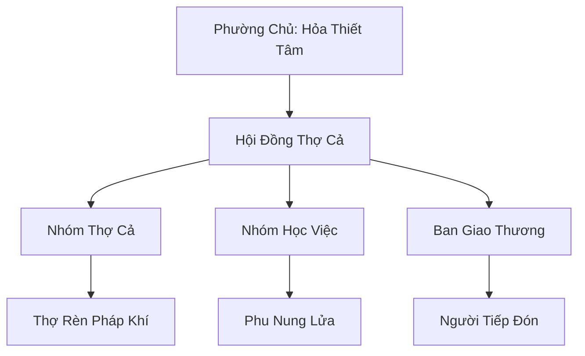

# HỎA DIỄM CÔNG PHƯỜNG (火焰工坊)

## I. Tổng Quan (总览)
Hỏa Diễm Công Phường là một xưởng rèn tán tu nổi tiếng nằm dọc theo tuyến đường huyết mạch Thiên Sa Thương Đạo tại Tây Mạc. Với khẩu hiệu "Rẻ mà bền", phường thợ này trở thành điểm dừng chân không thể thiếu cho các thương đoàn và lữ khách cần bảo trì trang bị giữa hành trình khắc nghiệt. Khác với sự hào nhoáng của các tông môn luyện khí lớn, Hỏa Diễm Công Phường tập trung vào tính thực dụng tuyệt đối và khả năng chịu đựng của vũ khí trong môi trường sa mạc.

## II. Địa Lý & Tài Nguyên (地理 với tài nguyên)
Trụ sở đặt tại một trạm dừng chân chiến lược gần mỏ quặng sắt cấp thấp, tận dụng địa nhiệt rò rỉ từ Xích Nham Sơn Mạch để vận hành các lò nung. Tài nguyên của phường bao gồm nguồn quặng sắt dồi dào tại chỗ, xương và gân yêu thú sa mạc dùng làm vật liệu gia cố, cùng với mối liên kết bí mật để thu mua khoáng linh từ các bộ lạc Thạch Tộc.

## III. Văn Hóa & Tín Ngưỡng (文化 với信仰)
Đề cao triết lý: "Lửa không phân biệt giàu nghèo — chỉ phân biệt thật giả". Thành viên phường tin rằng mỗi nhát búa đập xuống phôi thép là một lần thử thách đạo tâm. Văn hóa của họ mang đậm tính bụi bặm, chân chất của những người thợ. Nghi lễ hằng năm là việc ném những vũ khí hỏng vào lò nung chung để "tái sinh" chúng thành những vật phẩm mới, thể hiện sự luân hồi của năng lượng.

## IV. Cơ Cấu Tổ Chức (组织结构)


## V. Công Pháp & Trận Pháp (功法 với阵法)
- **Công Pháp:** *Hỏa Diễm Chú Linh Thuật* - kỹ thuật độc quyền sử dụng hỏa linh lực để khắc trực tiếp phù văn vào lõi vật chất ngay khi còn đang nóng chảy, giúp tăng độ bền và tính ổn định.
- **Trận Pháp:** Sử dụng các "Trận Pháp Tụ Nhiệt" đơn giản để duy trì nhiệt độ lò luyện mà không tốn nhiều linh thạch.

## VI. Đặc Sản Môn Phái (门派特产)
- **Sa Đao Chống Mòn:** Loại đao được xử lý bề mặt đặc biệt để không bị cát sa mạc mài mòn hay rỉ sét.
- **Giáp Lưới Linh Lực:** Bộ giáp nhẹ làm từ gân yêu thú và vòng thép, cung cấp khả năng phòng ngự linh hoạt cho lữ khách.

## VII. Cơ Sở Hạ Tầng (基础设施)
- **Lò Nung Địa Nhiệt:** Hệ thống lò luyện gắn liền với mạch nhiệt của núi lửa, cung cấp lửa linh vĩnh cửu.
- **Khu Nghỉ Chân Lữ Khách:** Dãy nhà trọ đơn sơ phục vụ khách hàng trong lúc chờ đợi sửa chữa vũ khí.

## VIII. Kinh Tế (経済)
Nguồn thu nhập chính từ các hợp đồng bảo trì định kỳ cho các đoàn buôn lớn và việc bán lẻ pháp khí hạ phẩm cho tán tu. Phường giữ vững nền độc lập kinh tế bằng cách đa dạng hóa nguồn cung vật liệu và duy trì giá thành cạnh tranh, bất chấp áp lực thâu tóm từ Thiên Sa Thương Hội.

## IX. Lịch Sử Tóm Tắt (简史)
Sáng lập bởi Hỏa Thiết Tâm, một thợ rèn bị khai trừ khỏi một bảo phái lớn vì linh căn không đủ tiêu chuẩn tu luyện cao cấp. Ông đã biến nỗi nhục nhã thành động lực, tìm đến Thương Đạo để lập nghiệp và xây dựng nên một nơi mà những người thợ rèn bình dân có thể cùng nhau phát triển kỹ nghệ.

## X. Giai Thoại & Bí Mật (轶 sự với bí mật)
Tương truyền Hỏa Thiết Tâm sở hữu một thanh kiếm đỏ rực tự phát sáng vào ban đêm, thứ được rèn từ một mảnh thiên thạch rơi xuống sa mạc, mang theo sức mạnh hỏa hệ vô cùng đáng sợ mà ông chưa bao giờ để lộ ra ngoài.

## XI. Quan Hệ Thế Lực (势力关系)
```mermaid
graph LR
    HĐCP[Hỏa Diễm Công Phường] -- Cung cấp -- TSTH[Thiên Sa Thương Hội]
    HĐCP -- Trao đổi -- TT[Thạch Tộc]
    HĐCP -- Hợp tác -- HYTĐ[Hỏa Yêu Tàn Đoàn]
    HĐCP -- Cạnh tranh -- SLC[Thạch Linh Cung]
```
