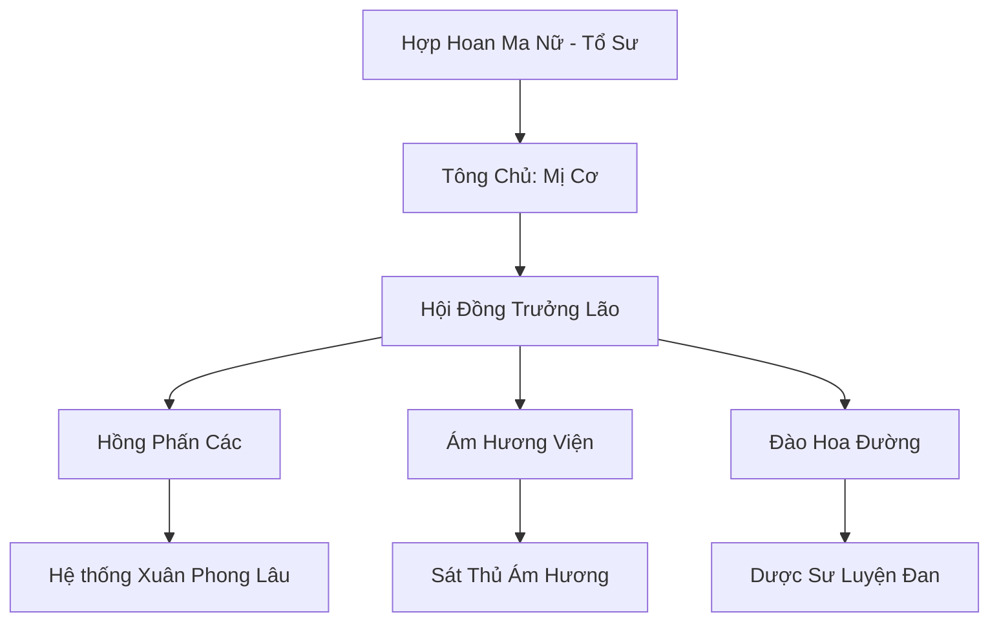

# HỢP HOAN TÔNG (合欢宗)

## I. Tổng Quan (总览)
Hợp Hoan Tông là một thế lực ma đạo đặc thù, chuyên tu luyện thông qua con đường âm dương hòa hợp. Thay vì chiến đấu trực diện, họ sử dụng sự quyến rũ, ảo giác và mạng lưới thông tin khổng lồ để thao túng đối thủ. Tông môn này vừa bị khinh bỉ bởi chính đạo, vừa là nỗi khiếp sợ ngầm của các tu sĩ có tâm tính không kiên định.

## II. Địa Lý & Tài Nguyên (地理与 tài nguyên)
Trụ sở chính nằm trên Hợp Hoan Đảo, một hòn đảo thơ mộng ẩn giấu giữa các lớp sương mù ảo ảnh tại vùng biển Đông Hoang. Nơi đây có Vườn Đào Vạn Năm, nơi hoa đào nở rộ quanh năm cung cấp linh khí và hương liệu đặc trưng cho công pháp của tông môn.

## III. Văn Hóa & Tín Ngưỡng (文化与信仰)
Tôn thờ chủ nghĩa khoái lạc và sự tự do của dục vọng. Họ tin rằng cảm xúc và sự ham muốn là nguồn năng lượng mạnh mẽ nhất của linh hồn. Đệ tử Hợp Hoan Tông thường có lối sống phóng túng, trang phục gợi cảm và luôn mang theo hương thơm mê hoặc.

## IV. Cơ Cấu Tổ Chức (组织结构)


## V. Công Pháp & Trận Pháp (功法与阵法)
- **Công Pháp:** *Hợp Hoan Thiên Thư* (Bí tịch tối cao), *Mê Hồn Đại Pháp* (Thao túng tâm trí).
- **Trận Pháp:** *Hồng Phấn Mê Hồn Trận* - tạo ra ảo cảnh cực lạc khiến quân địch mất đi ý chí chiến đấu và dần bị hút cạn tinh khí.

## VI. Đặc Sản Môn Phái (门派特产)
- **Hợp Hoan Tán:** Loại xuân dược và thuốc mê mạnh nhất lục địa.
- **Ám Hương Phù:** Linh phù tỏa hương có khả năng làm nhiễu loạn thần thức đối phương.

## VII. Cơ Sở Hạ Tầng (基础设施)
- **Hương Phấn Điện:** Trung tâm điều hành và nơi tổ chức các nghi lễ lớn của tông môn.
- **Xuân Phong Lâu:** Mạng lưới cơ sở kinh doanh trải dài khắp các thành trì lớn, đóng vai trò là "mắt thần" thu thập tin tức.

## VIII. Kinh Tế (经济)
Kinh tế cực kỳ hưng thịnh nhờ việc kinh doanh các dịch vụ giải trí (thanh lâu, tửu quán) và buôn bán các loại hương liệu, đan dược đặc thù. Họ cũng nắm giữ nguồn thu lớn từ việc bán thông tin tình báo cho các thế lực khác.

## IX. Lịch Sử Tóm Tắt (简史)
Được sáng lập bởi Hợp Hoan Ma Nữ, một nữ tu thiên tài nhưng bị tổn thương tình cảm sâu sắc. Bà đã sáng tạo ra con đường tu luyện dựa trên việc chiếm đoạt nguyên âm và nguyên dương để nhanh chóng thăng tiến tu vi, biến Hợp Hoan Tông thành một thế lực đáng gờm.

## X. Giai Thoại & Bí Mật (轶 sự与秘密)
Đồn rằng trong sâu thẳm Hợp Hoan Đảo có một "Hồ Ước Nguyện", nơi những ai hiến tế ký ức đau khổ về tình yêu sẽ nhận được sức mạnh mê hoặc vô song.

## XI. Quan Hệ Thế Lực (势力关系)
```mermaid
graph LR
    HHT[Hợp Hoan Tông] -- Phụ thuộc -- CUMT[Cửu U Ma Tông]
    HHT -- Cung cấp tin tức -- HSM[Huyết Sát Minh]
    HHT -- Tử địch -- CHKT[Cửu Hoa Kiếm Tông]
```
