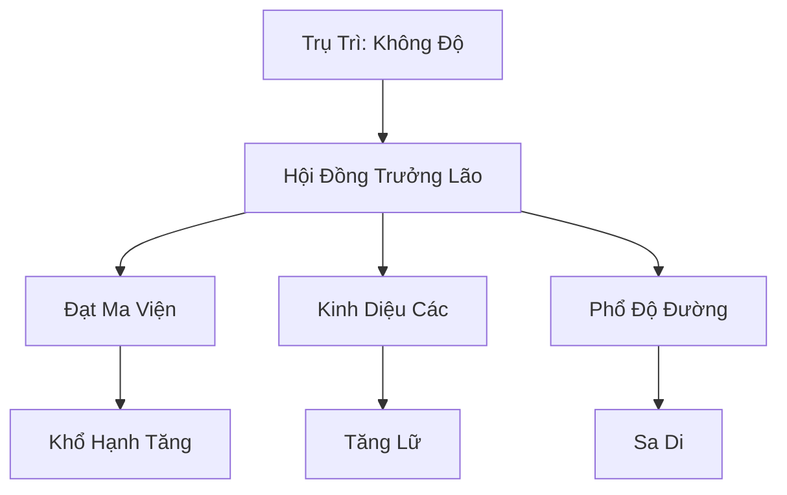
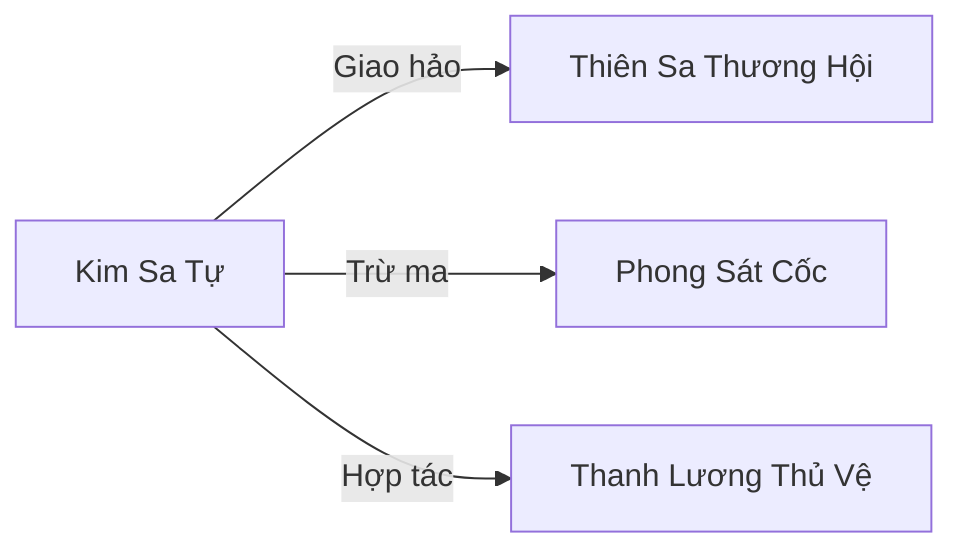

# KIM SA TỰ (金沙寺)

## I. Tổng Quan (总览)
Kim Sa Tự là thánh địa Phật giáo lớn nhất tại Tây Mạc, nổi tiếng với con đường tu hành khổ hạnh và kỹ thuật luyện thể đạt đến cảnh giới bất diệt. Tự viện đóng vai trò là cột trụ chính đạo, bảo vệ cư dân sa mạc khỏi sự xâm lấn của ma đạo và thiên tai.

## II. Địa Lý & Tài Nguyên (地理与 tài nguyên)
Tọa lạc tại trung tâm Kim Sa Nguyên, nơi cát vàng tích tụ linh khí kim hệ dày đặc nhất. Tự viện sở hữu nhiều giếng cổ chứa linh dịch thanh khiết và các mỏ Kim Sa Tinh - nguyên liệu quý giá để rèn luyện pháp thân.

## III. Văn Hóa & Tín Ngưỡng (文化与信仰)
Thờ phụng Kim Thân Đại Phật. Tín đồ tin rằng thân thể là đền đài của linh hồn, việc rèn luyện thân thể đến mức cực hạn là cách để thấu hiểu chân lý vĩnh hằng. Lễ hội Vạn Phật Cát là sự kiện lớn nhất, thu hút hàng vạn lữ khách sa mạc.

## IV. Cơ Cấu Tổ Chức (组织结构)

## V. Công Pháp & Trận Pháp (功法与阵法)
- **Công Pháp:** *Kim Sa Bất Diệt Quyết* (Luyện thể), *Đại Phạn Bát Nhã* (Tâm pháp).
- **Trận Pháp:** *Kim Sa Đại Trận* - biến toàn bộ cát vàng xung quanh tự viện thành lớp phòng thủ kiên cố hoặc bão cát nghiền nát kẻ thù.

## VI. Đặc Sản Môn Phái (门派特产)
- **Kim Sa Đan:** Đan dược hỗ trợ rèn luyện gân cốt.
- **Sa Thạch Niệm Châu:** Chuỗi hạt làm từ đá sa thạch có khả năng định tâm, kháng ảo giác.

## VII. Cơ Sở Hạ Tầng (基础设施)
- **Cửu Tầng Kim Tháp:** Nơi lưu trữ xá lợi của các vị cao tăng và cũng là trung tâm điều khiển đại trận.
- **Khổ Hạnh Lộ:** Con đường cát nóng hàng ngàn dặm dành cho việc rèn luyện đệ tử.

## VIII. Kinh Tế (经济)
Nguồn thu chính đến từ sự quyên góp của các tín đồ và việc kinh doanh Kim Sa Tinh cho các thương hội. Họ cũng nhận các hợp đồng hộ tống cao cấp xuyên sa mạc để gây quỹ cứu tế.

## IX. Lịch Sử Tóm Tắt (简史)
Sáng lập bởi Kim Sa Thiền Sư vào thời khởi nguyên. Ông đã dùng thần thông dời non lấp biển để tạo ra một vùng đất an lành giữa bão cát, đặt nền móng cho sự hưng thịnh của Phật pháp tại vùng đất cằn cỗi này.

## X. Giai Thoại & Bí Mật (轶 sự与秘密)
Tương truyền dưới đáy Cửu Tầng Kim Tháp có giam giữ một thực thể ma quỷ từ thời Thái Cổ, được trấn áp bởi sức mạnh của vạn dân tín ngưỡng.

## XI. Quan Hệ Thế Lực (势力关系)

