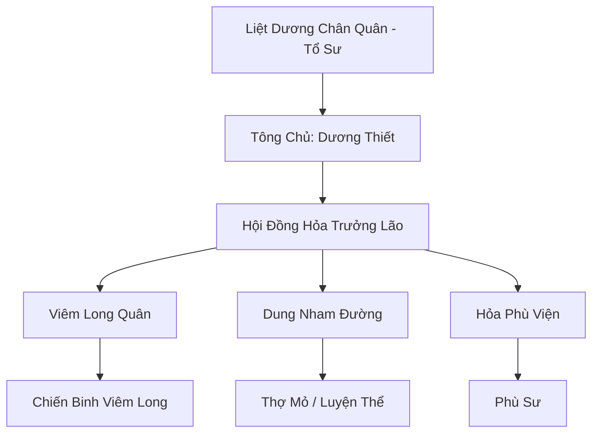

# LIỆT DƯƠNG TÔNG (烈阳宗)

## I. Tổng Quan (总览)
Liệt Dương Tông là một tông môn tu chân có phong cách chiến đấu hung bạo và cực đoan nhất khu vực Đông Hoang. Với khả năng làm chủ sức mạnh của núi lửa và dung nham, họ được coi là những "chiến binh lửa" có sức công phá kinh người. Tông môn này đề cao sức mạnh tuyệt đối và ý chí sắt đá, thường xuyên tham gia vào các cuộc tranh chấp tài nguyên linh hỏa trên lục địa.

## II. Địa Lý & Tài Nguyên (地理 với tài nguyên)
Trụ sở chính nằm ngay trên miệng Núi Lửa Liệt Dương, ngọn núi lửa hoạt động mạnh nhất miền Đông. Nơi đây sở hữu "Liệt Dương Linh Trì" - một hồ dung nham chứa nồng độ hỏa linh khí cực cao, là nơi rèn luyện thân thể và vũ khí lý tưởng. Họ cũng kiểm soát các hang động chứa đầy hỏa tinh thạch vạn năm.

## III. Văn Hóa & Tín Ngưỡng (文化 với信仰)
Tôn thờ Liệt Dương Chân Quân và triết lý "Hỏa Thiêu Vạn Vật, Tái Sinh Trong Tro Tàn". Đệ tử Liệt Dương Tông có văn hóa sống kỷ luật như quân đội, tính cách nóng nảy nhưng rất trọng danh dự võ biền. Mỗi năm, họ tổ chức "Đại Hội Thử Lửa" để chọn ra những chiến binh có khả năng chịu nhiệt cao nhất.

## IV. Cơ Cấu Tổ Chức (组织结构)


## V. Công Pháp & Trận Pháp (功法与阵法)
- **Công Pháp:** *Liệt Dương Thần Công* (Bùng nổ linh lực), *Dung Nham Phá Địa Thuật* (Tấn công diện rộng và thay đổi địa hình).
- **Trận Pháp:** *Thái Dương Kính Trận* - sử dụng các tấm kính linh khí khổng lồ để hội tụ ánh sáng mặt trời thành các chùm tia hủy diệt thiêu rụi quân địch từ xa.

## VI. Đặc Sản Môn Phái (门派特产)
- **Liệt Dương Hỏa Tinh:** Loại tinh thể chứa hỏa năng thuần khiết, dùng để đột phá cảnh giới hỏa hệ.
- **Dung Nham Chiến Giáp:** Giáp trụ đúc từ đá núi lửa, tỏa ra nhiệt lượng làm suy yếu kẻ thù khi tiếp cận.

## VII. Cơ Sở Hạ Tầng (基础设施)
- **Xích Nhiệt Điện:** Cung điện trung tâm xây dựng bằng gạch nung chịu nhiệt, bao quanh bởi các dòng dung nham.
- **Luyện Hỏa Đài:** Sân tập luyện công khai nơi đệ tử đối kháng trực tiếp giữa các cột lửa.

## VIII. Kinh Tế (经济)
Kinh tế dựa vào việc độc quyền khai thác hỏa tinh thạch tại vùng Hoang Mạc Đỏ. Họ cũng là nhà cung cấp linh hỏa và dịch vụ nung nấu nguyên liệu cho nhiều luyện khí sư và tông môn khác tại Đông Hoang.

## IX. Lịch Sử Tóm Tắt (简史)
Được sáng lập bởi Liệt Dương Chân Quân, một thiên tài hỏa tu bị các tông môn chính đạo xua đuổi do phương pháp tu luyện quá nguy hiểm. Ông đã tìm đến núi lửa này, dùng sức mạnh của mình trấn áp linh hồn hỏa long cổ đại và lập nên Liệt Dương Tông để chứng minh sức mạnh của ngọn lửa hủy diệt.

## X. Giai Thoại & Bí Mật (轶 sự với bí mật)
Tương truyền sâu trong lòng Núi Lửa Liệt Dương có một cánh cổng dẫn đến "Viêm Giới", nơi trú ngụ của các thực thể lửa nguyên thủy và là nguồn gốc của mọi loại linh hỏa trên thế gian.

## XI. Quan Hệ Thế Lực (势力关系)
```mermaid
graph LR
    LYT[Liệt Dương Tông] -- Cạnh tranh -- ĐHC[Đan Hà Cốc]
    LYT -- Xung đột -- TYD[Thiên Yêu Đình]
    LYT -- Giao dịch -- TKP[Thần Khí Phường]
    LYT -- Cảnh giác -- TAM[Thái Ất Môn]
```
