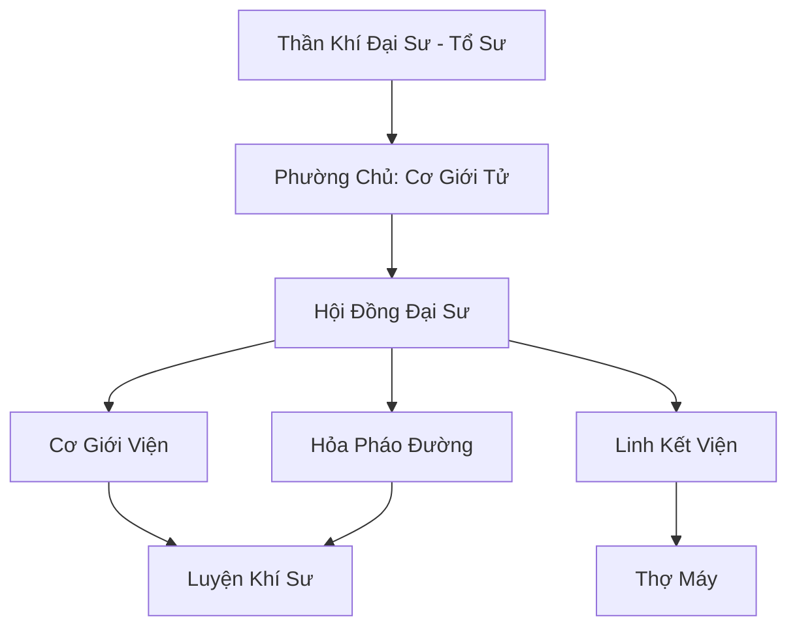

# THẦN KHÍ PHƯỜNG (神器坊)

## I. Tổng Quan (总览)
Thần Khí Phường là trung tâm công nghiệp tu chân lớn nhất của Nhân Tộc, nổi tiếng với việc ứng dụng các nguyên lý cơ khí phức tạp vào luyện khí. Khác với các tông môn rèn đúc truyền thống, Thần Khí Phường hướng tới việc sản xuất hàng loạt các khí tài quy mô lớn, giữ vai trò then chốt trong việc thay đổi bộ mặt chiến tranh tại Cố Nguyên Giới.

## II. Địa Lý & Tài Nguyên (地理 với tài nguyên)
Tọa lạc tại Thần Khí Thành, một thành phố nằm trên các mạch địa hỏa ổn định tại Đông Hoang. Thành phố luôn rực sáng bởi ánh lửa từ hàng ngàn lò luyện và tiếng máy móc vận hành. Thần Khí Phường kiểm soát các khu vực khai thác linh kim hiếm và sở hữu xưởng đúc phù không - nơi lắp ráp các phi thuyền khổng lồ.

## III. Văn Hóa & Tín Ngưỡng (文化 với信仰)
Tôn thờ "Thần Khí Đại Sư" và triết lý "Trí Tuệ Cải Tạo Thế Giới". Họ tin rằng máy móc và trận pháp có thể giúp con người vượt qua giới hạn của linh căn bẩm sinh. Văn hóa môn phái đề cao sự chính xác, đổi mới và tinh thần làm việc nhóm trong các dự án kỹ thuật lớn.

## IV. Cơ Cấu Tổ Chức (组织结构)


## V. Công Pháp & Trận Pháp (功法与阵法)
- **Công Pháp:** *Thiên Cơ Tâm Chú* (Điều khiển linh lực máy móc), *Vạn Linh Quy Nhất Quyết* (Kết nối trận pháp đa tầng).
- **Trận Pháp:** *Thiên Cơ Khởi Động Trận* - trận pháp cốt lõi dùng để cung cấp năng lượng khởi động cho các phi thuyền và đại pháo linh thạch.

## VI. Đặc Sản Môn Phái (门派特产)
- **Phi Thuyền "Thanh Long":** Chiến hạm bay có khả năng tự phục hồi và hỏa lực mạnh mẽ.
- **Linh Thạch Pháo:** Vũ khí phòng thủ thành trì có thể bắn xa hàng chục dặm.

## VII. Cơ Sở Hạ Tầng (基础设施)
- **Thiên Cơ Lò Đúc:** Lò nung khổng lồ sử dụng lõi hỏa linh thạch vạn năm.
- **Cảng Phù Không:** Nơi neo đậu và xuất phát của các hạm đội phi thuyền.

## VIII. Kinh Tế (经济)
Kinh tế cực kỳ vững mạnh nhờ các hợp đồng quân sự béo bở với các quốc gia và đại tông môn. Họ cũng độc quyền dịch vụ vận tải hàng không liên lục địa và bảo trì các thiết bị tu chân phức tạp.

## IX. Lịch Sử Tóm Tắt (简史)
Sáng lập bởi Thần Khí Đại Sư, một thiên tài bị coi là lập dị thời Trung Cổ. Ông đã chứng minh giá trị của mình khi chế tạo ra hạm đội phi thuyền đầu tiên giúp nhân loại đẩy lùi đợt tấn công của Yêu Tộc phương Bắc, từ đó đặt nền móng cho đế chế công nghiệp này.

## X. Giai Thoại & Bí Mật (轶 sự với bí mật)
Đồn rằng Thần Khí Phường đang bí mật nghiên cứu một loại "Thần Cơ Khôi Lỗi" có trí tuệ và sức mạnh tương đương tu sĩ Hóa Thần để thay thế con người trong các cuộc chiến.

## XI. Quan Hệ Thế Lực (势力关系)
```mermaid
graph LR
    TKP[Thần Khí Phường] -- Cạnh tranh -- SLC[Thạch Linh Cung]
    TKP -- Cung cấp -- DCHH[Đại Càn Hoàng Triều]
    TKP -- Hợp tác -- TAM[Thái Ất Môn]
    TKP -- Giao dịch -- BBC[Bách Bảo Các]
```
