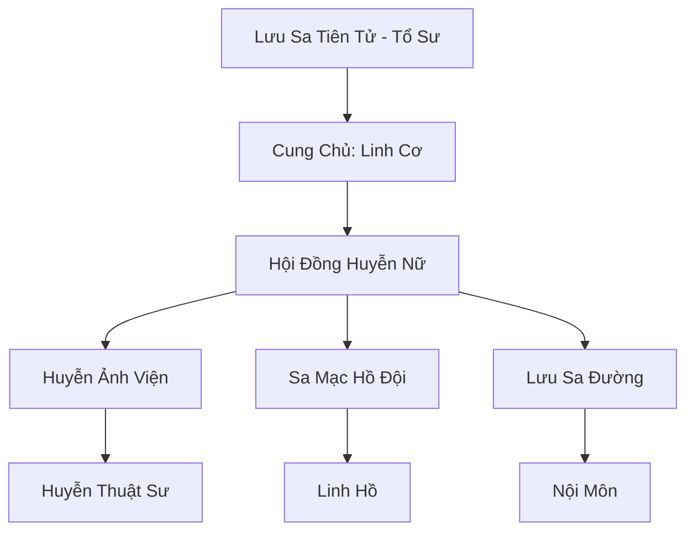

# LƯU SA HUYỄN CUNG (流沙幻宫)

## I. Tổng Quan (总览)
Lưu Sa Huyễn Cung là một thế lực bí ẩn và thơ mộng nhất Tây Mạc, được coi là một truyền thuyết sống giữa cát vàng. Cung điện không bao giờ ở yên một chỗ mà luôn di chuyển theo các bãi cát lún, khiến nó trở thành một pháo đài bất khả xâm phạm đối với những kẻ không am hiểu về ảo thuật và không gian.

## II. Địa Lý & Tài Nguyên (地理 với tài nguyên)
Trụ sở chính là Huyễn Ảo Thành, một tổ hợp kiến trúc lộng lẫy được xây dựng từ đá pha lê nhẹ, có khả năng lơ lửng trên mặt cát lún. Cung điện nắm giữ "Lưu Sa Mạch" - một mạch linh khí biến dị có khả năng bẻ cong ánh sáng và âm thanh, cung cấp năng lượng cho mọi ảo trận.

## III. Văn Hóa & Tín Ngưỡng (文化 với信仰)
Đề cao sự tinh tế, tâm linh và vẻ đẹp của sự hư ảo. Thành viên chủ yếu là nữ tu và linh hồ, những người tin rằng thực tại chỉ là một lớp sương mù che mắt. Họ có văn hóa thưởng trà ảo giác và tổ chức các buổi biểu diễn huyễn vũ dưới ánh trăng.

## IV. Cơ Cấu Tổ Chức (组织结构)


## V. Công Pháp & Trận Pháp (功法与阵法)
- **Công Pháp:** *Lưu Sa Huyễn Mộng Kinh* (Tu luyện thần thức), *Thủy Kính Ảo Ảnh* (Tạo hình từ linh lực).
- **Trận Pháp:** *Vạn Ảnh Hư Vô Trận* - trận pháp bao phủ toàn bộ vùng lãnh thổ di động của cung điện, khiến nó trở nên tàng hình hoặc hiển thị như một ốc ảo trù phú để bẫy kẻ thù.

## VI. Đặc Sản Môn Phái (门派特产)
- **Huyễn Mộng Hương:** Loại hương liệu khiến người ngửi thấy rơi vào giấc ngủ sâu và trải qua những giấc mơ đẹp nhất hoặc kinh hoàng nhất.
- **Lưu Sa Châu:** Viên ngọc chứa đựng một phần không gian ảo giác, dùng để phòng thân.

## VII. Cơ Sở Hạ Tầng (基础设施)
- **Huyễn Ảo Thành:** Lâu đài di động với hệ thống phòng ốc luôn thay đổi vị trí.
- **Thanh Kính Hồ:** Một hồ nước ảo giác bên trong cung điện dùng để rèn luyện tâm tính đệ tử.

## VIII. Kinh Tế (经济)
Nguồn thu đến từ việc thu thập các bảo vật từ những kẻ xúi quẩy đi lạc vào các ảo trận chết người. Họ cũng bí mật buôn bán các loại hương liệu cao cấp và cung cấp dịch vụ "Xóa bỏ dấu vết" cho những tu sĩ muốn ẩn danh.

## IX. Lịch Sử Tóm Tắt (简史)
Được sáng lập bởi Lưu Sa Tiên Tử vào thời Thái Cổ, người đã ngộ ra đạo lý ảo mộng sau khi bị lạc giữa sa mạc mười năm. Bà đã biến nỗi cô độc và sự sợ hãi thành một loại sức mạnh, xây dựng nên cung điện để bảo vệ những kẻ đồng cảnh ngộ.

## X. Giai Thoại & Bí Mật (轶 sự với bí mật)
Tương truyền mỗi khi trăng tròn, Lưu Sa Huyễn Cung sẽ hiển thị hình dáng thực sự của nó là một đóa hoa sen đá khổng lồ nở rộ giữa đại sa mạc.

## XI. Quan Hệ Thế Lực (势力关系)
```mermaid
graph LR
    LSHC[Lưu Sa Huyễn Cung] -- Tử địch -- PSC[Phong Sát Cốc]
    LSHC -- Tránh né -- KST[Kim Sa Tự]
    LSHC -- Cung cấp -- BHC[Bách Hoa Cốc]
```
