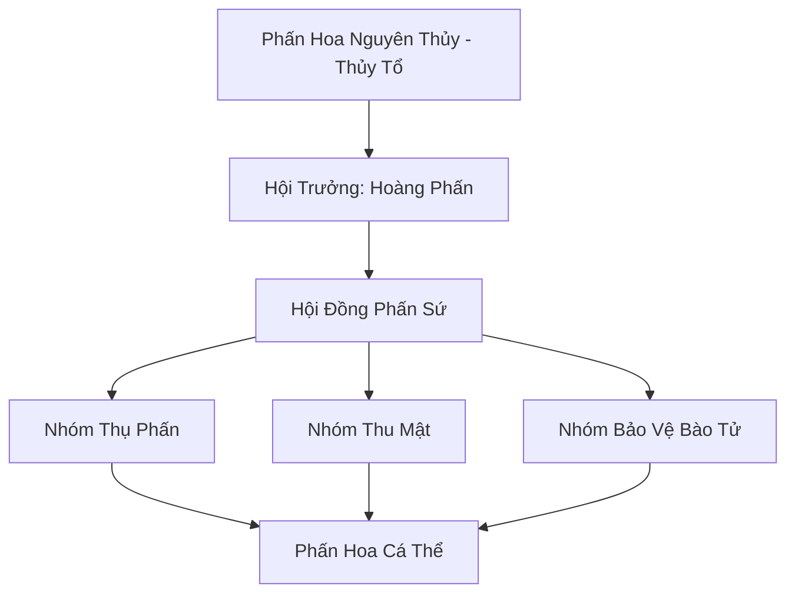

# BỤI PHẤN HỘI (花粉会)

## I. Tổng Quan (总览)
Bụi Phấn Hội là một tổ chức Vi Tộc tồn tại thầm lặng nhưng cực kỳ quan trọng trong hệ sinh thái linh thực vật tại Nam Cương. Tọa lạc quanh chân núi Hỏa Vân Sơn, hội bao gồm hàng tỷ cá thể phấn hoa linh lấp lánh, đóng vai trò là nhịp cầu sinh mệnh cho hàng ngàn loài hoa quý hiếm. Dù không có sức mạnh chiến đấu, sự hiện diện của họ đảm bảo dòng chảy linh khí và sự đa dạng sinh học của toàn bộ vùng rừng già.

## II. Địa Lý & Tài Nguyên (地理 với tài nguyên)
Địa bàn hoạt động là các cánh đồng hoa linh rực rỡ sắc màu quanh chân núi Hỏa Vân Sơn, nơi địa nhiệt từ núi lửa cung cấp năng lượng ấm áp quanh năm. Tài nguyên chính là khả năng thụ phấn đặc thù giúp linh thực vật sinh trưởng nhanh gấp đôi và các loại mật hoa tinh thuần được tích lũy trong quá trình làm việc.
Khu vực xung quanh ẩn chứa nhiều bí mật chưa được khám phá — hang động chưa ai đến, mạch khoáng chưa ai biết, dấu tích cổ đại mà thời gian chưa kịp xóa nhòa.

## III. Văn Hóa & Tín Ngưỡng (文化 với信仰)
Đề cao triết lý cộng sinh: "Hoa nở nhờ ta, ta sống nhờ hoa". Thành viên hội coi việc thụ phấn là một sứ mệnh thiêng liêng. Văn hóa của hội mang đậm tính tự nhiên, bay theo gió và hòa mình vào hương thơm. Nghi lễ "Chào Hoa" là nét đặc trưng, nơi họ cử những Phấn Sứ đến thụ phấn đầu tiên cho những đóa hoa quý mới nở để chúc phúc cho sự sống mới.
Mỗi thế hệ mới được truyền dạy không chỉ kỹ năng sinh tồn mà cả câu chuyện về nguồn cội, để ngọn lửa ký ức không bao giờ tắt dù hoàn cảnh khắc nghiệt đến đâu.

## IV. Cơ Cấu Tổ Chức (组织结构)


## V. Công Pháp & Trận Pháp (功法 với阵法)
- **Công Pháp:** Không có công pháp tu luyện nhân tạo, tiến hóa thông qua việc *Cộng Hưởng Linh Khí Hoa* để tăng cường mật độ và độ lấp lánh của bào tử.
- **Trận Pháp:** *Hoa Phấn Mê Hồn Trận* - trận pháp tự vệ diện rộng, phát tán đám mây phấn hoa gây hắt hơi, chảy nước mắt và làm nhiễu loạn thần thức của những kẻ xâm nhập trái phép, buộc họ phải rời khỏi cánh đồng hoa.

## VI. Đặc Sản Môn Phái (门派特产)
- **Hỏa Vân Linh Phấn:** Loại bột phát sáng chứa hỏa linh khí nhẹ, dùng làm chất phụ gia cho đan dược hoặc hương liệu cao cấp.
- **Mật Hoa Tinh Khiết:** Nguồn dinh dưỡng dồi dào có tác dụng bồi bổ khí huyết cho các loài linh trùng.
Ngoài ra, Bụi Phấn Hội còn sở hữu vật phẩm có giá trị văn hóa hơn vật chất — thứ mà thương nhân bỏ qua nhưng nhà sử học trả bất cứ giá nào.

## VII. Cơ Sở Hạ Tầng (基础设施)
- **Đài Phun Phấn:** Các điểm tập trung tự nhiên nơi gió thường xuyên cuốn phấn hoa đi xa nhất.
- **Túi Chứa Mật:** Các hốc cây cổ thụ được yểm bùa để lưu trữ mật hoa dự phòng.
Toàn bộ hạ tầng mang dấu ấn đặc trưng cộng đồng — không phải xa hoa mà là thực dụng đúc kết qua nhiều thế hệ thử nghiệm.

## VIII. Kinh Tế (経済)
Kinh tế mang tính trao đổi sinh thái. Hội cung cấp dịch vụ thụ phấn vô hình cho mọi loài hoa, đổi lại họ được hưởng nguồn mật và linh khí dồi dào. Thỉnh thoảng họ trao đổi mật hoa cho Mật Phong Linh Đàn để lấy các loại sáp bảo vệ tổ hoặc thông tin về các vùng hoa mới nở.
Tiềm năng kinh tế vượt xa những gì đang được khai thác — sự thiếu hụt nhân lực, kiến thức thương mại, và bảo hộ chính trị khiến phần lớn giá trị vẫn nằm yên.

## IX. Lịch Sử Tóm Tắt (简史)
Tồn tại từ thời kỳ khai thiên lập địa cùng với hệ thực vật Nam Cương. Bụi Phấn Hội đã âm thầm duy trì vẻ đẹp của Hỏa Vân Sơn qua hàng vạn năm mà không cần sự chú ý của thế giới tu chân. Họ là những người thợ làm vườn vô hình, bảo vệ di sản của thiên nhiên phương Nam.
Mỗi thế hệ kế tiếp gánh di sản và gánh nặng thế hệ trước — nhưng cũng mang khả năng mới mà cha ông chưa từng tưởng tượng.

## X. Giai Thoại & Bí Mật (轶 sự với bí mật)
Tương truyền Hoàng Phấn đang cất giữ một lượng nhỏ bào tử của loài "Hỏa Liên Hoa" đã tuyệt chủng, thứ chỉ có thể nảy mầm trong điều kiện nhiệt độ cực hạn của núi lửa phun trào, mang theo bí mật về sự trường sinh của hỏa hệ.
Những bí mật này, nếu được tiết lộ, có thể khiến nhiều thế lực phải nhìn lại đánh giá của mình về cộng đồng nhỏ bé này — vừa là cơ hội vừa là mối nguy.

## XI. Quan Hệ Thế Lực (势力关系)
```mermaid
graph LR
    BPH[Bụi Phấn Hội] -- Cộng sinh -- MPLĐ[Mật Phong Linh Đàn]
    BPH -- Cung cấp -- DVC[Dược Vương Cốc]
    BPH -- Vô hại -- ALL[Muôn Loài]
    BPH -- Cảnh giác -- LYT[Liệt Dương Tông]
Nhìn tổng thể, mạng lưới quan hệ tuy mỏng manh nhưng đủ duy trì sự tồn tại — trong thế giới tu chân tàn khốc, tồn tại đã là chiến thắng.
```
