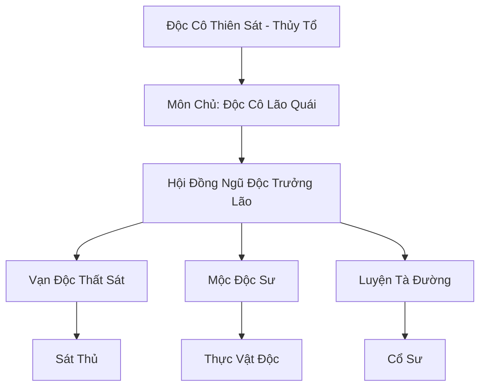

# VẠN ĐỘC MÔN (万毒门)

## I. Tổng Quan (总览)
Vạn Độc Môn là thế lực ma đạo thống trị tuyệt đối tại vùng rừng rậm Nam Cương, khởi nguồn từ sự phản bội của một thiên tài y thuật. Tông môn này biến nọc độc và cổ trùng thành một loại nghệ thuật chiến tranh đáng sợ, có khả năng tiêu diệt toàn bộ một thành trì chỉ bằng một làn khói độc. Với triết lý "Cường giả vi tôn", đây là nơi của những kẻ tàn nhẫn nhất, sẵn sàng hiến tế đồng môn và chính bản thân mình để đạt đến cảnh giới vạn độc bất xâm.

## II. Địa Lý & Tài Nguyên (地理 với tài nguyên)
Trụ sở chính là Vạn Độc Cốc, một thung lũng hình bát quái ngược nằm sâu trong rừng rậm nguyên sinh, quanh năm bao phủ bởi độc vụ màu tím lục. Trung tâm cốc là "Huyết Trì" - nơi nuôi dưỡng những loài cổ trùng vương giả. Tông môn kiểm soát hệ thống "Kho Chứa Ngầm" khổng lồ dùng để vận chuyển hàng cấm và nuôi dưỡng các mẫu vật thí nghiệm kinh tởm như "Dược Nhân".

## III. Văn Hóa & Tín Ngưỡng (文化 với信仰)
Tôn thờ sức mạnh của độc tố và sự đào thải tự nhiên. Đệ tử Vạn Độc Môn tin rằng độc là bản chất của sự sống và cái chết. Văn hóa môn phái cực kỳ tàn bạo, việc đệ tử tàn sát lẫn nhau để tranh giành cổ vương được coi là hợp lệ. Mỗi thành viên đều phải mang trong mình một "Bản Mệnh Cổ Trùng", thứ gắn liền sinh mạng của họ với sức mạnh tà đạo.

## IV. Cơ Cấu Tổ Chức (组织结构)


## V. Công Pháp & Trận Pháp (功法 với阵法)
- **Công Pháp:** *Vạn Độc Chân Kinh* (Hấp thụ vạn độc rèn luyện nhục thân), *Thiên Cổ Bí Thuật*.
- **Trận Pháp:** *Vạn Độc Phệ Tâm Trận* - trận pháp hộ môn sử dụng độc vụ và ảo giác để ăn mòn thần thức kẻ thù, biến họ thành những dược nhân điên loạn ngay tại chỗ.

## VI. Đặc Sản Môn Phái (门派特产)
- **Cổ Vương:** Những thực thể cổ trùng cấp cao có khả năng ký sinh và điều khiển tu sĩ cấp Nguyên Anh.
- **Vạn Độc Phấn:** Loại bột kịch độc không màu, không mùi, có khả năng vô hiệu hóa linh lực đối phương trong thời gian ngắn.

## VII. Cơ Sở Hạ Tầng (基础设施)
- **Huyết Trì Cổ Vương:** Hồ máu trung tâm, nơi diễn ra lễ tế cổ hàng năm.
- **Nấm Độc Lâm:** Vùng ngoại vi đầy những bào tử nấm đột biến, đóng vai trò là hàng rào phòng thủ tự nhiên.

## VIII. Kinh Tế (経済)
Nguồn thu khổng lồ từ việc buôn bán các loại kỳ độc, cổ trùng và thuốc giải độc (thực chất là thuốc khống chế) trên hắc thị. Họ cũng chiếm đoạt tài nguyên dược liệu quý hiếm của Nam Cương thông qua việc cưỡng bức các bộ lạc bản địa lao dịch và nộp phí bảo hộ.

## IX. Lịch Sử Tóm Tắt (简史)
Sáng lập bởi Độc Cô Thiên Sát, một phản đồ thiên tài của Dược Vương Cốc chạy trốn đến Nam Cương sau khi đánh cắp bí mật độc đạo. Ông đã biến vùng đất hoang dã này thành một đế chế ma đạo, liên tục đối đầu với các tông môn chính đạo phương Bắc trong suốt hàng ngàn năm qua.

## X. Giai Thoại & Bí Mật (轶 sự với bí mật)
Tương truyền Độc Cô Lão Quái đang bí mật nuôi dưỡng một "Thần Cổ" có khả năng nuốt chửng linh mạch của toàn bộ thế giới để biến ông ta thành vị thần độc đạo đầu tiên.

## XI. Quan Hệ Thế Lực (势力关系)
```mermaid
graph LR
    VDM[Vạn Độc Môn] -- Tử địch -- DVC[Dược Vương Cốc]
    VDM -- Đối địch -- ĐHC[Đan Hà Cốc]
    VDM -- Đồng minh -- HMT[Huyết Ma Tông]
    VDM -- Thao túng -- HBT[Hắc Báo Trại]
```
