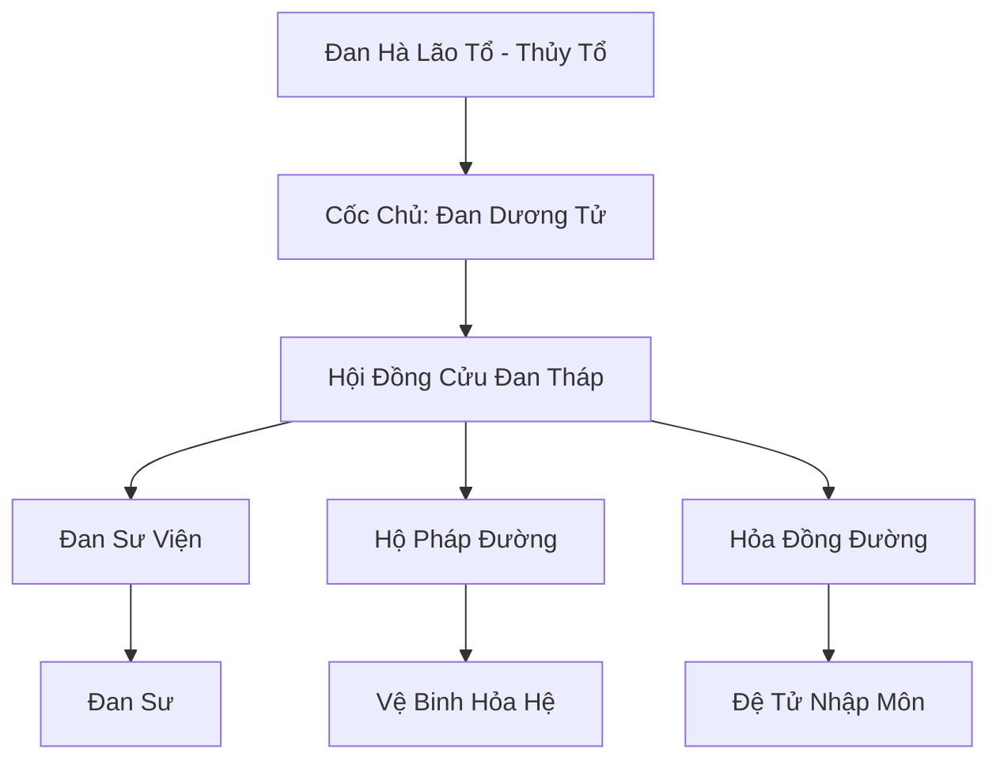

# ĐAN HÀ CỐC (丹河谷)

## I. Tổng Quan (总览)
Đan Hà Cốc là thế lực luyện đan hùng mạnh nhất khu vực phía Nam, nổi tiếng với kỹ thuật sử dụng địa hỏa và dòng sông dung nham để tôi luyện đan dược. Với phương châm "Lấy hỏa luyện tâm, lấy đan chứng đạo", tông môn này giữ vị thế trung lập tuyệt đối, sẵn sàng giao dịch với cả chính đạo lẫn ma đạo miễn là lợi nhuận đủ lớn. Tuy nhiên, họ cũng sở hữu một lực lượng hộ pháp mạnh mẽ để bảo vệ những bí mật đơn phương vô giá của mình.

## II. Địa Lý & Tài Nguyên (地理 với tài nguyên)
Trụ sở nằm bên trong miệng một ngọn núi lửa khổng lồ thuộc dãy Hỏa Diệm Sơn. Một dòng sông dung nham đỏ rực gọi là Đan Hà chảy xuyên qua trung tâm cốc, cung cấp nguồn hỏa năng ổn định và tinh thuần cho hàng ngàn lò luyện đan. Nơi đây sản sinh ra các loại linh thảo hỏa hệ cực phẩm và các khối hỏa tinh thạch vạn năm.

## III. Văn Hóa & Tín Ngưỡng (文化 với信仰)
Tôn thờ Đan Hà Lão Tổ và tinh thần lao động sáng tạo trong ngọn lửa. Thành viên Đan Hà Cốc coi quá trình luyện đan là một hình thức thiền định cao cấp. Họ đề cao sự sòng phẳng, chữ tín trong giao dịch và kỹ năng thực tế. Hàng năm, "Đan Hội" là sự kiện lớn nhất thu hút các đan sư toàn lục địa về tranh tài.

## IV. Cơ Cấu Tổ Chức (组织结构)


## V. Công Pháp & Trận Pháp (功法 với阵法)
- **Công Pháp:** *Cửu Chuyển Đan Hỏa Quyết* (Luyện hỏa thuật), *Vạn Dược Linh Thông* (Kiến thức dược liệu).
- **Trận Pháp:** *Vạn Hỏa Phần Thiên Trận* - trận pháp hộ môn cấp 9, có khả năng kích hoạt toàn bộ địa hỏa dưới lòng đất để biến thung lũng thành một biển lửa thiêu rụi mọi kẻ xâm lược.

## VI. Đặc Sản Môn Phái (门派特产)
- **Đan Hà Đỉnh:** Loại lò luyện đan đặc chế có khả năng chịu nhiệt và dẫn dụ linh hỏa cực tốt.
- **Phá Cảnh Đan:** Đan dược hỗ trợ đột phá các cảnh giới lớn (Trúc Cơ, Kim Đan, Nguyên Anh) với tỷ lệ thành công cao.

## VII. Cơ Sở Hạ Tầng (基础设施)
- **Cửu Đan Tháp:** Chín tòa tháp đá đen chuyên biệt cho từng loại đan dược và nghiên cứu.
- **Đan Hà Luyện Phòng:** Hệ thống phòng luyện đan xây dựng trực tiếp trên các mạch dung nham.

## VIII. Kinh Tế (経済)
Nguồn thu khổng lồ từ việc độc quyền cung cấp các loại đan dược tu luyện và đột phá cho các thế lực lớn. Họ cũng là nhà cung cấp Hỏa Tinh Thạch và Địa Tâm Hỏa cho các luyện khí sư. Kinh tế của cốc đủ mạnh để thuê mướn các đại năng làm khách khanh trưởng lão.

## IX. Lịch Sử Tóm Tắt (简史)
Sáng lập vào năm 80.000 (Kỷ Nguyên Khởi Nguyên) bởi Đan Hà Lão Tổ, người đã tìm thấy mạch địa hỏa độc nhất vô nhị này. Tông môn đã nhanh chóng vươn lên trở thành thực thể kinh tế và kỹ thuật không thể thiếu tại Nam Cương, vượt qua nhiều cuộc chiến tranh tài nguyên để giữ vững độc lập.

## X. Giai Thoại & Bí Mật (轶 sự với bí mật)
Tương truyền Đan Hà Lão Tổ vẫn đang bế quan trong mật thất sâu nhất dưới dòng Đan Hà để luyện chế một viên "Tiên Đan" có khả năng hồi sinh linh hồn đã tan biến.

## XI. Quan Hệ Thế Lực (势力关系)
```mermaid
graph LR
    ĐHC[Đan Hà Cốc] -- Đối tác -- DCHH[Đại Càn Hoàng Triều]
    ĐHC -- Giao thương -- HBC[Huyền Băng Cung]
    ĐHC -- Tử địch -- VDM[Vạn Độc Môn]
    ĐHC -- Cạnh tranh -- LYT[Liệt Dương Tông]
```
