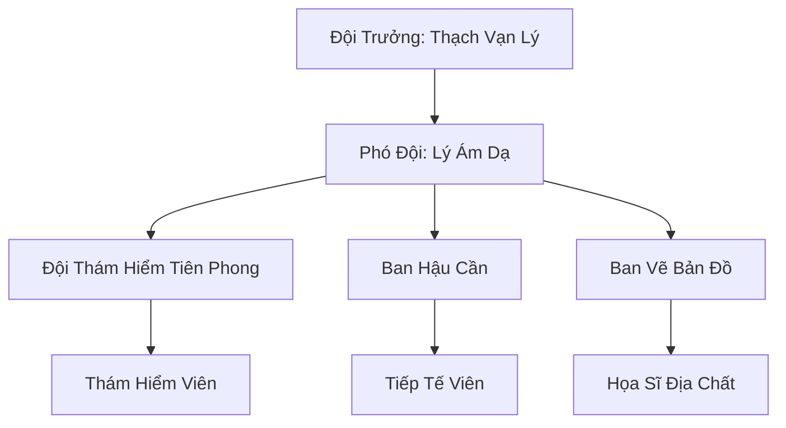

# ĐỊA MẠCH THÁM HIỂM ĐỘI (地脉探险队)

## I. Tổng Quan (总览)
Địa Mạch Thám Hiểm Đội là một tổ chức nhỏ gồm những tu sĩ có niềm đam mê mãnh liệt với việc khám phá thế giới bên dưới mặt đất. Tập trung vào hệ thống Mạch Ngầm chằng chịt của Nam Cương, đội đóng vai trò là những người mở đường, cung cấp thông tin quý giá về địa lý và tài nguyên khoáng sản cho giới tu chân. Họ coi việc vẽ nên một bản đồ hoàn chỉnh của lòng đất là sứ mệnh cao cả hơn cả việc thăng tiến tu vi cá nhân.

## II. Địa Lý & Tài Nguyên (地理 với tài nguyên)
Trạm chính đặt tại cửa hang phía đông của Huyết Uyên, một trong những lối vào lớn nhất dẫn xuống hệ thống mạch ngầm lục địa. Tài nguyên quý giá nhất của đội chính là bộ "Bản Đồ Mạch Ngầm Toàn Tập" - một di sản kiến trúc địa chất sống động được vẽ trên da thú khổng lồ. Họ cũng sở hữu nhiều loại khoáng thạch linh lực độc đáo thu thập được từ những độ sâu mà ít ai dám tới.

## III. Văn Hóa & Tín Ngưỡng (文化 với信仰)
Đề cao triết lý: "Dưới chân ta là cả một thế giới chưa ai biết". Thành viên đội coi trọng sự gan dạ, tính chính xác và tinh thần đồng đội. Văn hóa của họ gắn liền với bóng tối và tiếng vang của đá. Nghi lễ đặc trưng là việc "Găm Linh Thạch" tại những điểm xa nhất mà một thành viên từng đạt đến như một cách để ghi dấu sự hiện diện của nhân loại trong lòng đại địa.

## IV. Cơ Cấu Tổ Chức (组织结构)


## V. Công Pháp & Trận Pháp (功法 với阵法)
- **Công Pháp:** *Địa Tâm Cảm Ứng Quyết* (Cảm nhận cấu trúc đá và mạch linh khí), *Thổ Độn Thuật* (Di chuyển qua các khe đá hẹp).
- **Trận Pháp:** *Cảm Ứng Thạch Trận* - mạng lưới các viên đá linh lực được rải dọc theo đường thám hiểm, giúp duy trì liên lạc thần thức và định vị phương hướng trong mê cung tối đen.

## VI. Đặc Sản Môn Phái (门派特产)
- **Bản Đồ Da Thú:** Các bản sao bản đồ mạch ngầm có khả năng tự phát sáng nhẹ trong bóng tối.
- **Linh Thạch Thâm Tầng:** Các loại đá linh thạch có nồng độ thổ hệ cực cao, chỉ tìm thấy ở độ sâu vạn trượng.

## VII. Cơ Sở Hạ Tầng (基础设施)
- **Trại Huyết Uyên:** Khu trại dã chiến kiên cố tại cửa hang, trung tâm điều hành mọi chuyến đi.
- **Hệ thống Dây Linh Dẫn:** Mạng lưới dây thừng yểm bùa dẫn đường kéo dài hàng chục dặm vào sâu trong lòng đất.

## VIII. Kinh Tế (経済)
Nguồn thu nhập chính từ việc bán các bản sao bản đồ cho các thương hội và tông môn muốn tìm đường tắt xuyên qua Nam Cương. Họ cũng thu lợi từ việc bán các loại khoáng thạch hiếm nhặt được và cung cấp dịch vụ hướng đạo viên chuyên nghiệp cho các đội thám hiểm của thế lực lớn.

## IX. Lịch Sử Tóm Tắt (简史)
Được thành lập 20 năm trước bởi Thạch Vạn Lý, một thợ mỏ tán tu tình cờ phát hiện ra một lối vào mạch ngầm cổ đại. Ông đã từ bỏ việc đào vàng để theo đuổi giấc mơ khám phá, dần dần thu hút những kẻ cùng chí hướng để lập nên đội thám hiểm duy nhất có hệ thống tại khu vực này.

## X. Giai Thoại & Bí Mật (轶 sự với bí mật)
Tương truyền thành viên Châu Hàn đã biến mất vào một khe nứt không gian trong lòng đất 3 năm trước, thực tế vẫn đang gửi về những tín hiệu linh thạch rời rạc từ một nền văn minh cổ đại nằm sâu hơn cả những gì đội từng tưởng tượng.

## XI. Quan Hệ Thế Lực (势力关系)
```mermaid
graph LR
    ĐMTHĐ[Địa Mạch Thám Hiểm Đội] -- Giao thương -- QTNC[Quỷ Thị Nam Cương]
    ĐMTHĐ -- Cảm nhận -- BTMLT[Bào Tử Mật Lâm Tộc]
    ĐMTHĐ -- Tránh né -- VDM[Vạn Độc Môn]
    ĐMTHĐ -- Cung cấp tin -- TMT[Thiên Mộc Thành]
```
