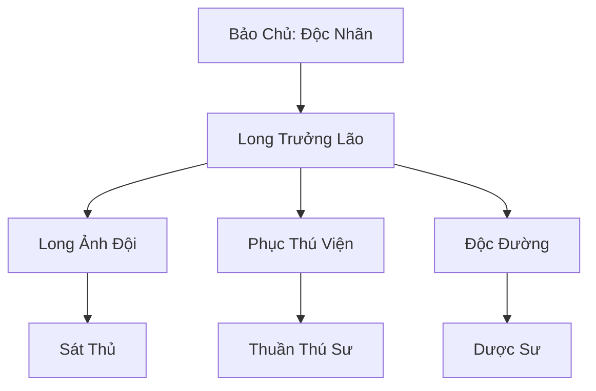

# ĐỘC LONG BẢO (毒龙堡)

## I. Tổng Quan (总览)
Độc Long Bảo là một tổ chức vũ trang đặc thù nằm ở ranh giới giữa ma đạo và trung lập, chuyên về nghệ thuật ám sát và điều khiển yêu thú. Pháo đài này nổi tiếng với việc biến loài Độc Long Tích tàn bạo thành những vũ khí chiến tranh di động, khiến họ trở thành một thế lực đáng gờm tại Nam Cương.

## II. Địa Lý & Tài Nguyên (地理与 tài nguyên)
Tọa lạc trên vách núi dựng đứng của Núi Độc Long, nơi chướng khí quanh năm không tan. Địa hình hiểm trở này là môi trường sống lý tưởng của Độc Long Tích. Bảo sở hữu các hang động tự nhiên được cải tạo thành chuồng trại khổng lồ và các lò luyện độc dược chiết xuất trực tiếp từ hơi thở của rồng đất.

## III. Văn Hóa & Tín Ngưỡng (文化与信仰)
Đề cao sự sinh tồn và cộng sinh với yêu thú. Đệ tử Độc Long Bảo tin rằng chỉ có nọc độc và sức mạnh mới mang lại sự an toàn tuyệt đối. Họ có văn hóa đeo mặt nạ xương rồng và xăm hình vảy rồng lên cơ thể như một biểu tượng của địa vị và khả năng kháng độc.

## IV. Cơ Cấu Tổ Chức (组织结构)


## V. Công Pháp & Trận Pháp (功法与阵法)
- **Công Pháp:** *Độc Long Thần Phục Quyết* (Điều khiển thú), *Vạn Độc Xuyên Tâm Thuật* (Ám sát).
- **Trận Pháp:** *Độc Sương Phục Kích Trận* - trận pháp phối hợp giữa người và thú trong môi trường sương mù, tăng cường khả năng ẩn nấp và sát thương độc hệ.

## VI. Đặc Sản Môn Phái (门派特产)
- **Độc Long Huyết:** Máu rồng dùng để nung nấu vũ khí hoặc pha chế thuốc tăng cường thể chất ngắn hạn.
- **Long Lân Giáp:** Giáp trụ làm từ vảy Độc Long Tích, cực kỳ nhẹ và có khả năng miễn nhiễm hầu hết các loại độc tố thông thường.

## VII. Cơ Sở Hạ Tầng (基础设施)
- **Độc Long Bảo:** Pháo đài đá kiên cố gắn liền với vách núi.
- **Hố Độc Tập Sự:** Nơi rèn luyện khả năng sinh tồn của các đệ tử mới bằng cách thả họ vào hang rết và rắn độc.

## VIII. Kinh Tế (经济)
Kinh tế dựa trên việc thực hiện các hợp đồng ám sát bí mật cho các thế lực ma đạo và việc bán các bộ phận quý giá của Độc Long Tích (da, máu, răng). Họ cũng là nhà cung cấp thú cưỡi chiến đấu hàng đầu cho những kẻ có đủ tài lực.

## IX. Lịch Sử Tóm Tắt (简史)
Được sáng lập bởi Độc Long Lão Nhân, một tu sĩ bị hãm hại và bị ném xuống vực sâu núi Độc Long. Ông không những không chết mà còn ngộ ra cách thuần phục bầy rồng đất tại đây, dùng chúng để quay lại báo thù và lập nên Độc Long Bảo.

## X. Giai Thoại & Bí Mật (轶 sự与秘密)
Đồn rằng sâu trong lòng núi có một con "Độc Long Vương" thực thụ từ thời Thái Cổ đang ngủ say, và hơi thở của nó chính là nguồn gốc của toàn bộ chướng khí tại Nam Cương.

## XI. Quan Hệ Thế Lực (势力关系)
```mermaid
graph LR
    DLB[Độc Long Bảo] -- Giao dịch -- QTNC[Quỷ Thị Nam Cương]
    DLB -- Đối đầu -- VDM[Vạn Độc Môn]
    DLB -- Thuê mướn -- CUMT[Cửu U Ma Tông]
```
