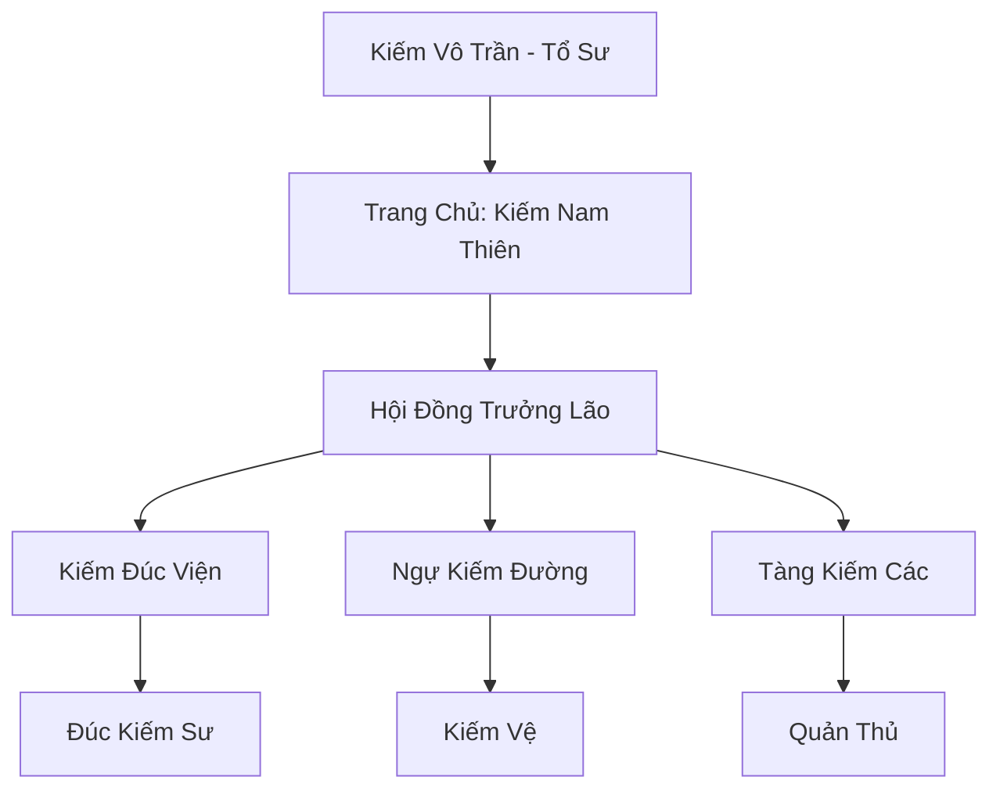

# NGỰ KIẾM SƠN TRANG (御剑山庄)

## I. Tổng Quan (总览)
Ngự Kiếm Sơn Trang là trung tâm chế tác phi kiếm lớn nhất Đông Hoang, nổi tiếng với sự kết hợp hoàn mỹ giữa kỹ thuật luyện khí và kiếm đạo. Sơn trang không chỉ cung cấp binh khí cho các kiếm tu mà còn là nơi lưu giữ những bí thuật ngự kiếm cổ xưa, giữ vai trò quan trọng trong việc duy trì sức mạnh của các thế lực Chính Đạo.

## II. Địa Lý & Tài Nguyên (地理 với tài nguyên)
Tọa lạc trên Ngự Kiếm Sơn, một ngọn núi có hình dáng như một thanh đại kiếm vươn thẳng lên trời. Dưới chân núi là Kiếm Trì - một hồ nước linh thiêng chứa đựng kiếm ý tích tụ hàng nghìn năm, là nơi lý tưởng để rèn luyện và khai phong cho các thanh linh binh. Sơn trang còn sở hữu các mạch hỏa tự nhiên phục vụ cho việc đúc kiếm.

## III. Văn Hóa & Tín Ngưỡng (文化与信仰)
Đề cao triết lý "Nhân Kiếm Hợp Nhất". Đệ tử Ngự Kiếm Sơn Trang coi thanh kiếm là người bạn đời, là linh hồn của mình. Văn hóa của sơn trang xoay quanh sự tỉ mỉ, kiên nhẫn và lòng trung thành. Hàng năm, họ tổ chức "Lễ Khai Phong" để tôn vinh những thanh kiếm xuất sắc nhất được ra đời.

## IV. Cơ Cấu Tổ Chức (组织结构)


## V. Công Pháp & Trận Pháp (功法与阵法)
- **Công Pháp:** *Ngự Kiếm Tâm Kinh* (Điều khiển kiếm ý), *Thiên Hỏa Luyện Kim Thuật* (Kỹ thuật đúc).
- **Trận Pháp:** *Vạn Kiếm Quy Tông Trận* - trận pháp phòng thủ tối thượng, điều khiển hàng vạn thanh kiếm tạo thành một lưới bảo vệ bất khả xâm phạm xung quanh sơn trang.

## VI. Đặc Sản Môn Phái (门派特产)
- **Thanh Phong Kiếm:** Loại phi kiếm phổ thông nhưng có độ linh hoạt và sắc bén cực cao.
- **Kiếm Hạp Thiên Cơ:** Hộp đựng kiếm đặc chế có khả năng dưỡng kiếm và phóng kiếm tự động.

## VII. Cơ Sở Hạ Tầng (基础设施)
- **Kiếm Trì:** Nơi rèn luyện kiếm ý và thử nghiệm sức mạnh của kiếm.
- **Lò đúc Thiên Hỏa:** Hệ thống lò luyện khổng lồ tận dụng địa hỏa để nung chảy linh kim.

## VIII. Kinh Tế (经济)
Nguồn thu chính đến từ việc sản xuất và bán các loại phi kiếm cho tu sĩ khắp lục địa. Họ cũng cung cấp dịch vụ bảo trì, nâng cấp linh binh và đào tạo các khóa học ngự kiếm ngắn hạn cho các tán tu.

## IX. Lịch Sử Tóm Tắt (简史)
Được sáng lập bởi Kiếm Vô Trần, một thiên tài đúc kiếm từng là trưởng lão của Cửu Hoa Kiếm Tông. Ông tách ra để theo đuổi con đường luyện khí thuần túy, nhưng vẫn giữ mối liên hệ mật thiết với tông môn cũ, biến sơn trang thành một thế lực độc lập nhưng uy tín.

## X. Giai Thoại & Bí Mật (轶 sự với bí mật)
Đồn rằng trong lòng Kiếm Trì có một thanh "Thần Kiếm Phôi" chưa hoàn thiện, được tổ sư để lại và chỉ có người mang kiếm ý thuần khiết nhất mới có thể đánh thức nó.

## XI. Quan Hệ Thế Lực (势力关系)
```mermaid
graph LR
    NKST[Ngự Kiếm Sơn Trang] -- Giao hảo -- CHKT[Cửu Hoa Kiếm Tông]
    NKST -- Đối tác -- SLC[Thạch Linh Cung]
    NKST -- Cung cấp -- TAM[Thái Ất Môn]
```
