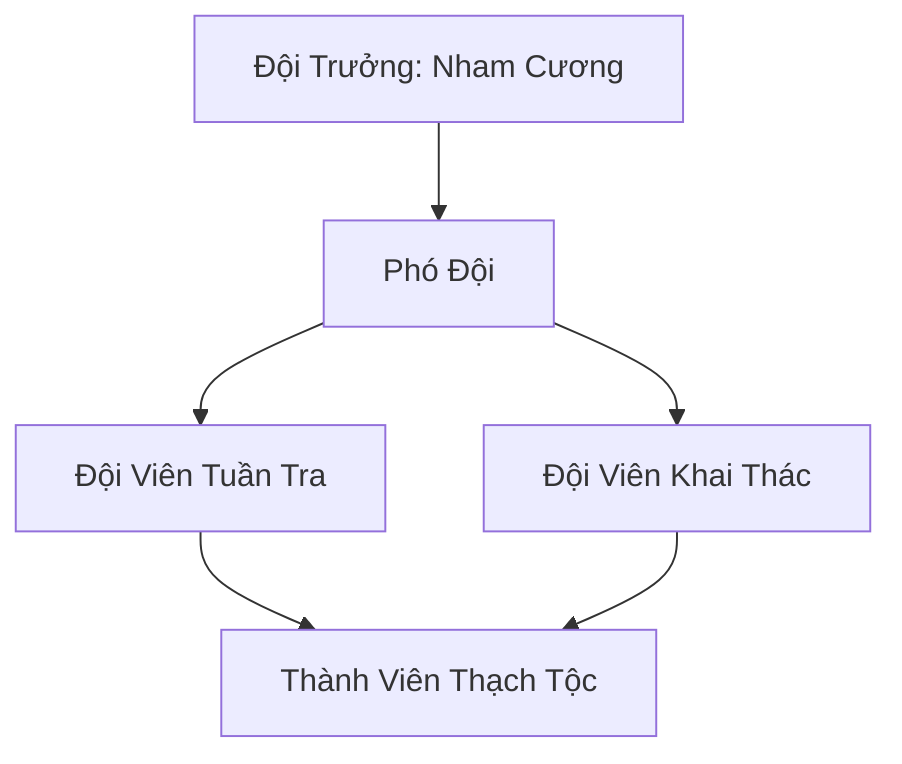

# NHAM THẠCH TIỂU ĐỘI (岩石小队)

## I. Tổng Quan (总览)
Nham Thạch Tiểu Đội là một đơn vị vũ trang nhỏ gồm các cá thể Thạch Tộc cư ngụ tại vùng núi đá hoang sơ của Đông Hoang. Với bản tính trầm lặng, kiên nhẫn và vô cùng kỷ luật, tiểu đội này tự nguyện gánh vác trọng trách bảo vệ vùng núi khỏi những thợ săn linh thạch tham lam và những tu sĩ quấy nhiễu. Dù quy mô khiêm tốn, nhưng sức phòng thủ của mỗi thành viên và khả năng phối hợp địa hình khiến họ trở thành một vật cản khó chịu đối với bất kỳ kẻ xâm nhập nào.

## II. Địa Lý & Tài Nguyên (地理 với tài nguyên)
Trụ sở là một hang đá tự nhiên nằm sâu trong vách núi, nơi có địa hình hiểm trở và ít người qua lại. Vùng núi này nghèo nàn về linh khí tiên đạo nhưng lại chứa đựng nhiều loại khoáng chất thô và linh thạch cấp thấp, vốn là nguồn thức ăn và năng lượng chính của Thạch Tộc. Nước mưa đọng trong các hốc đá cũng là một tài nguyên quan trọng cho các sinh vật cộng sinh xung quanh hang.

## III. Văn Hóa & Tín Ngưỡng (文化 với信仰)
Tôn thờ Sự Bền Bỉ và Tĩnh Lặng. Triết lý của đội là "Đá không nói, nhưng đá luôn đứng". Họ không có tôn giáo phức tạp, chỉ tôn trọng những thực thể có sức mạnh địa mạch to lớn. Văn hóa tiểu đội gắn liền với các nghi thức "Khắc Đá Ghi Danh", nơi mỗi thành viên mới sẽ đục hình tượng của mình vào vách hang để thề nguyện gắn bó với đội.

## IV. Cơ Cấu Tổ Chức (组织结构)


## V. Công Pháp & Trận Pháp (功法 với阵法)
- **Công Pháp:** Thạch Tộc không sử dụng công pháp nhân tạo mà tu luyện thông qua *Đại Địa Thôn Phệ Thuật* (Hấp thụ tinh hoa khoáng thạch).
- **Trận Pháp:** *Địa Mạch Cộng Hưởng Trận* - trận pháp sơ cấp giúp các thành viên chia sẻ sát thương vật lý cho nhau thông qua mặt đất, biến cả đội thành một khối đá thống nhất không thể tách rời.

## VI. Đặc Sản Môn Phái (门派特产)
- **Đá Mài Linh Lực:** Loại đá có độ cứng cực cao, dùng để mài sắc vũ khí kim loại.
- **Linh Thạch Thô:** Các khối linh thạch chưa qua tinh luyện nhưng có nồng độ thổ linh khí cao.

## VII. Cơ Sở Hạ Tầng (基础设施)
- **Hang Nham Thạch:** Hang động tự nhiên kiên cố, lối vào được ngụy trang bằng các khối đá lớn.
- **Bệ Tế Tổ:** Khối đá vuông lớn giữa hang dùng để tụ họp và thực hiện các nghi lễ kết nạp.

## VIII. Kinh Tế (経済)
Kinh tế mang tính trao đổi vật phẩm là chính. Tiểu đội đổi quặng thô và linh thạch nhặt được cho các thợ rèn hoặc thương nhân đi ngang qua để lấy các khối kim loại tinh luyện (món ăn cao cấp của Thạch Tộc) hoặc các phù lục gia cố hang động.

## IX. Lịch Sử Tóm Tắt (简史)
Được hình thành cách đây 30 năm khi Nham Cương tập hợp các cá thể Thạch Tộc lang thang trong vùng núi để cùng nhau sinh tồn. Từ một nhóm nhỏ lẻ, họ đã xây dựng nên một hệ thống tuần tra bài bản và giữ cho vùng núi này thoát khỏi sự nhòm ngó của các toán cướp nhỏ.

## X. Giai Thoại & Bí Mật (轶 sự với bí mật)
Đồn rằng Nham Cương từng phát hiện một vết nứt dẫn đến "Long Mạch Chi Tâm" sâu dưới lòng núi nhưng ông đã bí mật phong tỏa lối vào để tránh tai họa cho tiểu đội.

## XI. Quan Hệ Thế Lực (势力关系)
```mermaid
graph LR
    NTTĐ[Nham Thạch Tiểu Đội] -- Tôn kính -- SLC[Thạch Linh Cung]
    NTTĐ -- Giao thương -- TKP[Thần Khí Phường]
    NTTĐ -- Cảnh giác -- STLM[Sa Tặc Liên Minh]
    NTTĐ -- Trung lập -- ALL[Mọi Thế Lực]
```
