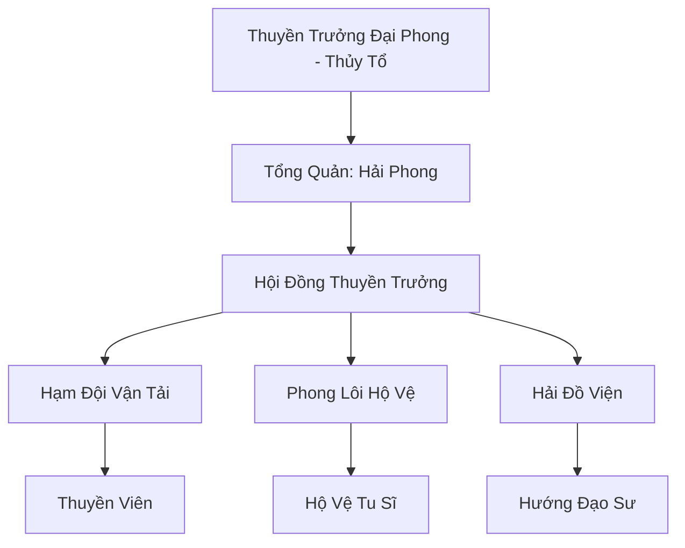

# PHONG BẠO THƯƠNG ĐỘI (风暴商队)

## I. Tổng Quan (总览)
Phong Bạo Thương Đội là một hạm đội thương vụ siêu cấp, chuyên trách việc vận chuyển hàng hóa và tu sĩ qua những vùng biển nguy hiểm nhất thế giới. Với slogan "Đi xuyên bão tố, cập bến bình an", thương đội này sở hữu những chiến hạm được gia cố bằng trận pháp phong lôi, cho phép họ di chuyển ngay cả trong những điều kiện thời tiết khắc nghiệt nhất.

## II. Địa Lý & Tài Nguyên (地理 với tài nguyên)
Không có lãnh thổ cố định trên đất liền ngoài Cảng Tự Do tại Đông Hoang. Toàn bộ tài nguyên và cơ sở hạ tầng của thương đội nằm trên hệ thống tàu mẹ khổng lồ - những hòn đảo nhân tạo di động trên mặt biển. Họ nắm giữ bí mật về các hải lưu vĩnh cửu và các mạch linh khí gió trên đại dương.

## III. Văn Hóa & Tín Ngưỡng (文化 với信仰)
Tôn thờ Thần Gió và tinh thần đồng đội của những người con biển cả. Thủy thủ của thương đội có văn hóa sống phóng khoáng, trọng nghĩa khí và coi con tàu là nhà. Họ có nghi lễ "Tế Biển" trước mỗi chuyến hành trình dài để cầu mong sự che chở của thiên địa.

## IV. Cơ Cấu Tổ Chức (组织结构)


## V. Công Pháp & Trận Pháp (功法 với阵法)
- **Công Pháp:** *Phong Lôi Hải Hành Quyết* (Tăng tốc độ di chuyển và cảm nhận gió), *Sóng Thần Kiếm Pháp* (Hải chiến).
- **Trận Pháp:** *Lôi Đình Hộ Hải Trận* - trận pháp phòng ngự bao phủ hạm đội, tạo ra một lớp màn điện năng nghiền nát mọi đòn tấn công từ xa và ngăn chặn yêu thú biển tiếp cận.

## VI. Đặc Sản Môn Phái (门派特产)
- **Phong Bạo Đan:** Đan dược giúp tu sĩ tạm thời kháng lại áp suất nước và gió mạnh.
- **Hải Đồ Linh Thạch:** Loại đá ghi chép bản đồ biển có khả năng tự động cập nhật sự thay đổi của các mạch linh khí đại dương.

## VII. Cơ Sở Hạ Tầng (基础设施)
- **Soái hạm "Phong Bạo":** Con tàu khổng lồ đóng vai trò là trung tâm chỉ huy và kho bãi chính.
- **Xưởng sửa chữa nổi:** Các bè mảng cơ động chuyên phục hồi hư tổn cho chiến hạm ngay giữa biển.

## VIII. Kinh Tế (経済)
Nguồn thu chính đến từ phí vận chuyển hàng hóa giá trị cao (linh dược, linh thạch, bảo vật). Họ cũng kinh doanh dịch vụ "Bảo hiểm hàng hải" - cam kết bồi thường 100% nếu hàng hóa bị mất mát do lỗi của thương đội.

## IX. Lịch Sử Tóm Tắt (简史)
Được thành lập bởi Thuyền Trưởng Đại Phong, một tu sĩ từng bị đắm tàu và trôi dạt trên biển mười năm. Ông đã học cách chế ngự sức mạnh của những cơn bão và dùng kiến thức đó để xây dựng nên một đội tàu có thể chinh phục mọi vùng biển, phá vỡ sự độc quyền vận chuyển của các thế lực lâu đời.

## X. Giai Thoại & Bí Mật (轶 sự với bí mật)
Tương truyền bên dưới soái hạm "Phong Bạo" có gắn một chiếc "Mỏ Neo Định Thế", thứ có khả năng giữ cho hạm đội không bị cuốn trôi ngay cả khi đối mặt với sự sụp đổ của không gian biển.

## XI. Quan Hệ Thế Lực (势力关系)
```mermaid
graph LR
    PBTĐ[Phong Bạo Thương Đội] -- Cạnh tranh -- TSTH[Thiên Sa Thương Hội]
    PBTĐ -- Đối địch -- HHHT[Hắc Hải Hải Tặc]
    PBTĐ -- Đối tác -- TKP[Thần Khí Phường]
    PBTĐ -- Trung lập -- LC[Long Cung]
```
