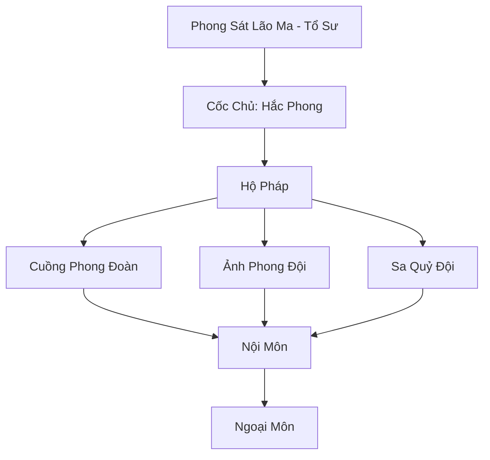

# PHONG SÁT CỐC (风煞谷)

## I. Tổng Quan (总览)
Phong Sát Cốc là một thế lực ma đạo khét tiếng tại Tây Mạc, nơi tập hợp những kẻ tu luyện Phong Ma Pháp tàn bạo. Tông môn này là nỗi khiếp đảm của các thương nhân và tu sĩ chính đạo khi băng qua sa mạc, nhờ khả năng điều khiển những cơn bão cát đen chết chóc.

## II. Địa Lý & Tài Nguyên (地理与 tài nguyên)
Nằm sâu trong một thung lũng hẹp có địa hình hiểm trở, nơi các luồng khí xoáy tự nhiên hội tụ. Thung lũng này chứa một mạch linh thạch đen (hắc linh thạch) hiếm có, cung cấp năng lượng ma quái cho các trận pháp và công pháp của môn phái.

## III. Văn Hóa & Tín Ngưỡng (文化与信仰)
Tôn thờ sức mạnh của sự hủy diệt và hỗn loạn. Phong Sát Cốc không có nhiều môn quy ràng buộc, kẻ mạnh có quyền chiếm đoạt mọi thứ từ kẻ yếu. Họ tin rằng bão cát là sự thanh tẩy của thiên địa đối với những kẻ tham lam.

## IV. Cơ Cấu Tổ Chức (组织结构)


## V. Công Pháp & Trận Pháp (功法与阵法)
- **Công Pháp:** *Hắc Phong Phệ Hồn Quyết* (Tấn công thần thức), *Sa Hải Diệt Tuyệt Thuật* (Diện rộng).
- **Trận Pháp:** *Vạn Phong Phệ Hồn Trận* - tạo ra một vùng không gian bão tố vĩnh cửu bao quanh cốc, nghiền nát bất kỳ ai dám xâm nhập.

## VI. Đặc Sản Môn Phái (门派特产)
- **Sa Độc Châm:** Kim châm tẩm độc chiết xuất từ yêu thú sa mạc và tử khí.
- **Hắc Sa Phù:** Linh phù có khả năng triệu hồi một cơn lốc xoáy nhỏ trong thời gian ngắn.

## VII. Cơ Sở Hạ Tầng (基础设施)
- **Hắc Phong Đài:** Nơi Cốc chủ luyện công và điều khiển đại trận.
- **Ngục Giam Nô Lệ:** Khu vực giam giữ những kẻ bị bắt trong các vụ cướp thương đoàn.

## VIII. Kinh Tế (经济)
Nguồn thu chủ yếu đến từ việc cướp bóc các chuyến hàng giá trị lớn của Thiên Sa Thương Hội. Họ cũng kinh doanh các tài nguyên ma đạo khai thác được từ các vùng đất chết và buôn bán nô lệ cho các thế lực tà ác khác.

## IX. Lịch Sử Tóm Tắt (简史)
Sáng lập bởi Phong Sát Lão Ma, một kẻ bị trục xuất khỏi các tông môn chính đạo do tu luyện cấm thuật. Hắn đã tìm thấy bí mật của Hắc Sa tại thung lũng này và xây dựng nên một đế chế tội ác tồn tại hàng nghìn năm.

## X. Giai Thoại & Bí Mật (轶 sự与秘密)
Đồn rằng trái tim của Phong Sát Lão Ma vẫn còn đập bên trong Hắc Phong Đài, liên tục cung cấp ma khí cho toàn bộ cốc.

## XI. Quan Hệ Thế Lực (势力关系)
```mermaid
graph LR
    PSC[Phong Sát Cốc] -- Cướp phá -- TSTH[Thiên Sa Thương Hội]
    PSC -- Giao dịch -- HSM[Huyết Sát Minh]
    PSC -- Đối địch -- KST[Kim Sa Tự]
```
