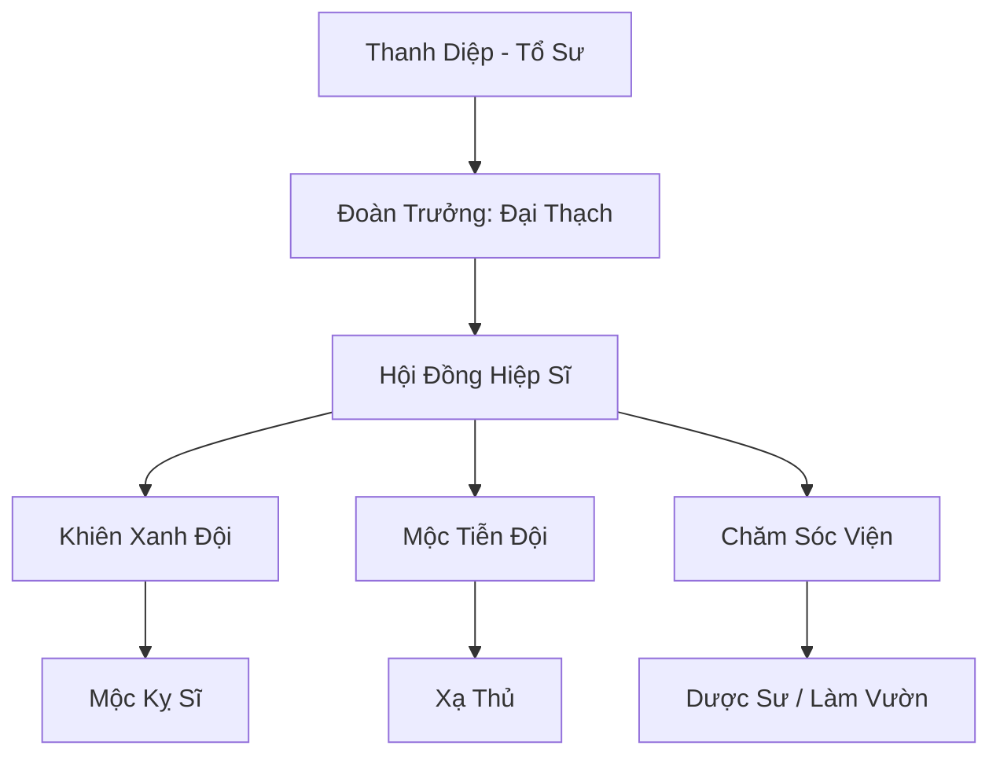

# THANH MỘC KỴ SĨ ĐOÀN (青木骑士团)

## I. Tổng Quan (总览)
Thanh Mộc Kỵ Sĩ Đoàn là một tổ chức vũ trang có kỷ luật cao, đóng vai trò là lá chắn xanh cho Đông Hoang. Với sứ mệnh ngăn chặn sự sa mạc hóa và xâm lấn của cát bụi từ Tây Mạc, các kỵ sĩ tại đây đã cống hiến cuộc đời mình để duy trì sự sống cho vành đai rừng biên giới. Họ nổi tiếng với sự trung thành, bảo thủ nhưng cực kỳ kiên cường trong phòng thủ.

## II. Địa Lý & Tài Nguyên (地理 với tài nguyên)
Trụ sở đặt tại Pháo Đài Xanh - một công trình vĩ đại kết hợp giữa các bức tường đá kiên cố và rễ của những cây cổ thụ vạn năm. Đoàn kiểm soát một dải đất hẹp dọc theo biên giới Đông-Tây, nơi có loại linh mộc đặc biệt có khả năng sinh trưởng cực nhanh trong môi trường khô hạn, là tài nguyên quan trọng để gia cố phòng tuyến.

## III. Văn Hóa & Tín Ngưỡng (文化 với信仰)
Tôn thờ Kỵ Sĩ Trưởng Thanh Diệp và tinh thần hy sinh vì sự sống. Đệ tử đoàn kỵ sĩ coi việc trồng và chăm sóc một cái cây cũng quan trọng như việc rèn luyện kiếm pháp. Họ có lối sống khắc kỷ, đề cao danh dự và sự đoàn kết giữa các thành viên.

## IV. Cơ Cấu Tổ Chức (组织结构)


## V. Công Pháp & Trận Pháp (功法 với阵法)
- **Công Pháp:** *Thanh Mộc Kiên Thuẫn Quyết* (Tăng cường phòng ngự nhục thân và giáp trụ), *Vạn Diệp Trận Pháp* (Phối hợp đội hình).
- **Trận Pháp:** *Vạn Mộc Thành Lũy* - trận pháp phòng ngự diện rộng biến các gốc cây xung quanh thành những lá chắn linh lực cực kỳ vững chắc, có khả năng phản chấn lại các đòn tấn công tầm xa.

## VI. Đặc Sản Môn Phái (门派特产)
- **Khiên Linh Mộc:** Loại khiên nhẹ nhưng có khả năng tự phục hồi hư tổn khi được cung cấp linh lực mộc hệ.
- **Hạt Giống Thanh Mộc:** Hạt giống đặc chế có thể nảy mầm thành hàng rào gai chỉ trong vài nhịp thở để cản đường kẻ thù.

## VII. Cơ Sở Hạ Tầng (基础设施)
- **Pháo Đài Cổ Thụ:** Hệ thống đài quan sát và hang ổ chiến đấu nằm ngay trong thân và tán lá của các cây thần.
- **Vành Đai Ranh Giới:** Tuyến phòng thủ dài hàng ngàn dặm được tuần tra liên tục.

## VIII. Kinh Tế (経済)
Nguồn thu chủ yếu từ phí bảo hộ mà các thương đoàn và du khách phải trả để được an toàn khi đi qua vành đai biên giới. Họ cũng thu lợi từ việc bán các sản phẩm gỗ linh mộc chống cát cho các làng mạc lân cận.

## IX. Lịch Sử Tóm Tắt (简史)
Được thành lập vào cuối kỷ nguyên Trung Cổ khi bão cát Tây Mạc đe dọa nuốt chửng các cánh rừng phía Tây Đông Hoang. Kỵ Sĩ Trưởng Thanh Diệp đã tập hợp những tu sĩ yêu thiên nhiên để lập nên đoàn kỵ sĩ, dùng chính máu và linh lực của mình để giữ vững màu xanh cho vùng đất này.

## X. Giai Thoại & Bí Mật (轶 sự với bí mật)
Tương truyền mỗi Đoàn Trưởng khi về già sẽ hóa thân thành một cây cổ thụ bên trong Pháo Đài Xanh để tiếp tục bảo vệ vành đai rừng bằng linh hồn của mình.

## XI. Quan Hệ Thế Lực (势力关系)
```mermaid
graph LR
    TMKSĐ[Thanh Mộc Kỵ Sĩ Đoàn] -- Đồng minh -- TAM[Thái Ất Môn]
    TMKSĐ -- Đối địch -- PSC[Phong Sát Cốc]
    TMKSĐ -- Trao đổi -- TLTV[Thanh Lương Thủ Vệ]
```
