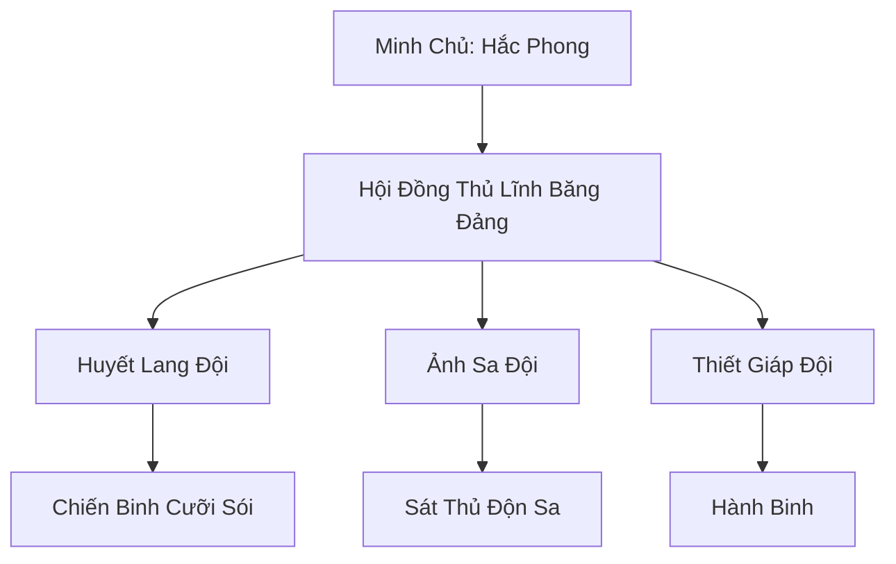

# SA TẶC LIÊN MINH (沙贼联盟)

## I. Tổng Quan (总览)
Sa Tặc Liên Minh là một tập hợp lỏng lẻo của hàng chục băng đảng tội phạm lớn nhỏ hoạt động rải rác khắp vùng sa mạc Tây Mạc. Dưới sự thống nhất của Hắc Phong Đại Vương, liên minh này đã trở thành một thế lực tà đạo đáng gờm, chuyên thực hiện các vụ cướp bóc quy mô lớn nhắm vào các đoàn thương buôn giàu có. Họ nổi tiếng với sự tàn bạo, khả năng di chuyển linh hoạt trên lưng lạc đà và sói sa mạc, cùng các bí thuật ẩn mình dưới cát khiến các lực lượng hộ vệ vô cùng vất vả đối phó.

## II. Địa Lý & Tài Nguyên (地理 với tài nguyên)
Không có lãnh thổ cố định lâu dài để tránh sự vây quét của Thiên Sa Thương Hội. Tuy nhiên, căn cứ chính hiện tại là Trại Hắc Phong, ẩn mình trong hệ thống hang động ngầm dưới ốc đảo khô cạn Khô Tuyền Châu. Tài nguyên của họ là những của cải cướp bóc được tích trữ và mạng lưới các trạm dừng chân bí mật giữa các khe núi đá Xích Nham.

## III. Văn Hóa & Tín Ngưỡng (文化 với信仰)
Tôn thờ chủ nghĩa sức mạnh và tự do vô luật pháp. Sa tặc tin rằng sa mạc là của những kẻ dám cầm dao đoạt lấy nó. Văn hóa của liên minh mang đậm tính hoang dã, trọng nghĩa khí huynh đệ trong băng nhóm nhưng cực kỳ tàn nhẫn với kẻ ngoại lai. Nghi lễ "Uống Máu Ăn Thề" là cách duy nhất để gắn kết các thủ lĩnh băng đảng lại với nhau.

## IV. Cơ Cấu Tổ Chức (组织结构)


## V. Công Pháp & Trận Pháp (功法 với阵法)
- **Công Pháp:** *Cuồng Sa Quyết* (Tăng cường sức mạnh vật lý trong bão cát), *Độn Sa Thuật* (Ẩn thân dưới cát).
- **Trận Pháp:** *Tiểu Sa Bão Trận* - trận pháp sơ cấp kết hợp linh lực của nhiều người để tạo ra những trận gió cát nhân tạo, làm nhiễu loạn tầm nhìn và thần thức của đối phương trong các cuộc phục kích.

## VI. Đặc Sản Môn Phái (门派特产)
- **Sa Tặc Đao:** Loại đao bản rộng, lưỡi răng cưa chuyên dùng để gây ra các vết thương sâu và mất máu nhiều.
- **Bột Mù Sa Mạc:** Loại bột mịn trộn linh lực, khi tung ra sẽ tạo ra một vùng không gian không thể sử dụng thần thức để dò tìm.

## VII. Cơ Sở Hạ Tầng (基础设施)
- **Hắc Phong Trại:** Pháo đài gỗ và đá được ngụy trang bằng các trận pháp ảo giác cấp thấp.
- **Hầm Chứa Hàng:** Hệ thống kho chứa bí mật nằm sâu dưới các cồn cát.

## VIII. Kinh Tế (経済)
Nền kinh tế hoàn toàn dựa trên việc chiếm đoạt. Sa tặc cướp bóc mọi thứ từ linh thạch, lương thực đến cả con người để bán làm nô lệ. Họ cũng nhận tiền từ các thế lực ma đạo lớn hơn để thực hiện các nhiệm vụ phá hoại thương lộ hoặc bắt cóc các mục tiêu cụ thể.

## IX. Lịch Sử Tóm Tắt (简史)
Được hình thành từ những nhóm tu sĩ thất bại và những kẻ bị trục xuất khỏi tộc Sa Tộc. Hắc Phong, một tu sĩ Phong hệ xảo quyệt, đã dùng vũ lực và lợi ích để liên kết các nhóm này lại vào khoảng 2000 năm trước, biến Sa Tặc Liên Minh thành một cái gai không thể nhổ sạch trong mắt Thiên Sa Thương Hội.

## X. Giai Thoại & Bí Mật (轶 sự với bí mật)
Tương truyền Hắc Phong sở hữu một tấm bản đồ dẫn đến một "Kho Báu Cát" vĩ đại, nơi lưu giữ toàn bộ số linh thạch bị mất tích của các thương đoàn trong suốt một vạn năm qua.

## XI. Quan Hệ Thế Lực (势力关系)
```mermaid
graph LR
    STLM[Sa Tặc Liên Minh] -- Tử địch -- TSTH[Thiên Sa Thương Hội]
    STLM -- Đối tác -- VDM[Vạn Độc Môn]
    STLM -- Phụ thuộc -- HSCQ[Hoàng Sa Cổ Quốc]
    STLM -- Đối địch -- TLTV[Thanh Lương Thủ Vệ]
```
