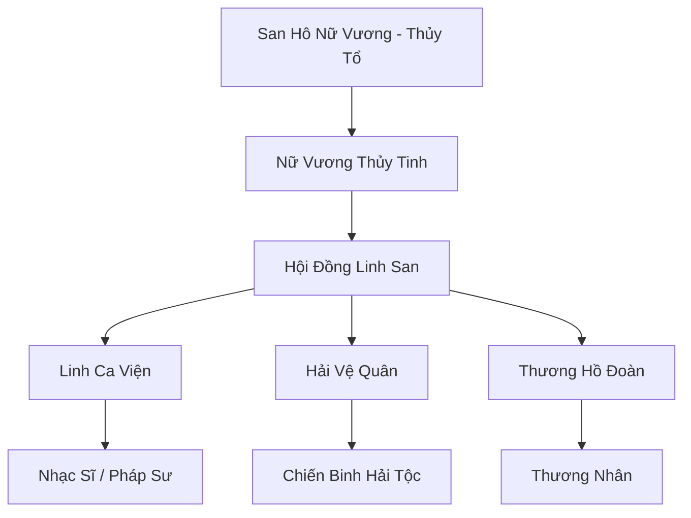

# SAN HÔ ĐẢO QUỐC (珊瑚岛国)

## I. Tổng Quan (总览)
San Hô Đảo Quốc là một liên minh các bộ lạc hải tộc ôn hòa, cư ngụ trong một hệ thống rạn san hô khổng lồ và rực rỡ nhất Vô Tận Hải. Đây là một vương quốc của nghệ thuật, âm nhạc và sự chữa lành, nơi kiến trúc hòa quyện hoàn hảo với các sinh vật sống của đại dương. Đảo quốc giữ vị thế trung lập và là điểm đến yêu thích của những tu sĩ muốn tìm kiếm sự thanh tịnh tâm hồn.

## II. Địa Lý & Tài Nguyên (地理 với tài nguyên)
Tọa lạc tại vùng Biển Lam Ngọc, nơi nước biển trong vắt có thể nhìn thấu đáy. Đảo quốc được xây dựng hoàn toàn từ san hô sống được cường hóa bằng linh lực, có khả năng tự phát triển và thay đổi hình dạng. Tài nguyên chính là ngọc trai linh khí, san hô ma thuật và các loại tảo biển có tác dụng dược lý cực cao.

## III. Văn Hóa & Tín Ngưỡng (文化 với信仰)
Tôn thờ San Hô Nữ Vương và linh hồn của đại dương. Cư dân đảo quốc tin rằng âm nhạc là ngôn ngữ chung của vạn vật và việc sống hòa hợp với thiên nhiên là con đường đạt đến sự trường sinh chân chính. Văn hóa của họ rất phong phú với các lễ hội ca múa dưới nước và nghệ thuật điêu khắc từ vỏ sò.

## IV. Cơ Cấu Tổ Chức (组织结构)


## V. Công Pháp & Trận Pháp (功法 với阵法)
- **Công Pháp:** *Thủy Tinh Linh Ca* (Âm nhạc huyễn thuật), *Hải Lưu Chú* (Điều khiển dòng nước).
- **Trận Pháp:** *Hải Lưu Ảo Ảnh Trận* - trận pháp bao phủ rạn san hô, sử dụng sự khúc xạ ánh sáng và âm thanh để tạo ra những huyễn cảnh che giấu lối vào vương quốc khỏi những kẻ có ý đồ xấu.

## VI. Đặc Sản Môn Phái (门派特产)
- **Ngọc Trai Lam Ngọc:** Loại ngọc chứa linh khí thủy hệ tinh thuần, dùng để chế tạo trang sức hoặc làm thuốc tăng cường thần thức.
- **Sáo San Hô:** Pháp bảo âm nhạc đặc trưng, có khả năng điều khiển các sinh vật biển nhỏ.

## VII. Cơ Sở Hạ Tầng (基础设施)
- **San Hô Thánh Điện:** Cung điện trung tâm lộng lẫy, nơi diễn ra các buổi hòa nhạc linh hồn.
- **Vườn Ngọc Trai:** Khu vực nuôi cấy và thu hoạch ngọc trai quy mô lớn dưới đáy biển.

## VIII. Kinh Tế (経済)
Kinh tế phát triển dựa trên việc xuất khẩu các sản phẩm mỹ nghệ và dược liệu biển sâu. Đảo quốc cũng thu lợi nhuận từ việc tiếp đón các đoàn du khách và cung cấp dịch vụ chữa thương tâm linh bằng âm nhạc cho những tu sĩ bị tâm ma quấy rối.

## IX. Lịch Sử Tóm Tắt (简史)
Được thành lập bởi San Hô Nữ Vương vào thời kỷ nguyên Thượng Cổ, người đã dùng tiếng hát của mình để thuyết phục các loài san hô liên kết lại tạo thành một pháo đài bảo vệ các hải tộc nhỏ bé khỏi các cuộc đại chiến của Long Tộc và Yêu Tộc.

## X. Giai Thoại & Bí Mật (轶 sự với bí mật)
Tương truyền mỗi hạt ngọc trai của Nữ Vương Thủy Tinh đều chứa đựng một mảnh ký ức của đại dương, và ai sở hữu đủ mười hai hạt ngọc sẽ có thể triệu hồi được sức mạnh của Hải Thần.

## XI. Quan Hệ Thế Lực (势力关系)
```mermaid
graph LR
    SHĐQ[San Hô Đảo Quốc] -- Cống nạp -- LC[Long Cung]
    SHĐQ -- Đối địch -- HYMC[Hải Yêu Mê Cung]
    SHĐQ -- Giao thương -- TSTH[Thiên Sa Thương Hội]
    SHĐQ -- Thân thiện -- TKĐ[Thủy Kiếm Đảo]
```
