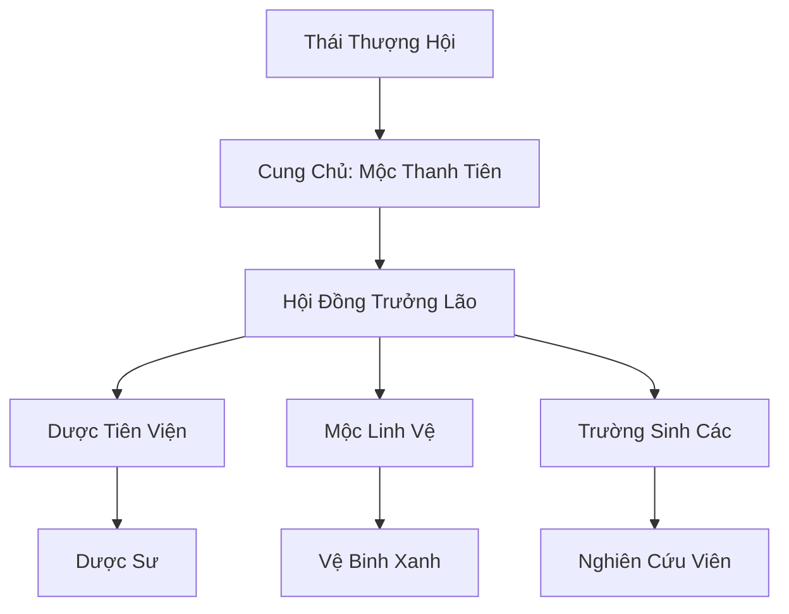

# THANH ĐẾ CUNG (青帝宫)

## I. Tổng Quan (总览)
Thanh Đế Cung là tông môn Mộc tu hàng đầu tại Đông Hoang, được coi là người bảo hộ của mọi sinh linh thảo mộc. Tông môn không chỉ sở hữu những bí thuật trị liệu huyền diệu mà còn gánh vác sứ mệnh canh giữ Mộc Linh Trận Địa - trái tim xanh của địa mạch khu vực phía Đông.

## II. Địa Lý & Tài Nguyên (地理与 tài nguyên)
Tọa lạc trên Thanh Đế Sơn, ngọn núi được bao phủ bởi rừng rậm quanh năm xanh tốt và linh khí mộc hệ dồi dào. Nơi đây sở hữu Vườn Dược Thượng Cổ, nơi quy tụ những loài linh thảo tuyệt chủng ở thế giới bên ngoài, cùng với các mạch linh tuyền có khả năng chữa lành thần kỳ.

## III. Văn Hóa & Tín Ngưỡng (文化与信仰)
Tôn thờ Thanh Đế và triết lý "Sinh Sinh Bất Tức" (Sự sống luân hồi không dứt). Đệ tử Thanh Đế Cung luôn hướng tới sự hòa hợp giữa con người và thiên nhiên, coi việc bảo vệ sự sống là trọng trách tối thượng. Họ có lối sống thanh đạm, gần gũi với cỏ cây.

## IV. Cơ Cấu Tổ Chức (组织结构)


## V. Công Pháp & Trận Pháp (功法与阵法)
- **Công Pháp:** *Thanh Đế Trường Sinh Quyết* (Tu luyện sinh cơ), *Vạn Diệp Phi Hoa Lệnh* (Tấn công linh hoạt).
- **Trận Pháp:** *Mộc Linh Tịnh Hóa Trận* - có khả năng thanh lọc mọi loại độc tố và tăng tốc độ hồi phục cho đồng minh trong phạm vi lớn.

## VI. Đặc Sản Môn Phái (门派特产)
- **Thanh Đế Trường Sinh Đan:** Đan dược cực phẩm có thể kéo dài tuổi thọ và hồi phục trọng thương.
- **Linh Mộc Phù:** Phù văn chế tác từ gỗ linh mộc, dùng để hộ thân hoặc trấn áp tử khí.

## VII. Cơ Sở Hạ Tầng (基础设施)
- **Thanh Đế Linh Tháp:** Tháp canh cao vút dùng để theo dõi tình trạng sức khỏe của rừng rậm Đông Hoang.
- **Mộc Linh Trận Địa:** Hệ thống rễ cây và địa mạch được cường hóa bằng trận pháp thượng cổ.

## VIII. Kinh Tế (经济)
Kinh tế dựa trên việc cung cấp đan dược trị liệu và các loại linh thảo quý hiếm cho toàn bộ lục địa. Họ cũng nhận được phí bảo hộ từ các bộ lạc và thương hội muốn băng qua những khu rừng nguy hiểm.

## IX. Lịch Sử Tóm Tắt (简史)
Được sáng lập bởi Thanh Đế vào cuối thời Thái Cổ, nhằm tạo ra một lá chắn ngăn chặn sự héo úa của thế giới. Thanh Đế Cung đã vượt qua vô số cuộc chiến với các thế lực ma đạo để giữ vững màu xanh cho Đông Hoang.

## X. Giai Thoại & Bí Mật (轶 sự与秘密)
Tương truyền trung tâm của Thanh Đế Cung là một hạt giống của Cây Thế Giới chưa nở, chờ đợi một vị chân chúa xuất hiện để hồi sinh lại kỷ nguyên rực rỡ nhất của mộc hệ.

## XI. Quan Hệ Thế Lực (势力关系)
```mermaid
graph LR
    TDC[Thanh Đế Cung] -- Đồng minh -- TLVD[Tinh Linh Vương Đình]
    TDC -- Đối địch -- VDM[Vạn Độc Môn]
    TDC -- Hợp tác -- DVC[Dược Vương Cốc]
```
