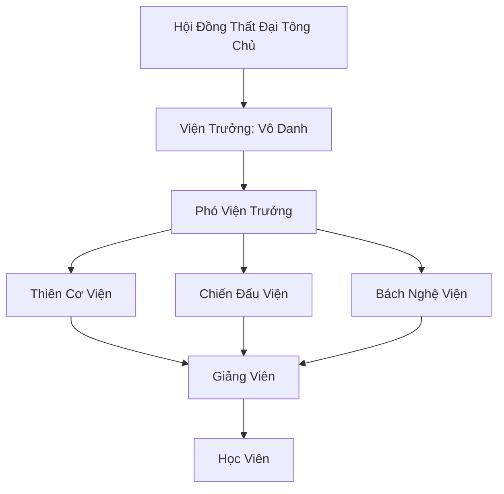

# THIÊN KIÊU HỌC VIỆN (天骄学院)

## I. Tổng Quan (总览)
Thiên Kiêu Học Viện là trung tâm giáo dục tu chân cao cấp nhất Cố Nguyên Giới, nơi hội tụ của những thiên tài kiệt xuất từ mọi chủng tộc và tông môn. Với vị thế trung lập, học viện là nơi duy nhất mà các bí kíp của nhiều môn phái được đem ra thảo luận công khai nhằm tìm kiếm con đường tu luyện tối ưu nhất cho nhân loại.

## II. Địa Lý & Tài Nguyên (地理 với tài nguyên)
Tọa lạc tại Thiên Kiêu Thành, một thành phố lơ lửng một phần trên không trung tại khu vực Trung Tâm lục địa. Học viện sở hữu "Thông Thiên Các" - thư viện chứa đựng hàng vạn bản sao công pháp và "Đảo Thử Thách" - một không gian biệt lập chứa đựng các yêu thú và cạm bẫy dùng để sát hạch học viên.

## III. Văn Hóa & Tín Ngưỡng (文化与信仰)
Đề cao triết lý "Trí Tuệ Khai Sáng Sức Mạnh". Học viện không tôn thờ thần thánh mà tôn thờ sự hiểu biết. Văn hóa học đường tại đây rất sôi nổi với các buổi biện luận, đấu giá ý tưởng và các giải đấu so tài định kỳ. Sự phân biệt đối xử về chủng tộc là điều cấm kỵ tuyệt đối.

## IV. Cơ Cấu Tổ Chức (组织结构)


## V. Công Pháp & Trận Pháp (功法与阵法)
- **Công Pháp:** Học viện không có công pháp trấn phái riêng mà tập trung vào *Căn Cơ Chú Đại Pháp* - kỹ thuật giúp học viên khai phá tối đa tiềm năng của linh căn cá nhân.
- **Trận Pháp:** *Mô Phỏng Thiên Địa Trận* - trận pháp ảo ảnh cấp cao cho phép tái tạo bất kỳ môi trường chiến đấu nào để học viên rèn luyện.

## VI. Đặc Sản Môn Phái (门派特产)
- **Thiên Kiêu Lệnh:** Thẻ bài chứng nhận tư cách học viên, tích hợp hệ thống điểm tích lũy và lưu trữ thông tin.
- **Linh Căn Thạch:** Loại đá dùng để kiểm tra chính xác thuộc tính và độ tinh khiết của linh căn.

## VII. Cơ Sở Hạ Tầng (基础设施)
- **Thông Thiên Các:** Tháp lưu trữ kiến thức khổng lồ với hệ thống phân loại tự động.
- **Diễn Võ Trường Phù Không:** Sân đấu bay lơ lửng trên mây, có thể thay đổi địa hình linh hoạt.

## VIII. Kinh Tế (经济)
Kinh tế dựa trên nguồn học phí đắt đỏ và sự tài trợ từ các đại tông môn muốn gửi gắm nhân tài. Học viện cũng thu lợi nhuận từ việc bán các loại pháp bảo và đan dược do sinh viên và giảng viên hợp tác nghiên cứu ra.

## IX. Lịch Sử Tóm Tắt (简史)
Được thành lập cách đây hàng ngàn năm sau "Cuộc Chiến Vạn Tộc", khi các thủ lĩnh nhận ra rằng sự cô lập kiến thức sẽ dẫn đến diệt vong. Thiên Kiêu Học Viện ra đời như một biểu tượng của sự đoàn kết và hy vọng cho tương lai của Cố Nguyên Giới.

## X. Giai Thoại & Bí Mật (轶 sự với bí mật)
Có lời đồn rằng "Viện Trưởng Vô Danh" thực chất là một linh hồn cổ đại đã sống qua nhiều kỷ nguyên và đang chờ đợi một học sinh có thể giải được "Bài toán cuối cùng" của Thiên Đạo.

## XI. Quan Hệ Thế Lực (势力关系)
```mermaid
graph LR
    TKHV[Thiên Kiêu Học Viện] -- Cung cấp nhân tài -- CHKT[Cửu Hoa Kiếm Tông]
    TKHV -- Nghiên cứu chung -- TAM[Thái Ất Môn]
    TKHV -- Trung lập -- DCHH[Đại Càn Hoàng Triều]
    TKHV -- Cảnh giác -- CUMT[Cửu U Ma Tông]
```
