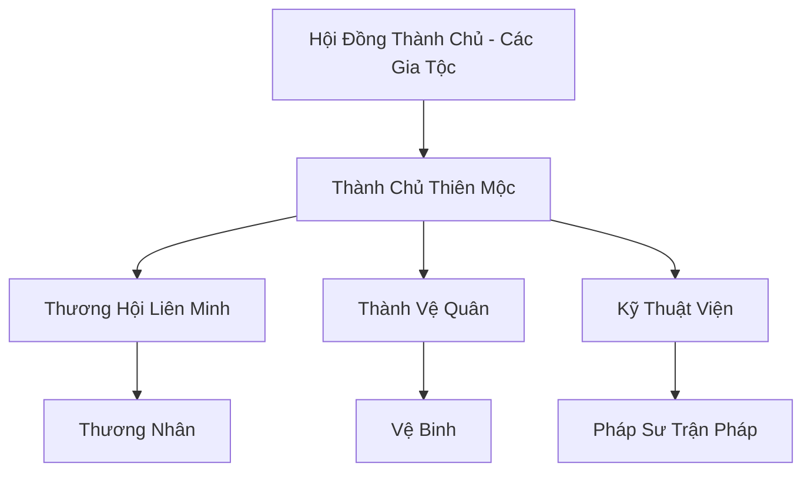

# THIÊN MỘC THÀNH (天木城)

## I. Tổng Quan (总览)
Thiên Mộc Thành là thành phố tự do lớn nhất nằm ở ranh giới giữa Nam Cương và khu vực Trung Tâm. Với vị thế chiến lược là "Cửa ngõ của sự sống", thành phố đóng vai trò là điểm dừng chân an toàn duy nhất trước khi lữ khách tiến vào vùng chướng khí độc hại của phương Nam. Đây là nơi hội tụ của các nền văn hóa, nơi linh dược từ rừng già được đổi lấy linh thạch và bí kíp từ mặt đất chính thống.

## II. Địa Lý & Tài Nguyên (地理 với tài nguyên)
Thành phố được xây dựng xung quanh một cây cổ thụ thần kỳ có khả năng thanh lọc không khí trong bán kính hàng trăm dặm. Đất đai xung quanh thành phố rất phù hợp để trồng các loại linh thảo cần sự kết hợp giữa linh khí Trung Tâm và độ ẩm Nam Cương. Tài nguyên lớn nhất của thành phố chính là mạng lưới thông tin thương mại và kho dự trữ linh dược khổng lồ.

## III. Văn Hóa & Tín Ngưỡng (文化 với信仰)
Đề cao sự tự do, trung lập và tính thực dụng. Cư dân Thiên Mộc Thành tin rằng "Thương mại là cầu nối cho hòa bình". Văn hóa thành phố rất đa dạng, cởi mở với mọi chủng tộc. Họ tôn trọng luật pháp thành phố hơn là môn quy của bất kỳ tông môn nào. Lễ hội "Mộc Linh Khai Hội" hàng năm là dịp để các thương nhân khắp nơi đổ về tham gia các phiên đấu giá lớn.

## IV. Cơ Cấu Tổ Chức (组织结构)


## V. Công Pháp & Trận Pháp (功法 với阵法)
- **Công Pháp:** Thành phố không có công pháp tu luyện riêng cho cư dân, nhưng Thành Vệ Quân được huấn luyện *Thiên Mộc Thủ Vệ Thuật* (Phòng ngự phối hợp).
- **Trận Pháp:** *Thiên Mộc Đại Trận* - trận pháp phòng hộ cấp Hạng Nhất, sử dụng rễ cây thần làm vật dẫn để tạo ra một lớp màn lọc chướng khí và ngăn chặn mọi loại tà thuật xâm nhập từ Nam Cương.

## VI. Đặc Sản Môn Phái (门派特产)
- **Thiên Mộc Giải Độc Đan:** Loại đan dược phổ biến và hiệu quả nhất để chống lại chướng khí Nam Cương.
- **Thẻ Thông Hành Thiên Mộc:** Thẻ bài linh khí cho phép người sở hữu được bảo vệ và hưởng các ưu đãi dịch vụ trong thành.

## VII. Cơ Sở Hạ Tầng (基础设施)
- **Chợ Linh Dược Trung Tâm:** Khu chợ trời khổng lồ hoạt động ngày đêm với hàng vạn sạp hàng.
- **Hệ Thống Tháp Lọc Khí:** Các tòa tháp cao vút bao quanh thành phố liên tục phát tán linh phấn thanh lọc sương mù độc.

## VIII. Kinh Tế (経済)
Nền kinh tế hoàn toàn dựa trên thương mại và dịch vụ. Thiên Mộc Thành nắm giữ quyền điều tiết giá cả linh dược trên toàn lục địa. Thu nhập từ thuế thương mại đủ để duy trì một quân đội mạnh mẽ và hệ thống phúc lợi xã hội tốt cho cư dân.

## IX. Lịch Sử Tóm Tắt (简史)
Được thành lập bởi một liên minh bảy đại gia tộc thương nhân vào thời kỳ Trung Cổ. Họ nhận thấy sự nguy hiểm nhưng cũng là cơ hội từ vùng đất Nam Cương nên đã chung tay xây dựng thành phố này để bảo vệ các đoàn buôn. Qua nhiều lần bị yêu thú tấn công, Thiên Mộc Thành vẫn đứng vững và ngày càng mở rộng quy mô.

## X. Giai Thoại & Bí Mật (轶 sự với bí mật)
Tương truyền cây cổ thụ trung tâm thành phố thực chất là một phần của Cây Thế Giới bị rơi xuống trong cuộc đại chiến thời Thái Cổ, và nó đang âm thầm hút lấy chướng khí để nuôi dưỡng một loại "Thần Quả" bên trong lõi.

## XI. Quan Hệ Thế Lực (势力关系)
```mermaid
graph LR
    TMT[Thiên Mộc Thành] -- Đối tác -- DCHH[Đại Càn Hoàng Triều]
    TMT -- Giao thương -- DVC[Dược Vương Cốc]
    TMT -- Cảnh giác -- VDM[Vạn Độc Môn]
    TMT -- Bảo hộ -- TNNC[Các Thôn Làng Nam Cương]
```
