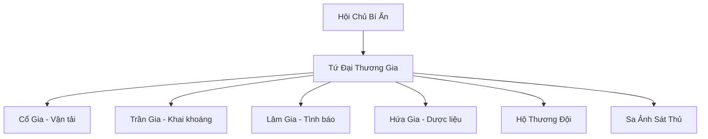

# THIÊN SA THƯƠNG HỘI (天沙商會)

## I. Tổng Quan (总览)
Thiên Sa Thương Hội là liên minh thương nhân hùng mạnh nhất Tây Mạc và là một trong những thực thể kinh tế lớn nhất Cố Nguyên Giới. Với tôn chỉ "Trước cửa Thiên Sa, không có chính tà, chỉ có mua bán", thương hội giữ vị thế trung lập tuyệt đối để kiểm soát toàn bộ các tuyến đường thương mại xuyên sa mạc. Họ không chỉ vận chuyển hàng hóa mà còn là kho lưu trữ thông tin tình báo khổng lồ, khiến mọi thế lực trên lục địa đều phải nể trọng và kiêng dè.

## II. Địa Lý & Tài Nguyên (地理 với tài nguyên)
Trụ sở chính là Thiên Sa Thương Thành, một thành phố rực rỡ được xây dựng trên Minh Nguyệt Châu - ốc đảo lớn nhất Tây Mạc. Thương Hội độc quyền khai thác Sa Kim Thạch và các loại khoáng sản quý hiếm từ Xích Nham Sơn Mạch. Họ cũng nắm giữ "Thiên Sa Thương Đạo" - con đường duy nhất đảm bảo an toàn cho các đoàn lữ hành đi xuyên qua vùng đất chết chóc của sa mạc.

## III. Văn Hóa & Tín Ngưỡng (文化 với信仰)
Tôn thờ Sa Thần và triết lý "Thiên hạ chi lợi, giai quy sa hà". Thành viên thương hội đề cao chữ tín và các bản khế ước máu. Văn hóa của họ là sự kết hợp giữa sự hào nhoáng của giới thương nhân và sự bền bỉ của dân du mục Sa Tộc. Nghi lễ "Sa Kim Tẩy Lễ" là bước ngoặt quan trọng của mỗi thành viên, đánh dấu lòng trung thành vĩnh cửu với hội.

## IV. Cơ Cấu Tổ Chức (组织结构)


## V. Công Pháp & Trận Pháp (功法 với阵法)
- **Công Pháp:** *Sa Hà Bảo Điển* (Thao túng cát và phong lôi), *Sa Ảnh Quyết* (Ẩn thân và ám sát).
- **Trận Pháp:** *Sa Thành Hộ Giới Trận* - trận pháp phòng thủ đa tầng sử dụng linh lực từ Sa Kim Thạch để tạo ra những bức tường cát bất khả xâm phạm bao quanh thành phố và các trạm dừng chân.

## VI. Đặc Sản Môn Phái (门派特产)
- **Sa Kim Thạch:** Loại đá quý dùng làm đơn vị tiền tệ cao cấp và nguyên liệu luyện khí hệ Kim-Thổ.
- **Thiên Sa Thông Hành Lệnh:** Lệnh bài bảo chứng sự an toàn và quyền lợi của lữ khách trên các tuyến đường do hội quản lý.

## VII. Cơ Sở Hạ Tầng (基础设施)
- **Thiên Sa Bảo Tháp:** Tòa tháp chín tầng trung tâm thành phố, nơi đặt đèn dẫn đường cho toàn bộ thương đạo.
- **Vạn Bảo Thương Phường:** Khu chợ thường trực lớn nhất Tây Mạc với đủ loại hàng hóa từ khắp thế giới.

## VIII. Kinh Tế (経済)
Nền kinh tế vững chắc dựa trên việc độc quyền vận tải và khai thác tài nguyên sa mạc. Thương hội cũng thu lợi nhuận khổng lồ từ mạng lưới Tình Báo Các, biến thông tin thành loại hàng hóa đắt đỏ nhất lục địa. Họ có khả năng thao túng thị trường linh thạch toàn cầu thông qua việc điều tiết nguồn cung.

## IX. Lịch Sử Tóm Tắt (简史)
Sáng lập cách đây hơn ba vạn năm bởi Cổ Sa Nhạn, người đầu tiên khai phá thành công tuyến đường thương mại nối liền Trung Thổ và Tây Mạc. Qua nhiều thế hệ Hội Chủ bí ẩn, thương hội đã vượt qua các cuộc đại chiến để giữ vững nền độc lập và sự thịnh vượng, trở thành huyết mạch kinh tế không thể thay thế của Cố Nguyên Giới.

## X. Giai Thoại & Bí Mật (轶 sự với bí mật)
Có lời đồn rằng Hội Chủ Thiên Sa thực chất là một thực thể cổ đại sống thọ hàng vạn năm, người nắm giữ chìa khóa dẫn đến "Lưu Sa Cổ Thành" - kho báu huyền thoại của các vị thần thời Hồng Hoang.

## XI. Quan Hệ Thế Lực (势力关系)
```mermaid
graph LR
    TSTH[Thiên Sa Thương Hội] -- Đối tác -- CHKT[Cửu Hoa Kiếm Tông]
    TSTH -- Giao thương -- DVC[Dược Vương Cốc]
    TSTH -- Tử địch -- STLM[Sa Tặc Liên Minh]
    TSTH -- Cạnh tranh -- BBC[Bách Bảo Các]
```
