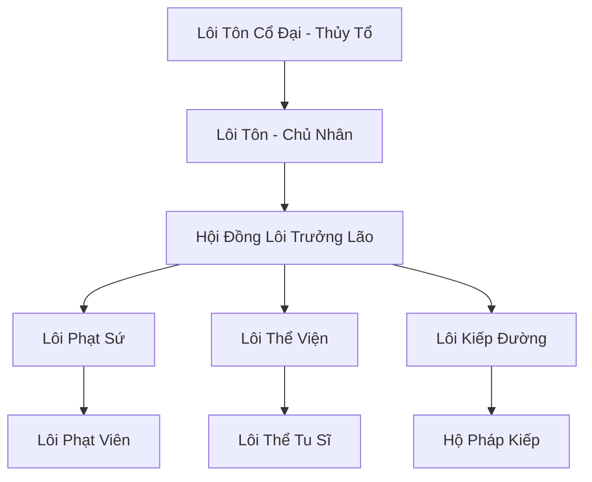

# LÔI TRÌ THÁNH ĐỊA (雷池圣地)

## I. Tổng Quan (总览)
Lôi Trì Thánh Địa là một trong những thế lực ẩn thế mạnh nhất Cố Nguyên Giới, đóng vai trò là "Kẻ hành pháp của Thiên Đạo". Tọa lạc tại khu vực có mật độ sấm sét dày đặc nhất xung quanh núi Thiên Trụ, thánh địa này chỉ thu nạp những tu sĩ có linh căn lôi hệ tinh thuần nhất hoặc những thực thể lôi yêu mang huyết thống thượng cổ. Đây là nơi duy nhất trên thế giới mà con người dám trực tiếp đối mặt và hấp thụ sức mạnh hủy diệt của Thiên Lôi để rèn luyện bản thân.

## II. Địa Lý & Tài Nguyên (地理 với tài nguyên)
Nằm ở sườn phía Đông của Thiên Trụ Sơn, trung tâm là Lôi Trì - một hồ linh dịch khổng lồ liên tục bị sấm sét từ chín tầng trời đánh xuống. Nơi đây sở hữu "Lôi Tinh Thạch" vạn năm và các mạch "Điện Linh Thủy", là nguồn tài nguyên vô giá cho việc đột phá cảnh giới và rèn luyện pháp bảo lôi hệ.

## III. Văn Hóa & Tín Ngưỡng (文化 với信仰)
Tôn thờ sức mạnh của sự công bằng và hủy diệt (Thiên Phạt). Đệ tử Lôi Trì có tính cách thẳng thắn, bộc trực và coi trọng sự thanh tẩy. Họ tin rằng sấm sét là công cụ để loại bỏ mọi sự ô uế và tà đạo trên thế gian. Văn hóa thánh địa đề cao thực lực tuyệt đối và sự kiên trì vượt qua nỗi sợ hãi trước cái chết.

## IV. Cơ Cấu Tổ Chức (组织结构)


## V. Công Pháp & Trận Pháp (功法 với阵法)
- **Công Pháp:** *Thiên Cương Lôi Quyết* (Chấn phái), *Ngũ Lôi Oanh Đỉnh Thuật* (Tấn công đơn mục tiêu cực mạnh).
- **Trận Pháp:** *Thiên Cương Lôi Giới* - trận pháp bao phủ toàn bộ thánh địa, biến khu vực này thành một vùng cấm bay tuyệt đối, mọi thực thể không có lôi ấn sẽ bị sấm sét đánh tan xác ngay khi đi vào.

## VI. Đặc Sản Môn Phái (门派特产)
- **Lôi Kiếp Dịch:** Linh dịch lấy từ tâm Lôi Trì, giúp tu sĩ tăng khả năng sống sót khi vượt qua thiên kiếp.
- **Lôi Phạt Tiễn:** Mũi tên chứa đựng sức mạnh của một đạo thiên lôi, có khả năng xuyên phá mọi tà khí.

## VII. Cơ Sở Hạ Tầng (基础设施)
- **Cửu Cực Lôi Đài:** Nơi đệ tử đứng chịu sét để đột phá cảnh giới.
- **Lôi Đình Điện:** Cung điện xây dựng bằng kim loại dẫn điện cao cấp, nơi hội họp của các trưởng lão.

## VIII. Kinh Tế (経済)
Kinh tế dựa trên việc cung cấp dịch vụ "Hộ Pháp Lôi Kiếp" - hỗ trợ các tu sĩ từ các tông môn khác vượt qua thiên kiếp một cách an toàn (với giá cực đắt). Họ cũng bán các loại vật liệu lôi hệ hiếm và nhận các hợp đồng thực thi công lý đối với các tội đồ lục địa.

## IX. Lịch Sử Tóm Tắt (简史)
Sáng lập bởi Lôi Tôn Cổ Đại vào cuối thời Thái Cổ, người đã dùng nhục thân để trấn áp một vụ nổ linh mạch lôi hệ khổng lồ tại Thiên Trụ Sơn. Ông đã biến thảm họa thành một vùng đất tu luyện và để lại truyền thừa về sự thanh tẩy của sấm sét cho hậu thế.

## X. Giai Thoại & Bí Mật (轶 sự với bí mật)
Tương truyền dưới đáy Lôi Trì có cất giấu "Trái Tim Của Sấm Sét", thứ có thể điều khiển toàn bộ thời tiết và khí hậu của Cố Nguyên Giới nếu được kích hoạt hoàn toàn.

## XI. Quan Hệ Thế Lực (势力关系)
```mermaid
graph LR
    LTTH[Lôi Trì Thánh Địa] -- Hợp tác -- TMKĐ[Thiên Môn Kính Đài]
    LTTH -- Đối địch -- LC[Long Cung]
    LTTH -- Trừ ma -- HMT[Huyết Ma Tông]
    LTTH -- Trung lập -- TAM[Thái Ất Môn]
```
