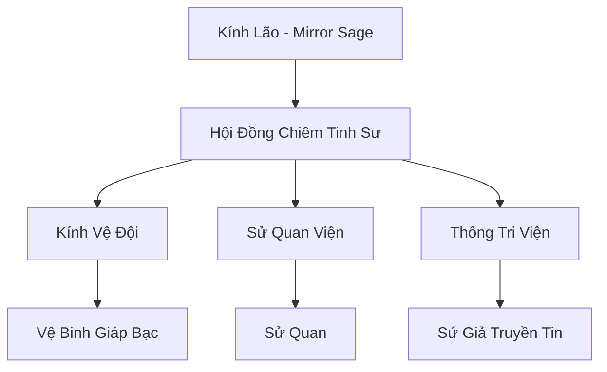

# THIÊN MÔN KÍNH ĐÀI (天门境台)

## I. Tổng Quan (总览)
Thiên Môn Kính Đài là cơ quan giám sát và ghi chép lịch sử quyền lực nhất Cố Nguyên Giới, ngự trị tại vùng mây mù lưng chừng Thiên Trụ Sơn. Với vị thế trung lập tuyệt đối, Kính Đài không tham gia vào bất kỳ cuộc tranh chấp nào mà chỉ tập trung vào việc quan sát sự ổn định của địa mạch và sự trỗi dậy của các cường giả. Đây là nơi nắm giữ "Đôi mắt của thế giới", nơi mọi sự kiện lớn nhỏ đều được ghi khắc vào sử ký vĩnh hằng.

## II. Địa Lý & Tài Nguyên (地理 với tài nguyên)
Trụ sở là một tổ hợp đài quan sát khổng lồ xây dựng từ loại đá phản quang đặc biệt, nằm ở vị trí có thể nhìn bao quát toàn bộ lục địa thông qua các trận pháp chiết xạ ánh sáng. Kính Đài sở hữu "Kính Linh Mạch" - mạch linh khí có khả năng truyền dẫn hình ảnh và âm thanh từ khoảng cách vạn dặm, cùng với tàng thư viện chứa đựng sử liệu từ thời khai thiên lập địa.

## III. Văn Hóa & Tín Ngưỡng (文化 với信仰)
Tôn thờ Sự Thật và Sự Cân Bằng. Thành viên Kính Đài (thường gọi là Kính Nhân) phải thề nguyện từ bỏ mọi ân oán cá nhân và tông môn để giữ cho đôi mắt luôn trong sáng. Văn hóa tại đây mang đậm tính học thuật, trầm mặc và khách quan. Họ coi việc ghi chép lịch sử là một hình thức tu luyện đạo tâm tối cao.

## IV. Cơ Cấu Tổ Chức (组织结构)


## V. Công Pháp & Trận Pháp (功法 với阵法)
- **Công Pháp:** *Thiên Nhãn Thông* (Thấu thị), *Tâm Kính Quyết* (Chống huyễn thuật).
- **Trận Pháp:** *Kính Chi Kết Giới* - một vùng không gian hòa bình tuyệt đối rộng 100 dặm bao quanh Kính Đài, nơi mọi đòn tấn công đều bị chiết xạ vào hư không và mọi sát ý đều bị dập tắt bởi áp lực tinh thần của Đài Kính.

## VI. Đặc Sản Môn Phái (门派特产)
- **Cố Nguyên Sử Ký:** Bộ sách ghi chép lịch sử được cập nhật liên tục, là nguồn tham khảo uy tín nhất lục địa.
- **Kính Phản Quang:** Loại pháp bảo phòng thủ cá nhân có khả năng phản hồi lại một phần sát thương từ các đòn tấn công tầm xa.

## VII. Cơ Sở Hạ Tầng (基础设施)
- **Thiên Nhãn Đài:** Sàn kính khổng lồ dùng để quan sát địa hình và linh mạch toàn cầu.
- **Vạn Chữ Lâu:** Kho lưu trữ tài liệu với hàng triệu cuộn giấy da và ngọc giản.

## VIII. Kinh Tế (経済)
Kinh tế được duy trì thông qua các khoản đóng góp tự nguyện từ mọi thế lực lớn như một cách để "mua sự ổn định". Họ cũng thu lợi nhuận từ việc bán các bản tin thiên văn, điềm báo và dịch vụ giám định thực lực (Xếp hạng cường giả) vốn rất được giới tu chân coi trọng.

## IX. Lịch Sử Tóm Tắt (简史)
Được thành lập bởi Kính Lão, người đã sống qua ba kỷ nguyên, ngay sau khi kết thúc Cuộc Chiến Vạn Tộc đầu tiên. Ngài nhận ra rằng nếu không có một kẻ đứng ngoài quan sát và ghi chép, nhân loại sẽ mãi lặp lại những sai lầm của quá khứ. Thiên Môn Kính Đài ra đời như một nhân chứng vĩnh cửu của thời gian.

## X. Giai Thoại & Bí Mật (轶 sự với bí mật)
Tương truyền trong lòng Đài Kính có một "Gương Luân Hồi", có thể cho một người nhìn thấy tiền kiếp và hậu kiếp của chính mình, nhưng cái giá phải trả thường là chính tu vi hiện tại.

## XI. Quan Hệ Thế Lực (势力关系)
```mermaid
graph LR
    TMKĐ[Thiên Môn Kính Đài] -- Trung lập -- ALL[Mọi Thế Lực]
    TMKĐ -- Tư vấn -- DCHH[Đại Càn Hoàng Triều]
    TMKĐ -- Đối tác -- TAM[Thái Ất Môn]
    TMKĐ -- Cảnh cáo -- CUMT[Cửu U Ma Tông]
```
