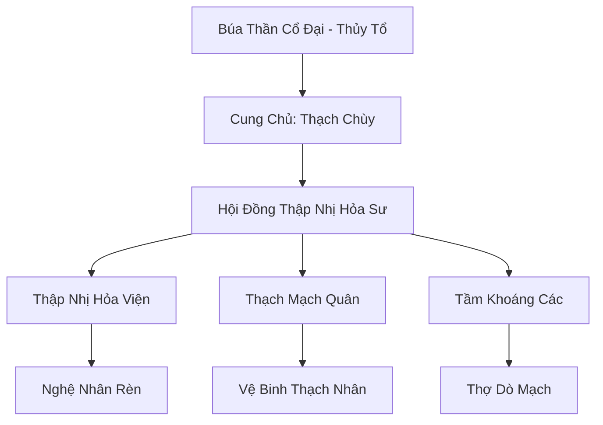

# THẠCH LINH CUNG (石灵宫)

## I. Tổng Quan (总览)
Thạch Linh Cung là thánh địa rèn đúc lâu đời nhất lục địa, nằm sâu trong lòng những hang động đá tảng dưới chân núi Thiên Trụ. Với sự kết hợp giữa sức mạnh thể chất của lai Cự Tộc và linh tính của Thạch Tộc, những nghệ nhân tại đây đã tạo ra hàng vạn thần binh lợi khí qua nhiều kỷ nguyên. Họ nổi tiếng với sự kiên nhẫn cực hạn, có thể dành hàng trăm năm chỉ để hoàn thiện một thanh kiếm duy nhất.

## II. Địa Lý & Tài Nguyên (地理 với tài nguyên)
Tọa lạc tại khu vực chân núi Thiên Trụ Sơn, nơi địa mạch vô cùng vững chắc và chứa đựng những loại quặng linh thạch nặng nề, quý hiếm nhất. Cung điện thực chất là một hệ thống hang động tự nhiên được mở rộng bằng tay, nối liền với các mạch địa hỏa sâu thẳm cung cấp nhiệt lượng vĩnh cửu cho các lò luyện.

## III. Văn Hóa & Tín Ngưỡng (文化 với信仰)
Tôn thờ "Búa Thần Cổ Đại" và tinh thần lao động miệt mài. Đối với thành viên Thạch Linh Cung, mỗi món pháp bảo đều có linh hồn và việc rèn đúc là một quá trình giao tiếp linh hồn. Họ có văn hóa sống trầm mặc, ít nói, coi trọng thực lực và những giá trị truyền thống bền vững.

## IV. Cơ Cấu Tổ Chức (组织结构)


## V. Công Pháp & Trận Pháp (功法 với阵法)
- **Công Pháp:** *Thạch Linh Tâm Chú* (Nén linh khí vào vật chất), *Thiên Hỏa Luyện Kim* (Kỹ thuật nung).
- **Trận Pháp:** *Thạch Linh Hộ Giới Trận* - trận pháp bao phủ cung điện, biến mọi bức tường đá thành lớp phòng thủ có khả năng tự phục hồi và phản chấn lại các đòn tấn công vật lý nặng.

## VI. Đặc Sản Môn Phái (门派特产)
- **Thạch Linh Chiến Giáp:** Loại giáp trụ nặng nhưng cung cấp khả năng phòng ngự vật lý gần như tuyệt đối.
- **Nội Đan Khảm Nạm:** Kỹ thuật đặc biệt cho phép gắn nội đan yêu thú vào vũ khí mà không làm mất đi linh tính của đan.

## VII. Cơ Sở Hạ Tầng (基础设施)
- **Lò đúc Vạn Niên Hỏa:** Trung tâm rèn đúc sử dụng hỏa năng trực tiếp từ lõi địa mạch của Thiên Trụ Sơn.
- **Quảng Trường Đá:** Nơi trưng bày các tác phẩm rèn đúc vĩ đại nhất qua các thời kỳ.

## VIII. Kinh Tế (経済)
Kinh tế cực kỳ ổn định nhờ các hợp đồng độc quyền cung cấp khí tài cho Đại Càn Hoàng Triều và các đại tông môn. Họ cũng sở hữu nguồn thu từ việc khai thác và bán các quặng thô linh thạch cao cấp cho những luyện khí sư tự do.

## IX. Lịch Sử Tóm Tắt (简史)
Được thành lập bởi một nhóm lai Cự Tộc rời bỏ chiến tranh thời Thái Cổ để tìm kiếm sự bình yên trong việc lao động sáng tạo. Thạch Linh Cung đã âm thầm tồn tại dưới chân Thiên Trụ Sơn, chứng kiến sự hưng vong của hàng trăm vương triều mà vẫn giữ vững được vị thế của mình nhờ sự trung lập và giá trị kỹ thuật không thể thay thế.

## X. Giai Thoại & Bí Mật (轶 sự với bí mật)
Tương truyền Cung Chủ Thạch Chùy đang bí mật rèn luyện "Thập Tam Thần Binh", những món vũ khí có khả năng thay đổi quy luật vận hành của chính Thiên Trụ Sơn.

## XI. Quan Hệ Thế Lực (势力关系)
```mermaid
graph LR
    SLC[Thạch Linh Cung] -- Cung cấp -- TMKĐ[Thiên Môn Kính Đài]
    SLC -- Đối tác -- VHC[Vũ Hoàng Các]
    SLC -- Cạnh tranh -- TKP[Thần Khí Phường]
    SLC -- Trao đổi -- ĐHC[Đan Hà Cốc]
```
