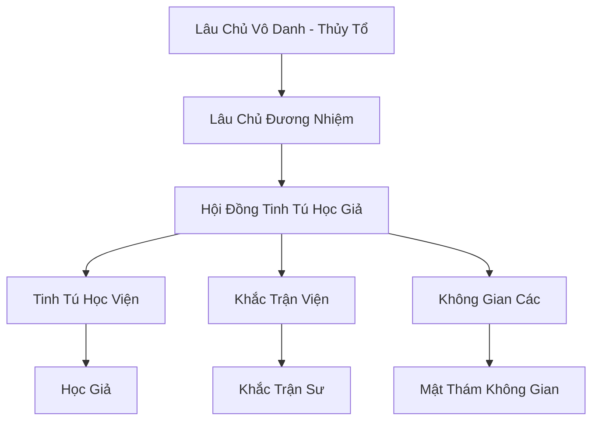

# TRÍCH TINH LÂU (摘星楼)

## I. Tổng Quan (总览)
Trích Tinh Lâu là nơi tập trung của những bộ óc thông minh và lập dị nhất Cố Nguyên Giới, ngự trị trên một mỏm đá chọc trời tại núi Thiên Trụ. Với tôn chỉ "Giải mã vũ trụ, thấu hiểu Thiên Đạo", họ không quan tâm đến việc tranh giành lãnh thổ hay tài nguyên thông thường. Thay vào đó, họ dành hàng kỷ nguyên để nghiên cứu về trận pháp, không gian và sức mạnh của các tinh tú. Dù quân số cực kỳ ít ỏi, mỗi thành viên của Trích Tinh Lâu đều là một bậc thầy có khả năng xoay chuyển càn khôn thông qua các kết giới phức tạp.

## II. Địa Lý & Tài Nguyên (地理 với tài nguyên)
Trụ sở là tòa tháp đá Đỉnh Trích Tinh, nằm ở độ cao mà không khí loãng đến mức linh khí tinh thần trở nên cực kỳ nhạy bén. Họ nắm giữ "Thiên Hà Trận Đồ" - một bản đồ linh lực sống động phản chiếu vị trí của các vì sao và các mạch không gian của lục địa. Tài nguyên chính là "Tinh Thạch" rơi xuống từ trời đêm và các bí kíp không gian cổ đại.

## III. Văn Hóa & Tín Ngưỡng (文化 với信仰)
Tôn thờ Trí Tuệ và Quy Luật Toán Học của vũ trụ. Thành viên Trích Tinh Lâu thường có phong thái trầm mặc, dành phần lớn thời gian để quan sát bầu trời đêm và thực hiện các phép tính linh lực phức tạp. Văn hóa tại đây đề cao sự chính xác và sáng tạo. Họ tin rằng mọi thứ trên đời, từ một ngọn cỏ đến một đại tông môn, đều vận hành theo những trận đồ nhất định.

## IV. Cơ Cấu Tổ Chức (组织结构)


## V. Công Pháp & Trận Pháp (功法 với阵法)
- **Công Pháp:** *Tinh Tú Diệu Pháp* (Hấp thụ ánh sao), *Hư Không Chú* (Thao túng không gian ngắn hạn).
- **Trận Pháp:** *Vạn Tinh Trấn Thế Trận* - trận pháp phòng thủ và tấn công mạnh nhất của lâu, có khả năng tạo ra một vùng không gian biệt lập (Tinh Cảnh) giam cầm đối thủ trong một vũ trụ thu nhỏ vô tận.

## VI. Đặc Sản Môn Phái (门派特产)
- **Tinh Tú La Bàn:** Thiết bị định vị linh lực chính xác nhất thế giới, có khả năng cảnh báo các vết nứt không gian.
- **Trận Bàn Thu Nhỏ:** Các trận pháp cấp cao được nén vào những viên ngọc thạch nhỏ, có thể kích hoạt tức thì trong chiến đấu.

## VII. Cơ Sở Hạ Tầng (基础设施)
- **Vọng Tinh Đài:** Sân thượng khổng lồ dùng để quan sát thiên văn và hội tụ ánh sao.
- **Mật Thất Không Gian:** Các căn phòng có kích thước bên trong lớn hơn hàng nghìn lần so với bên ngoài.

## VIII. Kinh Tế (経済)
Nguồn thu khổng lồ từ việc cung cấp dịch vụ thiết lập và bảo trì các Truyền Tống Trận liên lục địa cho các thành bang và đại thương hội. Họ cũng thu lợi nhuận từ việc bán các bản đồ bí cảnh và giải mã các cấm chế cổ đại cho những nhà thám hiểm giàu có.

## IX. Lịch Sử Tóm Tắt (简史)
Sáng lập từ thời Thái Cổ bởi một vị đại năng vô danh, người đã dành cả đời để tìm hiểu vì sao trời cao lại cách biệt với đất thấp. Trích Tinh Lâu đã âm thầm ghi chép lịch sử thế giới và duy trì sự ổn định của các mạch không gian lục địa, đứng ngoài mọi cuộc chiến tranh nhưng lại nắm giữ chìa khóa của mọi lối đi.

## X. Giai Thoại & Bí Mật (轶 sự với bí mật)
Tương truyền Đỉnh Trích Tinh thực chất là một chiếc "Ăng-ten" cổ đại dùng để liên lạc với các thế giới khác bên ngoài Cố Nguyên Giới, và Lâu Chủ đang chờ đợi một tín hiệu phản hồi từ hư không.

## XI. Quan Hệ Thế Lực (势力关系)
```mermaid
graph LR
    TTL[Trích Tinh Lâu] -- Đối tác kỹ thuật -- TAM[Thái Ất Môn]
    TTL -- Cung cấp dịch vụ -- BBC[Bách Bảo Các]
    TTL -- Trung lập -- DCHH[Đại Càn Hoàng Triều]
    TTL -- Giám sát -- CUMT[Cửu U Ma Tông]
```
