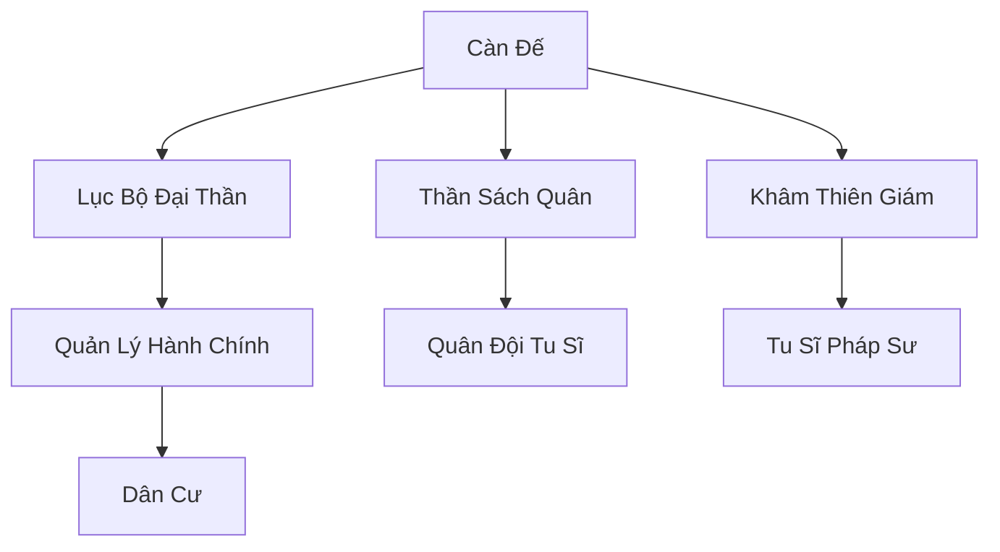

# ĐẠI CÀN HOÀNG TRIỀU (大乾皇朝)

## I. Tổng Quan (总览)
Đại Càn Hoàng Triều là thực thể chính trị lớn nhất và ổn định nhất Cố Nguyên Giới, cai trị vùng đất phì nhiêu nhất tại trung tâm lục địa. Đây là một đế quốc nơi phàm nhân và tu sĩ cùng tồn tại dưới sự quản lý chặt chẽ của luật pháp hoàng gia. Hoàng triều nắm giữ vận mệnh của hàng triệu dân chúng và là lá chắn vững chắc chống lại sự hỗn loạn của ma đạo.

## II. Địa Lý & Tài Nguyên (地理 với tài nguyên)
Tọa lạc tại vùng đồng bằng Trung Tâm, nơi hội tụ của chín mạch Long Mạch chính (Cửu Long tụ hội). Đất đai nơi đây vô cùng màu mỡ, sản sinh ra nhiều loại linh gạo và dược thảo phổ thông. Hoàng triều kiểm soát các cửa ngõ giao thương giữa các châu lục và nắm giữ nhiều mỏ linh thạch lộ thiên lớn.

## III. Văn Hóa & Tín Ngưỡng (文化 với信仰)
Đề cao Nho giáo tu chân, tôn trọng trật tự, lễ nghĩa và lòng trung quân ái quốc. Cư dân Đại Càn tin rằng Hoàng đế là con của trời (Thiên tử), người kết nối ý chí của nhân loại với Thiên Đạo. Văn hóa hoàng gia rất xa hoa, tinh tế với các buổi yến tiệc, thi cử và lễ tế trời quy mô lớn.

## IV. Cơ Cấu Tổ Chức (组织结构)


## V. Công Pháp & Trận Pháp (功法与阵法)
- **Công Pháp:** *Càn Khôn Đại Đạo Quyết* (Hoàng tộc), *Hoàng Long Kiếm Pháp* (Quân đội).
- **Trận Pháp:** *Cửu Long Hộ Quốc Trận* - đại trận bao phủ kinh thành, sử dụng sức mạnh của địa mạch để tạo ra lớp phòng ngự tuyệt đối trước các đòn tấn công cấp Hóa Thần.

## VI. Đặc Sản Môn Phái (门派特产)
- **Càn Nguyên Linh Gạo:** Loại gạo chứa linh lực, giúp phàm nhân kéo dài tuổi thọ và tu sĩ hồi phục thể lực.
- **Hoàng Gia Phù Văn:** Các loại bùa chú được đóng dấu ấn hoàng gia, có tính pháp lý và hiệu lực trấn áp ma khí cao.

## VII. Cơ Sở Hạ Tầng (基础设施)
- **Càn Nguyên Cung:** Tổ hợp cung điện lộng lẫy được xây dựng trên một mạch linh thạch khổng lồ.
- **Hệ thống Quan Đạo Phù Văn:** Các con đường huyết mạch được yểm bùa để tăng tốc độ di chuyển và đảm bảo an toàn cho thương đoàn.

## VIII. Kinh Tế (经济)
Nền kinh tế đa dạng dựa trên thuế, khai thác tài nguyên và phí bảo hộ. Đại Càn là trung tâm tiêu dùng linh dược và pháp bảo lớn nhất lục địa, tạo ra dòng chảy linh thạch không bao giờ cạn về kho bạc hoàng gia.

## IX. Lịch Sử Tóm Tắt (简史)
Được sáng lập bởi Đại Càn Thái Tổ sau khi ngài thống nhất hàng trăm tiểu quốc đang xâu xé mạch Long Mạch Trung Tâm. Trải qua hàng ngàn năm, dù có những thời kỳ suy vi nhưng nhờ liên minh chặt chẽ với các đại tông môn chính đạo, hoàng triều vẫn giữ vững được vị thế thống trị.

## X. Giai Thoại & Bí Mật (轶 sự với bí mật)
Tương truyền dưới lòng hoàng cung có một "Long Huyệt" chứa đựng chân thân của một con rồng vàng từ thời khai thiên lập địa, bảo vệ khí vận cho toàn bộ quốc gia.

## XI. Quan Hệ Thế Lực (势力关系)
```mermaid
graph LR
    DCHH[Đại Càn Hoàng Triều] -- Đồng minh -- CHKT[Cửu Hoa Kiếm Tông]
    DCHH -- Đối địch -- CUMT[Cửu U Ma Tông]
    DCHH -- Bảo hộ -- TKHV[Thiên Kiêu Học Viện]
    DCHH -- Giao thương -- BBC[Bách Bảo Các]
```
