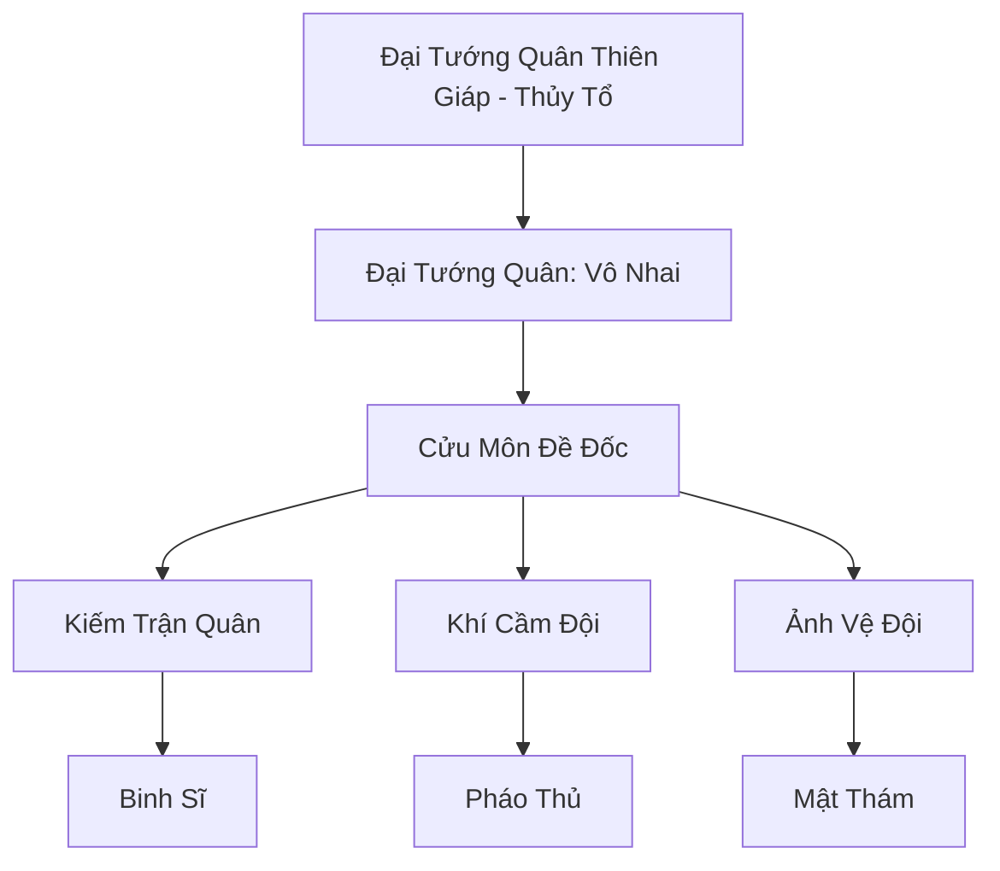

# THIÊN TRỤ HỘ VỆ ĐOÀN (天柱护卫团)

## I. Tổng Quan (总览)
Thiên Trụ Hộ Vệ Đoàn là lực lượng quân sự kỷ luật nhất lục địa, có nhiệm vụ trấn giữ con đường bộ duy nhất dẫn lên đỉnh núi Thiên Trụ Sơn. Với quân số đông đảo và hệ thống trận pháp liên kết hàng vạn người, quân đoàn này là bức tường thép ngăn chặn mọi thế lực tà ác hoặc tội phạm muốn xâm nhập vào các vùng đất linh thiêng phía trên. Họ hoạt động dựa trên tôn chỉ: "Thiên Trụ không đổ, Hộ Vệ không lùi."

## II. Địa Lý & Tài Nguyên (地理 với tài nguyên)
Đóng quân dọc theo các bậc thang đá khổng lồ (Thiên Thang) của núi Thiên Trụ. Quân đoàn kiểm soát chín cửa ải chiến lược từ chân núi lên đến tầng mây. Tài nguyên chính của họ là các mỏ đá linh thạch cứng cáp dùng để gia cố thành lũy và nguồn linh khí phong phú từ trục thế giới tỏa ra.

## III. Văn Hóa & Tín Ngưỡng (文化 với信仰)
Tôn thờ kỷ luật và lòng trung thành. Thành viên hộ vệ đoàn coi nhiệm vụ trấn thủ là vinh dự cao quý nhất. Văn hóa quân đội tại đây rất nghiêm khắc, mọi hành vi vi phạm kỷ luật đều bị trừng trị bằng pháp hình nặng nề. Họ có nghi lễ "Thề Dưới Chân Cột Trời" mỗi khi có tân binh gia nhập.

## IV. Cơ Cấu Tổ Chức (组织结构)


## V. Công Pháp & Trận Pháp (功法 với阵法)
- **Công Pháp:** *Thiên Trụ Trấn Áp Quyết* (Tăng cường trọng lực và phòng ngự), *Liên Tâm Công* (Chia sẻ linh lực).
- **Trận Pháp:** *Cửu Trọng Hộ Thiên Trận* - hệ thống trận pháp đa tầng kết nối chín cửa ải, có khả năng hóa đá không gian xung quanh để ngăn chặn các thực thể bay hoặc dịch chuyển tức thời.

## VI. Đặc Sản Môn Phái (门派特产)
- **Thiên Trụ Trấn Giáp:** Bộ giáp nặng làm từ đá thạch anh linh lực, có khả năng kháng lại mọi hiệu ứng đẩy lùi.
- **Linh Thạch Pháo:** Loại pháo cầm tay có sức công phá cực lớn, chuyên dùng để tiêu diệt yêu thú bay.

## VII. Cơ Sở Hạ Tầng (基础设施)
- **Cửu Trọng Quan:** Chín pháo đài đá kiên cố nằm ở các độ cao khác nhau trên núi.
- **Doanh Trại Phù Không:** Các doanh trại nằm lơ lửng giữa các tầng mây để dự phòng lực lượng.

## VIII. Kinh Tế (経済)
Ngân sách chủ yếu được cung cấp bởi Đại Càn Hoàng Triều và các đại tông môn có lợi ích tại Thiên Trụ Sơn. Họ cũng thu phí thông hành (hợp pháp) đối với các thương đoàn và tu sĩ hành tẩu qua các cửa ải để duy trì trang thiết bị quân sự.

## IX. Lịch Sử Tóm Tắt (简史)
Được thành lập vào thời Trung Cổ sau khi một nhóm ma tu lớn cố gắng leo lên Thiên Trụ để phá hoại Long Mạch thế giới. Đại Tướng Quân Thiên Giáp đã tập hợp những binh lính dũng cảm nhất để lập nên phòng tuyến này, từ đó về sau trở thành lực lượng bảo vệ trục thế giới chính thức.

## X. Giai Thoại & Bí Mật (轶 sự với bí mật)
Tương truyền dưới chân cửa ải thứ nhất có chôn cất một thanh "Trấn Thiên Kiếm", chỉ có Đại Tướng Quân mới có thể rút ra khi Thiên Trụ thực sự gặp nguy hiểm.

## XI. Quan Hệ Thế Lực (势力关系)
```mermaid
graph LR
    TTHVĐ[Thiên Trụ Hộ Vệ Đoàn] -- Phục vụ -- DCHH[Đại Càn Hoàng Triều]
    TTHVĐ -- Đồng minh -- VT[Vân Tông]
    TTHVĐ -- Cảnh giới -- HSM[Huyết Sát Minh]
    TTHVĐ -- Hợp tác -- SLC[Thạch Linh Cung]
```
